# 第一题：双特征线性回归建模与梯度下降优化分析

> 编辑说明：本文为已运行实验的报告稿，包含正文、16 张插图、结果表和完整代码。图片采用相对路径，引用项目根目录下的 `results` 文件夹。SVG 矢量图与 PNG 位于同一位置，可用于 Word 排版。数学公式保留可编辑 LaTeX 源码。已静态检查公式定界符、括号配对和图片引用；未在 Markpad 或 Obsidian 的实际界面中核验预览。

## 1.1 问题重述

本题基于数据集 A，以建筑面积和房龄为输入特征，以月租金为预测目标，建立带截距项的多元线性回归模型。数据集包含 900 条训练样本和 300 条测试样本，房源编号仅用于标识记录，不参与模型训练。

首先，分别采用正规方程和自行实现的批量梯度下降求解模型参数，比较两种方法得到的参数、预测结果和误差。其次，通过可视化展示样本与拟合结果、模型随迭代的变化、参数更新轨迹以及损失函数的变化，解释模型的学习过程。最后，围绕特征标准化、学习率和正则化开展对照实验，分析不同设置对梯度下降收敛速度、数值稳定性及最终解的影响。

本题的比较分为三个层次：第一层比较同一无正则目标下的两种求解方法；第二层在保持该目标对应的预测模型不变时，研究预处理和学习率如何影响求解过程；第三层研究正则化改变目标函数之后，对参数和优化过程产生的影响。正则化所得参数不混入第一层的求解一致性比较。

## 1.2 数据特征与问题分析

### 1.2.1 数据说明与基本统计

建筑面积原始单位为平方分米，报告统一换算为平方米，即原始数值除以 100。房龄单位为年，月租金单位为元/月。程序检查了数据的有限性、编号唯一性和训练测试编号交集；两组数据没有重叠编号。

**表1　训练集基本统计量。** 标准差采用分母为样本数的定义，与标准化代码一致。

| 变量 | 最小值 | 最大值 | 均值 | 标准差 |
| --- | --- | --- | --- | --- |
| 面积（平方米） | 57.029239 | 86.999801 | 72.254539 | 8.510899 |
| 房龄（年） | 5.000000 | 11.000000 | 8.098889 | 2.021605 |
| 租金（元/月） | 2542.902000 | 3931.085600 | 3319.203307 | 256.640723 |

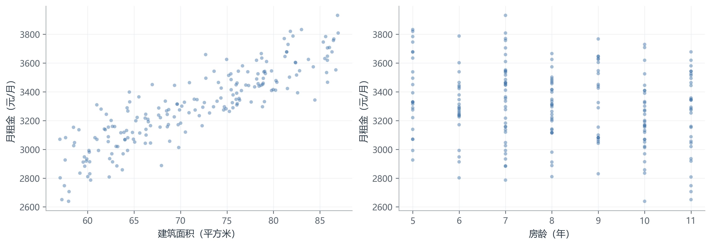

**图1　房屋特征与月租金的样本分布。** 左图展示建筑面积与租金，右图展示房龄与租金。图中固定随机种子抽取 200 条训练记录以减少遮挡，实际训练使用全部 900 条样本。

面积与租金存在明显的正向关系；房龄方向的边际趋势相对较弱，不同房龄下均存在一定租金波动。由于面积和房龄同时作用于模型，不能仅根据其中一个散点图判断完整回归模型的系数，更不能将这种统计关联直接解释为因果关系。

### 1.2.2 问题分析

本题仅包含两个输入特征，线性模型结构简单，参数含义明确，适合对比解析求解与迭代求解。训练集的设计矩阵列满秩，因此无正则平方损失具有唯一最优参数。正规方程可以作为梯度下降的独立参考。

面积与房龄的数值尺度不同，且两个特征的均值均偏离零。这会影响损失曲面的曲率，使统一步长难以同时适应不同参数方向。单位换算有助于解释参数，但不能替代标准化。所有均值和标准差均由训练集估计，测试数据仅使用这些已有统计量进行变换。

标准化后的特征相关系数约为 0.024707，表明两个输入的线性相关较弱。标准化后优化问题已经具有良好的数值条件，因此不预设正则化能够显著加快收敛或改善预测，而是通过实际实验判断。

## 1.3 线性模型与平方损失

### 1.3.1 模型表达与目标函数

记第 $i$ 个样本的建筑面积、房龄和月租金分别为 $a_i$、$h_i$ 和 $y_i$，建立模型：

$$
\hat y_i=\beta_0+\beta_a a_i+\beta_h h_i.
$$

其中，$\beta_0$ 为截距，$\beta_a$ 和 $\beta_h$ 分别为面积和房龄系数。将一列常数 $1$ 纳入设计矩阵 $X$，可写为：

$$
\hat{\boldsymbol y}=X\boldsymbol\theta.
$$

采用半均方误差作为优化目标：

$$
J(\boldsymbol\theta)
=\frac{1}{2n}\left\|X\boldsymbol\theta-\boldsymbol y\right\|_2^2.
$$

评价结果同时报告均方误差与均方根误差：

$$
\operatorname{MSE}=\frac{1}{n}\sum_{i=1}^{n}(y_i-\hat y_i)^2,
\qquad
\operatorname{RMSE}=\sqrt{\operatorname{MSE}}.
$$

无正则情况下，$\operatorname{MSE}=2J$。引入正则化后，MSE 仍只衡量数据拟合误差，不能用正则化总目标的两倍替代。

### 1.3.2 标准化及参数还原

对两个特征分别进行训练集标准化：

$$
z_{ij}=\frac{x_{ij}-\mu_j}{s_j},
\qquad
s_j=\sqrt{\frac{1}{n}\sum_{i=1}^{n}(x_{ij}-\mu_j)^2}.
$$

标准化空间的模型为：

$$
\hat y=b+w_a z_a+w_h z_h.
$$

对应的原单位参数为：

$$
\beta_a=\frac{w_a}{s_a},
\qquad
\beta_h=\frac{w_h}{s_h},
\qquad
\beta_0=b-\frac{w_a\mu_a}{s_a}-\frac{w_h\mu_h}{s_h}.
$$

目标变量月租金不作标准化，因此预测结果始终保持元/月的单位。所有参数比较与最终模型表达均还原到原始物理单位。

## 1.4 正规方程与梯度下降的参数求解及比较

### 1.4.1 正规方程的推导与求解

平方损失的梯度为：

$$
\nabla J(\boldsymbol\theta)
=\frac{1}{n}X^{\mathsf T}(X\boldsymbol\theta-\boldsymbol y).
$$

令梯度为零，得到正规方程：

$$
X^{\mathsf T}X\boldsymbol\theta=X^{\mathsf T}\boldsymbol y.
$$

当 $X$ 列满秩时：

$$
\boldsymbol\theta^*=(X^{\mathsf T}X)^{-1}X^{\mathsf T}\boldsymbol y.
$$

理论表达式使用逆矩阵，程序则采用线性方程求解器 `np.linalg.solve`，避免显式求逆。本题只有两个特征，且主实验在标准化后求解，正规方程适合作为基准。其优势是在本题规模下直接得到解，不需要选择学习率；不能据此推广为高维或病态问题中始终最优的数值方案。

### 1.4.2 批量梯度下降的推导与实现

批量梯度下降每次使用全部训练样本计算梯度，再进行更新：

$$
\boldsymbol\theta^{(t+1)}
=\boldsymbol\theta^{(t)}
-\alpha\frac{1}{n}X^{\mathsf T}
\left(X\boldsymbol\theta^{(t)}-\boldsymbol y\right).
$$

平方损失的 Hessian 为：

$$
H=\frac{1}{n}X^{\mathsf T}X.
$$

记最大特征值为 $L$，对于列满秩的二次问题，固定步长满足下式即可收敛：

$$
0<\alpha<\frac{2}{L}.
$$

主实验设置 $\alpha=0.2/L$，最大更新次数为 20,000，梯度无穷范数不超过 $10^{-8}$ 时停止。主实验取这一保守步长，是为了清楚展示学习过程，不将其预设为最快步长。

初始斜率为零，截距设为训练租金均值 $\bar y=3319.203307$。在特征已中心化的情况下，两列输入均值为零，截距梯度为 $b-\bar y$。因此该初始化使截距保持不变，实际需要学习的是两个斜率。这也使二维损失等高线能够严格对应实际更新过程，而非任意投影。

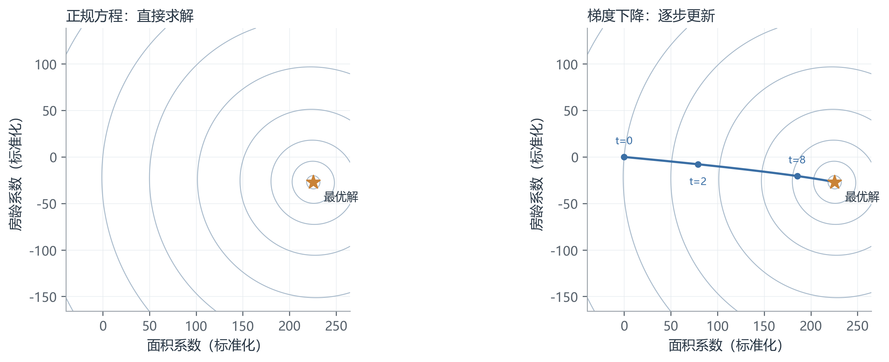

**图2　正规方程解与梯度下降轨迹。** 左图标出正规方程给出的最优点，右图绘制同一标准化目标下的真实梯度下降轨迹，并标注第 0、2、8 次更新位置。等高线表示固定最优截距后的损失水平。

由于两个标准化特征的相关性很弱，等高线接近圆形，梯度下降路径也接近直线。该结果由数据决定，不需要人为绘制弯曲或振荡路径来模仿示意图。

### 1.4.3 参数、模型表达式与预测结果比较

**表2　两种方法的原单位参数。** 差异列为绝对差异，截距单位为元/月，面积系数单位为元/月/平方米，房龄系数单位为元/月/年。

| 参数 | 正规方程 | 梯度下降 | 绝对差异 |
| --- | --- | --- | --- |
| 截距 | 1514.047218852 | 1514.047218911 | 5.916e-08 |
| 面积系数 | 26.493484062 | 26.493484061 | 1.186e-09 |
| 房龄系数 | -13.473255475 | -13.473255472 | 3.279e-09 |

最终无正则模型为：

$$
\boxed{\hat y=1514.047219+26.493484a-13.473255h}.
$$

在其他特征固定的条件下，面积增加 1 平方米对应预测租金增加约 26.49 元/月，房龄增加 1 年对应预测租金减少约 13.47 元/月。截距对应面积和房龄均为零的外推情形，超出了本数据范围，不宜单独赋予实际经济解释。

**表3　训练与测试误差。** 训练 MSE 和测试 MSE 的单位均为元²/月²，RMSE 的单位为元/月。

| 方法 | 训练 MSE | 训练 RMSE | 测试 MSE | 测试 RMSE |
| --- | --- | --- | --- | --- |
| 正规方程 | 14583.308742 | 120.761371 | 14915.719423 | 122.129928 |
| 批量梯度下降 | 14583.308742 | 120.761371 | 14915.719423 | 122.129928 |

基准梯度下降经过 111 次更新满足停止条件。两种方法在测试集上的最大预测差异为 $2.729\times10^{-8}$ 元，说明手写梯度下降与正规方程在数值精度内求得同一模型。测试集仅用于此处的最终评价，不用于选择学习率或正则强度。

为了清楚展示两个系数，采用条件回归直线：面积子图固定房龄为训练均值，房龄子图固定面积为训练均值。背景散点使用同一个正规方程基准扣除另一特征的影响：

$$
y_i^{(a)}=y_i-\beta_h^{\mathrm{ref}}(h_i-\bar h),
\qquad
y_i^{(h)}=y_i-\beta_a^{\mathrm{ref}}(a_i-\bar a).
$$

散点属于校正后的租金，不是原始租金；所有实验复用这组散点，保证比较口径一致。图中的参考线称为正规方程解，不称为未知的真实生成直线。

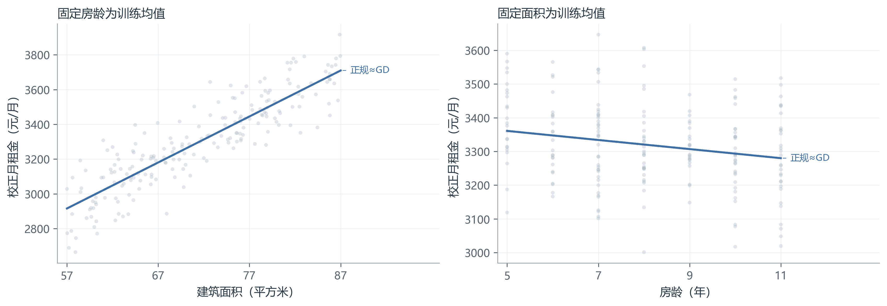

**图3　两种求解方法的条件回归直线。** 左图固定房龄为 8.098889 年，右图固定面积为 72.254539 平方米。灰色虚线与蓝色实线分别对应正规方程和梯度下降，二者重合，采用合并标注；精确差异见表2。

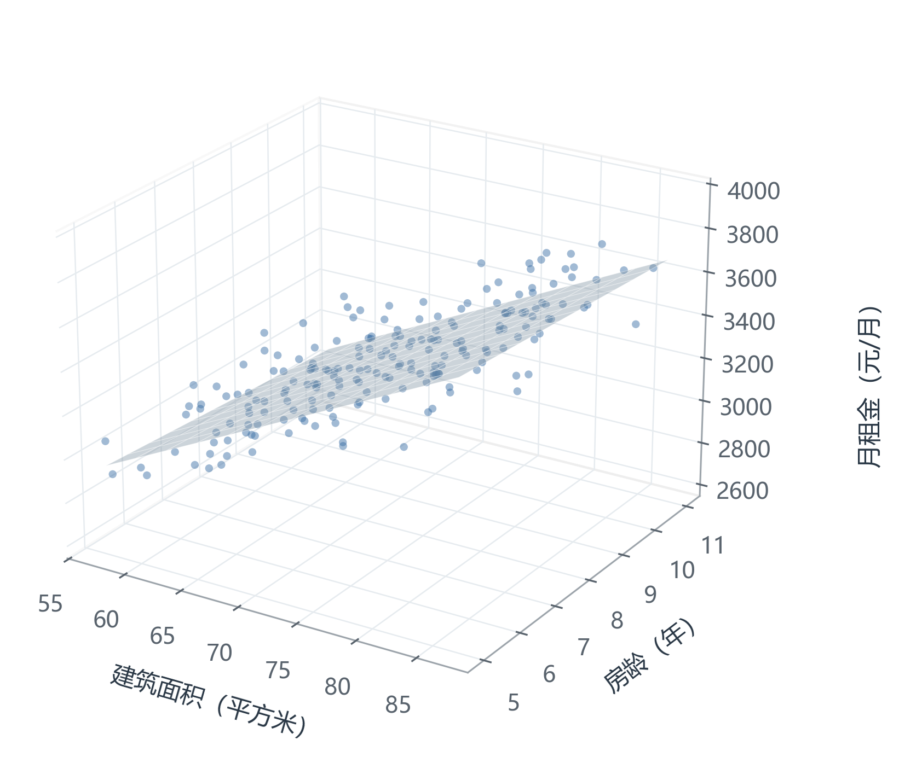

**图4　房源样本与双特征回归平面。** 三维坐标分别为面积、房龄和月租金，半透明平面为最终拟合模型，散点为固定抽取的 200 条训练记录。平面随面积上升，随房龄增加而下降；样本围绕平面分布，表明线性模型仍存在拟合残差。

## 1.5 梯度下降的学习过程

### 1.5.1 拟合关系如何随迭代变化

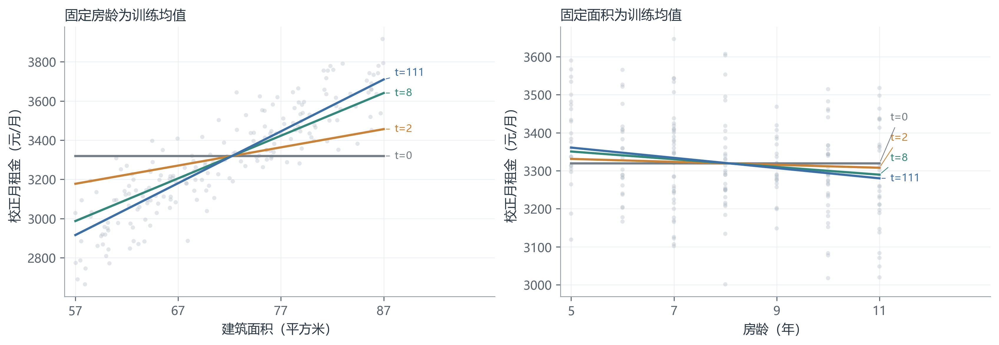

**图5　梯度下降迭代中的条件回归直线。** 叠加第 0、2、8 和 111 次更新后的模型。每根线旁直接标注迭代次数，左、右子图分别展示面积系数与房龄系数的变化。

初始模型只输出训练租金均值，因而两条条件回归线均为水平线。随着迭代进行，面积系数逐步变为正值，房龄系数逐步变为负值，最终接近正规方程解。由于特征已中心化且截距保持为租金均值，每组条件回归直线均经过相应的训练均值位置。

### 1.5.2 损失下降与参数收敛

定义相对于最优目标的归一化差距：

$$
q_t=\frac{J(\boldsymbol\theta^{(t)})-J(\boldsymbol\theta^*)}
{J(\boldsymbol\theta^{(0)})-J(\boldsymbol\theta^*)}.
$$

同时计算标准化坐标下的相对参数误差：

$$
e_t=\frac{\|\boldsymbol\theta^{(t)}-\boldsymbol\theta^*\|_2}
{\|\boldsymbol\theta^{(0)}-\boldsymbol\theta^*\|_2}.
$$

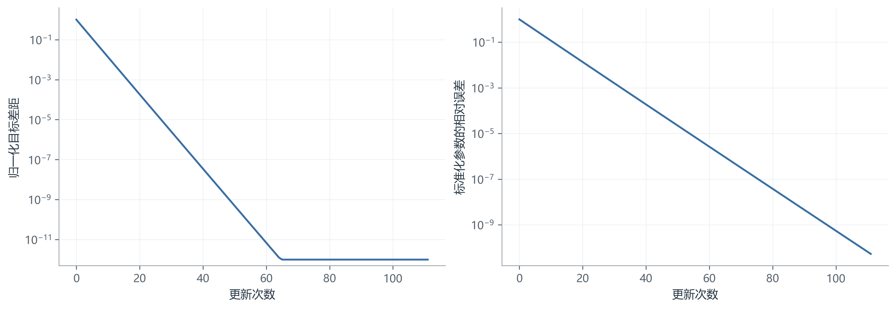

**图6　损失下降与参数误差。** 左图为归一化目标差距，右图为相对参数误差，纵轴采用对数尺度。目标差距低于 $10^{-12}$ 时按该下限显示，以避免对接近浮点精度的差值取对数；左图末端的平台不表示算法在该处停止。

两项指标均持续下降，表明优化过程既降低目标，也接近正确参数。基准实验在第 43 次更新时达到 $q_t\le10^{-8}$，随后继续迭代至第 111 次满足更严格的梯度停止条件。因此，“达到某一目标精度所需次数”和“算法停止次数”应分别报告。

## 1.6 标准化对梯度下降的影响

### 1.6.1 相同步长与适配步长的对照

本节设置未标准化、仅中心化、标准化三种处理方式。未标准化也已经完成面积单位换算，仅使用平方米和年；仅中心化减去训练均值但不改变尺度；标准化进一步除以训练标准差。三者使用同一训练集和相同的初始预测 $\bar y$。

**表4　预处理、步长与收敛情况。** 此处条件数均针对包含截距的完整 Hessian。目标精度采用 $q_t\le10^{-8}$，停止条件仍使用梯度阈值。

| 处理方式 | 条件数 | 学习率 | 目标精度次数 | 停止次数 | 状态 |
| --- | --- | --- | --- | --- | --- |
| 未标准化，各自步长 | 469164 | 3.73204785e-05 | 未达到 | 20000 | 达到上限 |
| 仅中心化，各自步长 | 72.4381 | 0.00276097983 | 627 | 1979 | 收敛 |
| 标准化，各自步长 | 1.05067 | 0.195177649 | 43 | 111 | 收敛 |
| 未标准化，共用标准化步长 | 469164 | 0.195177649 | 未达到 | 3 | 发散 |

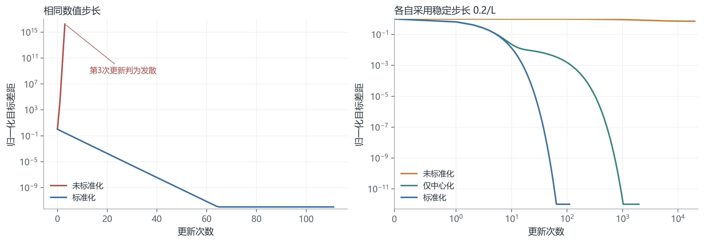

**图7　标准化前后的梯度下降收敛。** 左图对未标准化和标准化数据使用相同数值步长 $\alpha=0.195178$，未标准化实验在第 3 次更新后触发发散阈值。右图分别使用各自的 $0.2/L$，横轴采用保留零点的对称对数尺度；三条曲线均对应同一个最小二乘问题。

未标准化时，较大的最大曲率使适宜步长远小于标准化情形。直接使用标准化后的步长会导致发散；即使缩小到稳定步长，最小曲率方向上的进展仍很慢。20,000 次更新后，未标准化实验的训练 MSE 仍为 51,163.558270，目标差距比例仍约为 0.7133，尚未充分收敛。

仅中心化后，达到目标精度所需次数降为 627；进一步标准化后仅需 43。由此可见，本数据上的改善既包含中心化消除较大均值影响的作用，也包含尺度调整平衡曲率的作用，不能把全部差异归因于简单的单位换算。

### 1.6.2 损失曲面与参数更新方向

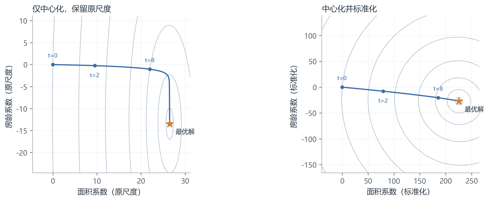

**图8　特征尺度与损失曲面的几何关系。** 左图采用仅中心化数据，右图进一步标准化；两图截距均保持为训练租金均值，因而二维等高线与两个斜率的实际更新严格对应。斜率子问题的 Hessian 条件数分别为 17.735977 和 1.050667。两侧参数坐标的单位不同，应结合各自刻度理解。

仅中心化后，等高线呈狭长椭圆，算法先沿高曲率方向快速调整，再沿低曲率方向缓慢前进。标准化后等高线接近圆形，统一步长能够更均衡地调整两个方向。

这里的条件数仅针对两个斜率。表4针对含截距的三个参数，二者计算对象不同；完全未经中心化的数据也没有被错误地投影成二维优化路径。

### 1.6.3 相同迭代预算下的模型比较

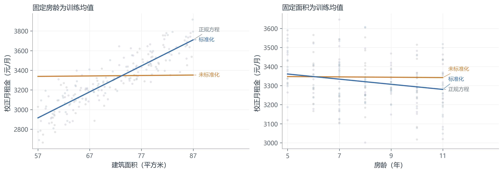

**图9　100 次更新后的条件回归关系。** 比较各自采用稳定步长的未标准化、标准化模型，同时保留正规方程参考线。左、右子图分别展示两个特征的条件关系。

未标准化模型此时的面积与房龄系数约为 0.456499 和 -0.895163，仍远离最优值；训练 MSE 为 64,714.765354。标准化模型的训练 MSE 已达到 14,583.308742，对应直线与正规方程几乎重合。标准化改善了有限迭代预算下的拟合程度，但并没有创造一个不同的无正则最优预测模型。

## 1.7 学习率对收敛速度与稳定性的影响

固定标准化数据、初始参数和无正则目标，仅改变学习率：

$$
\alpha=\frac{c}{L},
\qquad
c\in\{0.05,0.2,1.0,1.8,2.2\}.
$$

**表5　不同学习率的求解结果。** “目标精度次数”指首次满足 $q_t\le10^{-8}$ 的更新次数，不等同于最后停止次数。

| 步长因子 c | 学习率 | 目标精度次数 | 停止次数 | 状态 |
| --- | --- | --- | --- | --- |
| 0.05 | 0.048794412 | 187 | 481 | 收敛 |
| 0.2 | 0.195177649 | 43 | 111 | 收敛 |
| 1 | 0.975888247 | 3 | 8 | 收敛 |
| 1.8 | 1.756598844 | 40 | 104 | 收敛 |
| 2.2 | 2.146954143 | 未达到 | 80 | 发散 |

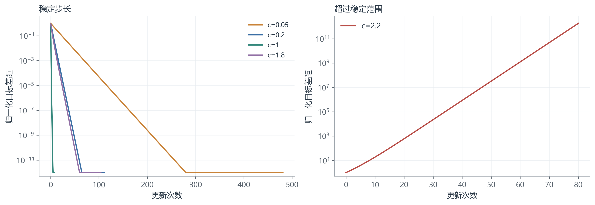

**图10　不同学习率的收敛与发散。** 左图比较四个稳定步长，右图单独展示 $c=2.2$ 的发散过程。左右子图纵轴范围不同，目的分别是辨认收敛速度与显示目标上升。

当 $c=0.05$ 时，每步较小，达到停止条件需要 481 次更新；$c=1$ 时仅需 8 次，是本次预设网格中最快的设置。$c=1.8$ 仍在理论稳定区间内，但并不比 $c=1$ 更快。$c=2.2$ 超过 $0<c<2$ 的稳定范围，并在第 80 次更新后触发发散阈值。因此，学习率与速度不是简单的单调关系。

在 Hessian 特征方向上，误差每步乘以 $1-\alpha\lambda_j$。若该值为负，参数会交替跨越最优位置；只要绝对值小于 1，该方向仍会收敛。参数交替变化并不必然导致损失上下振荡，本实验的稳定大步长损失仍下降。

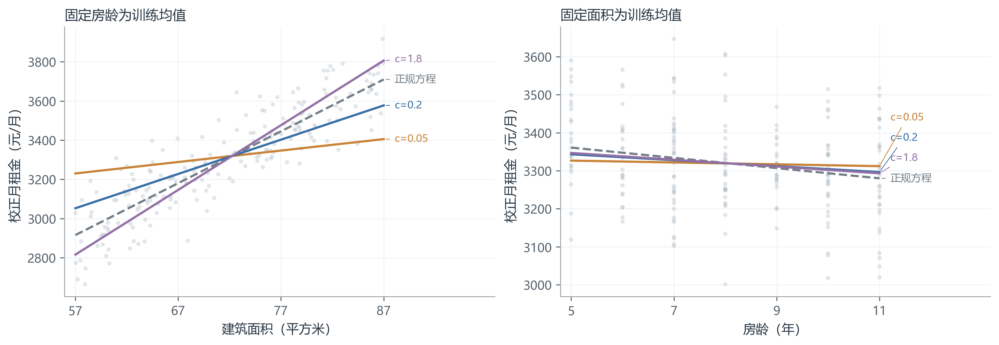

**图11　第 5 次更新时不同学习率的模型。** 使用 $c=0.05$、$0.2$、$1.8$ 三种设置，与正规方程参考线比较。各条直线直接标注其 $c$ 值。

面积方向上，小步长尚未形成充分斜率，较大步长已经跨过最优面积系数。房龄方向的具体变化还受两个特征之间的耦合影响，不能假定每个系数在同一时刻都以同样方式跨越。由于所有稳定设置最终会收敛到同一模型，比较固定早期迭代比重叠展示所有最终直线更有解释力。

## 1.8 正则化对梯度下降求解过程的影响

### 1.8.1 统一目标、实验设置与比较原则

在标准化特征矩阵 $Z$ 上定义：

$$
F(b,\boldsymbol w)=\frac{1}{2n}\left\|b\boldsymbol1+Z\boldsymbol w-\boldsymbol y\right\|_2^2
+\lambda_1\|\boldsymbol w\|_1+\frac{\lambda_2}{2}\|\boldsymbol w\|_2^2.
$$

截距不参与惩罚。惩罚作用于标准化坐标中的斜率，以避免特征单位不同造成不对称惩罚。还原后的原单位截距可以随斜率变化，这不表示截距被直接惩罚。

为了给不同惩罚设置有依据的强度尺度，定义：

$$
g_{\max}=\left\|\frac{1}{n}Z^{\mathsf T}(\boldsymbol y-\bar y\boldsymbol1)\right\|_\infty,
\qquad
L_Z=\lambda_{\max}\left(\frac{1}{n}Z^{\mathsf T}Z\right).
$$

本数据中，$g_{\max}=224.810404$，$L_Z=1.024707$。采用 $r\in\{0.01,0.1,1\}$：

**表6　正则化定义与强度换算。**

| 方法 | L1 系数 | L2 系数 | 手写求解方式 |
|---|---|---|---|
| L1 | $\lambda_1=r g_{\max}$ | $\lambda_2=0$ | 近端梯度 |
| L2 | $\lambda_1=0$ | $\lambda_2=rL_Z$ | 批量梯度下降 |
| Elastic Net | $\lambda_1=0.5r g_{\max}$ | $\lambda_2=0.5rL_Z$ | 近端梯度 |

这里的相对强度用于覆盖弱、中、强三种状态，不表示各惩罚具有完全相同的约束程度。Elastic Net 的两个 0.5 是此处归一化方案的系数，并不等于参考库所用的 `l1_ratio=0.5`；参考库参数按实际 $\lambda_1$、$\lambda_2$ 换算。

所有实验以 $0.2/L_{\mathrm{smooth}}$ 为步长，其中最大曲率包含 L2 部分但不包含不可微的 L1 部分。正则化实验仅分析训练目标、参数和求解过程，不使用测试集筛选强度。

### 1.8.2 L2 正则化：参数收缩与曲率变化

L2 为梯度增加一个与当前参数成比例的项：

$$
\boldsymbol w^{(t+1)}=\boldsymbol w^{(t)}
-\alpha\left[\frac{1}{n}Z^{\mathsf T}
(b^{(t)}\boldsymbol1+Z\boldsymbol w^{(t)}-\boldsymbol y)
+\lambda_2\boldsymbol w^{(t)}\right].
$$

对两个斜率构成的子问题，Hessian 从 $H_w$ 变为 $H_w+\lambda_2I$，条件数变为：

$$
\kappa_{\lambda_2}=\frac{\lambda_{\max}(H_w)+\lambda_2}
{\lambda_{\min}(H_w)+\lambda_2}.
$$

L2 可以改善斜率子问题的条件数，但也提高最大曲率，需要调整步长。该结论不能不加区分地套用到截距不受惩罚的完整 Hessian。本题截距始终停留在最优位置，实际动态由两个斜率决定。

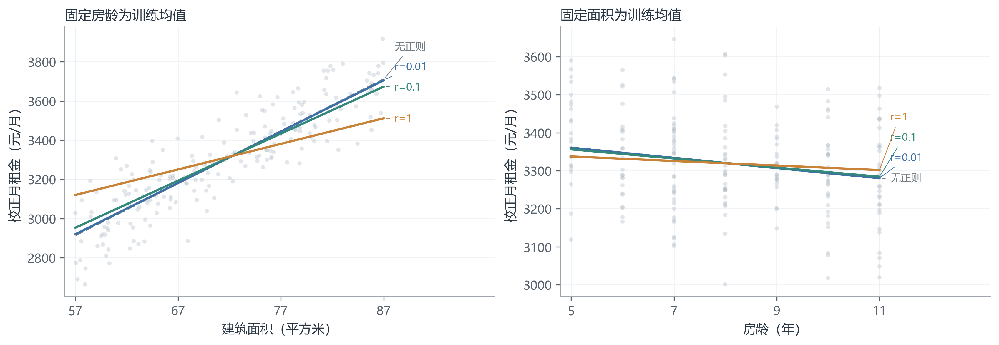

**图12　不同 L2 强度下的条件回归直线。** 灰色虚线为无正则模型，其他三条线分别对应弱、中、强 L2 惩罚。

当 $r=1$ 时，面积系数由 26.493484 减小到 13.063327，房龄系数由 -13.473255 变为 -5.964456，两个系数均保留非零值。训练 MSE 上升至 27,793.106566，说明惩罚牺牲了一部分样本拟合以换取更小的系数。标准化后原始条件数已接近 1，三个强度的停止次数分别为 111、111、109，且达到各自相同目标差距精度均需 43 次；本实验没有观察到显著的优化加速。

### 1.8.3 L1 正则化：软阈值更新与稀疏解

L1 在零点不可微，不能直接当作普通光滑梯度项处理。本实验采用近端梯度法，先对光滑部分做梯度更新：

$$
\boldsymbol u^{(t)}=\boldsymbol w^{(t)}
-\alpha\left[\frac{1}{n}Z^{\mathsf T}
(b^{(t)}\boldsymbol1+Z\boldsymbol w^{(t)}-\boldsymbol y)
+\lambda_2\boldsymbol w^{(t)}\right],
$$

再逐元素执行软阈值：

$$
\boldsymbol w^{(t+1)}=S_{\alpha\lambda_1}(\boldsymbol u^{(t)}),
\qquad
S_\tau(u)=\operatorname{sign}(u)\max(\lvert u\rvert-\tau,0).
$$

纯 L1 时令 $\lambda_2=0$。当某个更新分量的绝对值不超过阈值，它会被直接置为零，这与 L2 的连续收缩不同。

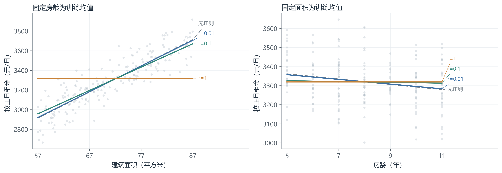

**图13　不同 L1 强度下的条件回归直线。** 中等强度显著削弱房龄作用，最强设置下两条直线均变为水平线。

当 $r=0.1$ 时，面积系数为 23.785126，房龄系数为 -2.071147，后者已经较小，但尚未归零。当 $r=1$ 时，$\lambda_1=g_{\max}$，零斜率满足最优性条件，两个系数均为零。初始截距已设为租金均值，因此算法在第 0 次更新即满足停止条件。

这个“零次更新”表示初始模型恰好就是强惩罚目标的最优解，并不说明它比无正则模型更善于拟合。其训练 MSE 为 65,864.460469，等于只预测训练均值时的误差。

本次只测试了三个非零强度，因此图13不用于确定各系数精确归零的临界位置。

### 1.8.4 Elastic Net：收缩与稀疏的结合

Elastic Net 同时保留 L1 与 L2 项，使用上面的同一近端更新：L2 进入光滑梯度，L1 通过软阈值实现。若将 $\lambda_1$ 设为零，更新退化为 L2 梯度下降；两项均为零时退化为普通梯度下降。

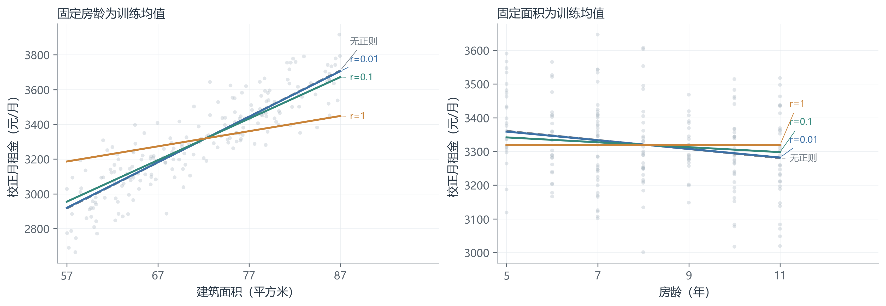

**图14　不同 Elastic Net 强度下的条件回归直线。** 随相对强度增加，面积方向逐渐变平，最强设置的房龄方向成为水平线。

当 $r=1$ 时，面积系数为 8.732882，房龄系数为零，训练 MSE 为 37,970.697204。该结果表明，在本次强度换算下，Elastic Net 保留面积特征而消除房龄项。由于三种方法的惩罚形式和尺度不同，不能只凭这一结果断言 Elastic Net 普遍优于 L1 或 L2。

### 1.8.5 不同正则化方法的综合比较

**表7　正则化实验结果。** 系数均还原到原单位；非零系数个数仅统计两个斜率，阈值为 $10^{-8}$。除注明初始最优的情形外，各算法均正常收敛。

| 方法 | $r$ | $\lambda_1$ | $\lambda_2$ | 面积系数 | 房龄系数 | 训练 MSE | 非零数 | 停止次数 |
| --- | --- | --- | --- | --- | --- | --- | --- | --- |
| 无正则 | 0 | 0 | 0 | 26.493484 | -13.473255 | 14583.308742 | 2 | 111 |
| L2 | 0.01 | 0 | 0.010247 | 26.223802 | -13.308827 | 14588.649657 | 2 | 111 |
| L2 | 0.1 | 0 | 0.102471 | 24.023101 | -11.987884 | 15031.264021 | 2 | 111 |
| L2 | 1 | 0 | 1.024707 | 13.063327 | -5.964456 | 27793.106566 | 2 | 109 |
| L1 | 0.01 | 2.248104 | 0 | 26.222648 | -12.333045 | 14593.672755 | 2 | 111 |
| L1 | 0.1 | 22.481040 | 0 | 23.785126 | -2.071147 | 15619.709972 | 2 | 111 |
| L1 | 1 | 224.810404 | 0 | 0 | 0 | 65864.460469 | 0 | 0（初始最优） |
| Elastic Net | 0.01 | 1.124052 | 0.005124 | 26.223243 | -12.823425 | 14590.175240 | 2 | 111 |
| Elastic Net | 0.1 | 11.240520 | 0.051235 | 23.911266 | -7.271886 | 15209.851734 | 2 | 111 |
| Elastic Net | 1 | 112.405202 | 0.512354 | 8.732882 | 0 | 37970.697204 | 1 | 106 |

为了公平观察求解进度，各方法的归一化目标差距使用自己的 $F^*$：

$$
q_t^{(F)}=\frac{F(\boldsymbol\theta^{(t)})-F^*}
{F(\boldsymbol\theta^{(0)})-F^*}.
$$

无正则与 L2 的参考解由相应正规方程计算；L1 与 Elastic Net 的参考解由独立库以严格容差求得，仅用于校验和计算参考目标，不参与手写迭代更新。若初始点已最优，则单独记录该情形，不计算零分母比值。

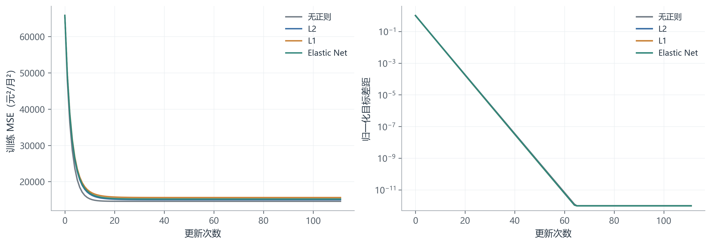

**图15　中等正则强度下的拟合损失与目标收敛。** 左图展示可直接比较的数据拟合 MSE；右图展示各自目标的归一化差距。正则方法均取 $r=0.1$，并与无正则基准比较。右图多条曲线接近重合，是实际结果。

中等强度下，各方法达到 $q_t^{(F)}\le10^{-8}$ 均需 43 次更新，最终停止次数均为 111。其收敛形状相近，与本数据标准化后的良好条件数及按各自最大曲率设置步长有关。不同方法最终训练误差不同，源于各自优化目标包含不同惩罚，不能把训练误差较大解释为求解没有收敛。

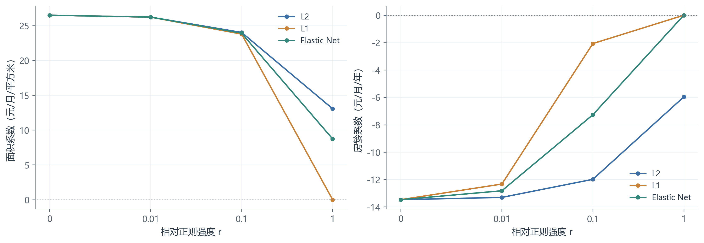

**图16　正则强度与原单位回归系数。** 左图为面积系数，右图为房龄系数。每个点对应实际求解结果，连线仅辅助阅读，不表示精确的连续正则路径。横轴保留零强度基准，并对正强度使用对数式间距。

L2 在所测试范围内连续缩小两个系数；L1 在最强设置下令两个系数同时为零；Elastic Net 在最强设置下仅消除房龄系数。该对照展示的是参数收缩、稀疏性与优化行为。本题没有通过验证集选择最优正则强度，也没有证据据此宣称某种正则方法改善了测试泛化性能。

此外，提前停止迭代本身可以产生隐式正则化效果，但本题主要分析收敛过程，未将早停作为单独调参实验，以免混淆“尚未求解充分”和“有意施加正则”的两种情形。

## 1.9 程序组织与实验复现

### 1.9.1 模块与配置

程序由四个模块组成：`model.py` 负责数据准备、算法和指标；`run.py` 负责 YAML 配置和实验管理；`plot.py` 读取保存结果绘图；`verify.py` 进行数学与数值校验。管理器仅负责运行和记录，不包含复杂继承或插件机制。

所有图均从已保存的实验历史生成，调整图形无需重新训练。每次完整运行使用独立目录，保存实际配置、参数、完整迭代历史、结果表、环境版本和原始 CSV 的 SHA-256。正则化实验只记录训练指标；只有无正则求解比较输出测试集预测。

实际环境为 **medsafety**，软件版本如下：

| 软件 | 版本 |
| --- | --- |
| Python | 3.10.20 |
| numpy | 2.2.6 |
| matplotlib | 3.10.9 |
| PyYAML | 6.0.3 |
| scikit-learn | 1.7.2 |
| scipy | 1.15.3 |

每个实验从相同初始预测出发，训练算法是确定性的；随机种子 42 仅用于显示散点的固定抽样。坐标图使用 Microsoft YaHei 字体，换用其他系统时可在绘图样式函数中选择可用中文字体。

### 1.9.2 运行方法

将代码目录作为当前工作目录，在终端中执行：

```powershell
conda activate medsafety
python run.py
```

首次完整执行会在 `results` 下新建带时间戳的目录。也可以指定一个尚不存在的目录名：

```powershell
python run.py --output results/new_experiment
python verify.py results/new_experiment
```

只运行某一实验组时，程序仍会自动生成正规方程和梯度下降基准：

```powershell
python run.py --group scaling
python run.py --group learning_rate
python run.py --group regularization
```

对本次交付的已有结果，只需重新绘图或校验：

```powershell
python run.py --plot-only results/complete
python verify.py results/complete
```

`--no-plots` 可用于只运行数值实验。配置中的实际实验组可以调整；绘图默认比较最多四条稳定学习率曲线，条件拟合图展示最多三个正则强度。论文使用的预设配置与完整结果均已保留。

### 1.9.3 正确性核验

程序完成以下独立核验：参数还原前后预测一致；正规方程与收敛梯度下降预测差异满足阈值；L2 解与正则化正规方程一致；L1、Elastic Net 与独立参考结果及 KKT 条件一致；零正则近端法退化正确；相同设置重新运行可精确复现基准迭代历史；发散和达到迭代上限被正确区分。

- 全部模型参数还原后的预测一致；收敛解通过独立参考与 KKT 检验。
- 正规方程与梯度下降测试预测最大差异 2.729e-08 元。
- 零正则近端法退化正确；基准梯度下降逐步历史可精确复现。
- 强 L1 的初始最优点正确记录为 0 次更新。
- 发散与迭代上限状态正确区分。
- 全部18个实验再次运行后，参数、指标、状态及逐步历史完全一致。

另外，全部 18 个实验已再次运行进行数值复现核对。表格、图像与模型表达式均来自保存结果，正文没有把未收敛状态解释为最优解。

### 1.9.4 完整代码与配置

以下清单为实际运行文件的完整内容。训练、管理、绘图和验证代码均放在正文，复制时按清单标题保存为对应文件即可。

#### 代码清单1：configs/q1.yaml

```yaml
data:
  train: data/A_train.csv
  test: data/A_test.csv
base:
  seed: 42
  max_iter: 20000
  tol: 1.0e-8
  step_factor: 0.2
  divergence_ratio: 1.0e+12
experiments:
  learning_rate: [0.05, 1.0, 1.8, 2.2]
  regularization: [0.01, 0.1, 1.0]
figures:
  sample_count: 200
  dpi: 300
  snapshots: [0, 2, 8]
  scaling_budget: 100
  learning_rate_step: 5
output:
  root: results
```

#### 代码清单2：model.py

```python
"""第一题的线性回归模型：所有训练算法均由 NumPy 实现。"""

import csv
import numpy as np


def load_data(path):
    """面积由平方分米换成平方米，房源编号仅作记录。"""
    with open(path, encoding="utf-8-sig", newline="") as file:
        rows = list(csv.DictReader(file))
    ids = [row["listing_id"] for row in rows]
    x = np.array([[float(row["area_dm2"]) / 100,
                   float(row["building_age_years"])] for row in rows])
    y = np.array([float(row["monthly_rent"]) for row in rows])
    if not np.isfinite(x).all() or not np.isfinite(y).all():
        raise ValueError("数据含缺失值或非有限数值。")
    if len(set(ids)) != len(ids):
        raise ValueError("房源编号重复。")
    return ids, x, y


def prepare_features(x, mode):
    """只在训练集调用；测试集复用返回的均值和标准差。"""
    if mode not in {"none", "center", "standard"}:
        raise ValueError("未知的预处理方式。")
    shift = x.mean(axis=0) if mode != "none" else np.zeros(x.shape[1])
    scale = x.std(axis=0) if mode == "standard" else np.ones(x.shape[1])
    if np.any(scale == 0):
        raise ValueError("特征标准差为零。")
    return design_matrix(x, shift, scale), shift, scale


def design_matrix(x, shift, scale):
    z = (x - shift) / scale
    return np.column_stack([np.ones(len(x)), z])


def original_parameters(theta, shift, scale):
    slopes = theta[1:] / scale
    intercept = theta[0] - shift @ slopes
    return np.r_[intercept, slopes]


def normal_equation(X, y, l2=0.0):
    penalty = np.diag([0.0, l2, l2])
    hessian = X.T @ X / len(y) + penalty
    return np.linalg.solve(hessian, X.T @ y / len(y))


def objective_gradient(X, y, theta, l1=0.0, l2=0.0):
    residual = X @ theta - y
    data_loss = np.mean(residual ** 2) / 2
    penalty = l1 * np.abs(theta[1:]).sum()
    penalty += l2 * np.sum(theta[1:] ** 2) / 2
    gradient = X.T @ residual / len(y)
    gradient[1:] += l2 * theta[1:]
    return data_loss, penalty, gradient


def soft_threshold(values, threshold):
    return np.sign(values) * np.maximum(np.abs(values) - threshold, 0)


def gradient_descent(X, y, alpha, max_iter=20000, tol=1e-8,
                     l2=0.0, divergence_ratio=1e12):
    """批量梯度下降；l2=0 时就是普通最小二乘。"""
    theta = np.array([y.mean(), 0.0, 0.0])
    history = []
    initial_loss = np.var(y) / 2
    status = "max_iter"
    for step in range(max_iter + 1):
        with np.errstate(over="ignore", invalid="ignore"):
            loss, penalty, gradient = objective_gradient(X, y, theta, l2=l2)
        total = loss + penalty
        if not np.isfinite(total) or not np.isfinite(gradient).all():
            status = "diverged"
            break
        norm = np.max(np.abs(gradient))
        history.append([step, loss, penalty, total, norm, *theta])
        if total > max(initial_loss, 1) * divergence_ratio:
            status = "diverged"
            break
        if norm <= tol:
            status = "converged"
            break
        if step < max_iter:
            theta = theta - alpha * gradient
    history = np.asarray(history)
    return history[-1, 5:].copy(), history, status


def proximal_gradient(X, y, alpha, l1, l2=0.0,
                      max_iter=20000, tol=1e-8, divergence_ratio=1e12):
    """L1/Elastic Net：先更新光滑部分，再对斜率做软阈值。"""
    theta = np.array([y.mean(), 0.0, 0.0])
    history = []
    initial_loss = np.var(y) / 2
    status = "max_iter"
    for step in range(max_iter + 1):
        with np.errstate(over="ignore", invalid="ignore"):
            loss, penalty, gradient = objective_gradient(X, y, theta, l1, l2)
            next_theta = theta - alpha * gradient
            next_theta[1:] = soft_threshold(next_theta[1:], alpha * l1)
        total = loss + penalty
        if not np.isfinite(total) or not np.isfinite(next_theta).all():
            status = "diverged"
            break
        norm = np.max(np.abs(theta - next_theta)) / alpha
        history.append([step, loss, penalty, total, norm, *theta])
        if total > max(initial_loss, 1) * divergence_ratio:
            status = "diverged"
            break
        if norm <= tol:
            status = "converged"
            break
        if step < max_iter:
            theta = next_theta
    history = np.asarray(history)
    return history[-1, 5:].copy(), history, status


def reference_solution(X, y, l1=0.0, l2=0.0):
    """独立校验用；不参与手写算法的参数更新。"""
    if l1 == 0:
        return normal_equation(X, y, l2)
    from sklearn.linear_model import Lasso, ElasticNet
    settings = dict(fit_intercept=False, tol=1e-13, max_iter=100000)
    if l2 == 0:
        estimator = Lasso(alpha=l1, **settings)
    else:
        estimator = ElasticNet(alpha=l1 + l2,
                               l1_ratio=l1 / (l1 + l2), **settings)
    estimator.fit(X[:, 1:], y - y.mean())
    return np.r_[y.mean(), estimator.coef_]


def prediction_metrics(y, prediction):
    mse = np.mean((y - prediction) ** 2)
    return {"mse": float(mse), "rmse": float(np.sqrt(mse))}
```

#### 代码清单3：run.py

```python
"""YAML 配置驱动的轻量实验管理器。"""

import argparse
import csv
import hashlib
import json
import platform
from datetime import datetime
from importlib.metadata import version
from pathlib import Path
import numpy as np
import yaml
from model import (load_data, prepare_features, design_matrix,
                   original_parameters, normal_equation, gradient_descent,
                   proximal_gradient, reference_solution, objective_gradient,
                   prediction_metrics)

BASE = Path(__file__).resolve().parent
HISTORY_COLUMNS = "step,data_loss,penalty,objective,optimality,b,w_area,w_age"


def save_json(path, value):
    path.write_text(json.dumps(value, ensure_ascii=False, indent=2,
                               allow_nan=False), encoding="utf-8")


class ExperimentManager:
    def __init__(self, config_path, output=None):
        self.config = yaml.safe_load(Path(config_path).read_text(encoding="utf-8"))
        self.base = self.config["base"]
        self.train_path = BASE / self.config["data"]["train"]
        self.test_path = BASE / self.config["data"]["test"]
        self.ids, self.x, self.y = load_data(self.train_path)
        self.test_ids, self.x_test, self.y_test = load_data(self.test_path)
        if set(self.ids) & set(self.test_ids):
            raise ValueError("训练集与测试集房源编号重叠。")
        stamp = datetime.now().strftime("%Y%m%d_%H%M%S_%f")
        self.output = Path(output) if output else BASE / self.config["output"]["root"] / stamp
        self.output.mkdir(parents=True, exist_ok=False)
        self.results = []

    def experiment_list(self, group):
        standard, _, _ = prepare_features(self.x, "standard")
        L = np.linalg.eigvalsh(standard.T @ standard / len(self.y))[-1]
        gmax = np.max(np.abs(standard[:, 1:].T @ (self.y-self.y.mean()) / len(self.y)))
        experiments = [dict(name="normal", method="normal", group="baseline"),
                       dict(name="baseline", group="baseline")]
        if group in {"all", "scaling"}:
            experiments += [dict(name="raw_adapted", mode="none", group="scaling"),
                            dict(name="center_adapted", mode="center", group="scaling"),
                            dict(name="raw_same", mode="none", group="scaling",
                                 alpha=self.base["step_factor"] / L)]
        if group in {"all", "learning_rate"}:
            for factor in self.config["experiments"]["learning_rate"]:
                experiments.append(dict(name=f"lr_{factor:g}", group="learning_rate",
                                        step_factor=factor))
        if group in {"all", "regularization"}:
            for kind in ["l1", "l2", "elastic"]:
                for strength in self.config["experiments"]["regularization"]:
                    l1 = strength * gmax if kind != "l2" else 0.0
                    l2 = strength * L if kind != "l1" else 0.0
                    if kind == "elastic":
                        l1, l2 = l1 / 2, l2 / 2
                    experiments.append(dict(name=f"{kind}_{strength:g}",
                                            group="regularization", kind=kind,
                                            strength=strength, l1=l1, l2=l2))
        return experiments

    def run_one(self, spec):
        mode = spec.get("mode", "standard")
        X, shift, scale = prepare_features(self.x, mode)
        l1, l2 = spec.get("l1", 0.0), spec.get("l2", 0.0)
        hessian = X.T @ X / len(self.y)
        hessian += np.diag([0.0, l2, l2])
        eigenvalues = np.linalg.eigvalsh(hessian)
        factor = spec.get("step_factor", self.base["step_factor"])
        alpha = spec.get("alpha", factor / eigenvalues[-1])
        reference = reference_solution(X, self.y, l1, l2)
        ref_loss, ref_penalty, _ = objective_gradient(X, self.y, reference, l1, l2)
        if spec.get("method") == "normal":
            theta = normal_equation(X, self.y)
            history = np.empty((0, 8))
            status = "analytic"
        else:
            options = dict(max_iter=self.base["max_iter"], tol=self.base["tol"],
                           divergence_ratio=self.base["divergence_ratio"])
            if l1 > 0:
                theta, history, status = proximal_gradient(X, self.y, alpha, l1, l2, **options)
            else:
                theta, history, status = gradient_descent(X, self.y, alpha, l2=l2, **options)
        beta = original_parameters(theta, shift, scale)
        metrics = prediction_metrics(self.y, X @ theta)
        result = dict(spec, mode=mode, alpha=float(alpha), l1=float(l1), l2=float(l2),
                      status=status, steps=int(history[-1, 0]) if len(history) else 0,
                      theta=theta.tolist(), beta=beta.tolist(), shift=shift.tolist(),
                      scale=scale.tolist(), reference=reference.tolist(),
                      reference_objective=float(ref_loss + ref_penalty),
                      condition=float(eigenvalues[-1] / eigenvalues[0]),
                      train_mse=metrics["mse"], train_rmse=metrics["rmse"],
                      nonzero=int(np.count_nonzero(np.abs(theta[1:]) > 1e-8)),
                      reference_error=float(np.max(np.abs(theta-reference))))
        if len(history):
            result["optimality"] = float(history[-1, 4])
        if spec["group"] == "baseline":
            X_test = design_matrix(self.x_test, shift, scale)
            prediction = X_test @ theta
            result["test"] = prediction_metrics(self.y_test, prediction)
            with (self.output / f"{spec['name']}_predictions.csv").open("w", newline="", encoding="utf-8") as file:
                writer = csv.writer(file)
                writer.writerow(["listing_id", "actual_rent", "predicted_rent"])
                writer.writerows(zip(self.test_ids, self.y_test, prediction))
        folder = self.output / spec["name"]
        folder.mkdir()
        np.savetxt(folder / "history.csv", history, delimiter=",", header=HISTORY_COLUMNS, comments="")
        save_json(folder / "result.json", result)
        self.results.append(result)
        print(f"{spec['name']:18s} {status:10s} steps={result['steps']:5d} MSE={metrics['mse']:.6f}")

    def run(self, group="all"):
        for spec in self.experiment_list(group):
            self.run_one(spec)
        np.savez_compressed(self.output / "data.npz", x=self.x, y=self.y,
                            x_test=self.x_test, y_test=self.y_test)
        resolved = dict(self.config, resolved_experiments=self.results)
        (self.output / "config.yaml").write_text(yaml.safe_dump(resolved, allow_unicode=True,
                                                              sort_keys=False), encoding="utf-8")
        save_json(self.output / "summary.json", self.results)
        packages = ["numpy", "matplotlib", "PyYAML", "scikit-learn", "scipy"]
        hashes = {p.name: hashlib.sha256(p.read_bytes()).hexdigest()
                  for p in [self.train_path, self.test_path]}
        save_json(self.output / "environment.json", dict(python=platform.python_version(),
                  packages={name: version(name) for name in packages}, data_sha256=hashes))
        with (self.output / "summary.csv").open("w", newline="", encoding="utf-8") as file:
            columns = ["name", "mode", "status", "steps", "alpha", "l1", "l2", "train_mse", "nonzero"]
            writer = csv.DictWriter(file, fieldnames=columns, extrasaction="ignore")
            writer.writeheader()
            writer.writerows(self.results)
        print("RESULTS:", self.output)
        return self.output


def main():
    parser = argparse.ArgumentParser()
    parser.add_argument("--config", default=str(BASE / "configs/q1.yaml"))
    parser.add_argument("--output")
    parser.add_argument("--group", choices=["all", "baseline", "scaling", "learning_rate", "regularization"], default="all")
    parser.add_argument("--plot-only", type=Path)
    parser.add_argument("--no-plots", action="store_true")
    args = parser.parse_args()
    if args.plot_only:
        output = args.plot_only
    else:
        output = ExperimentManager(args.config, args.output).run(args.group)
    if not args.no_plots:
        from plot import draw_all
        draw_all(output)


if __name__ == "__main__":
    main()
```

#### 代码清单4：plot.py

```python
"""读取实验结果生成论文插图；不执行训练。"""

import argparse
import json
from pathlib import Path
import matplotlib
matplotlib.use("Agg")
import matplotlib.pyplot as plt
import numpy as np
import yaml
from model import design_matrix, original_parameters

BLUE, ORANGE, GREEN, PURPLE = "#3B6FA5", "#C98338", "#33877B", "#9270A5"
GRAY, RED = "#747E87", "#B94E48"
COLORS = [BLUE, ORANGE, GREEN, PURPLE]


def set_style():
    plt.rcParams.update({"font.sans-serif": ["Microsoft YaHei", "DejaVu Sans"],
        "axes.unicode_minus": False, "font.size": 10, "axes.labelsize": 10.5,
        "axes.titlesize": 11, "axes.spines.top": False, "axes.spines.right": False,
        "axes.edgecolor": "#9BA3AA", "axes.linewidth": 0.7,
        "xtick.color": "#59636D", "ytick.color": "#59636D",
        "text.color": "#283644", "axes.labelcolor": "#283644",
        "grid.color": "#E6EBEF", "grid.linewidth": 0.6,
        "svg.fonttype": "none", "savefig.facecolor": "white"})


def two_axes():
    fig, axes = plt.subplots(1, 2, figsize=(11.2, 3.8), layout="constrained")
    for ax in axes:
        ax.grid(alpha=0.7)
        ax.set_axisbelow(True)
    return fig, axes


def end_labels(ax, x_end, endpoints):
    """仅调整文字位置，不移动曲线；短引线连接真实端点。"""
    low, high = ax.get_ylim()
    spacing = (high-low) * 0.075
    positions = []
    for y, text, color in sorted(endpoints):
        position = max(y, positions[-1][0]+spacing) if positions else y
        positions.append((position, y, text, color))
    overflow = max(0, positions[-1][0] - (high-spacing))
    dx = (ax.get_xlim()[1]-ax.get_xlim()[0]) * 0.025
    for position, y, text, color in positions:
        ax.annotate(text, (x_end, y), (x_end+dx, position-overflow),
                    fontsize=8.5, color=color, va="center",
                    arrowprops=dict(arrowstyle="-", color=color, lw=0.6))


class Figures:
    def __init__(self, output):
        self.output = Path(output)
        self.folder = self.output / "figures"
        self.folder.mkdir(exist_ok=True)
        self.config = yaml.safe_load((self.output / "config.yaml").read_text(encoding="utf-8"))
        self.results = {r["name"]: r for r in json.loads((self.output / "summary.json").read_text(encoding="utf-8"))}
        self.data = np.load(self.output / "data.npz")
        self.x, self.y = self.data["x"], self.data["y"]
        self.mean = self.x.mean(axis=0)
        self.reference = np.array(self.results["normal"]["beta"])
        rng = np.random.default_rng(self.config["base"]["seed"])
        count = min(self.config["figures"]["sample_count"], len(self.y))
        self.sample = rng.choice(len(self.y), count, replace=False)
        self.manifest = []

    def history(self, name):
        return np.loadtxt(self.output / name / "history.csv", delimiter=",", skiprows=1, ndmin=2)

    def beta(self, name, step=None):
        result = self.results[name]
        if step is None:
            return np.array(result["beta"])
        history = self.history(name)
        row = history[min(step, len(history)-1)]
        return original_parameters(row[5:], np.array(result["shift"]), np.array(result["scale"]))

    def gap(self, name):
        history = self.history(name)
        best = self.results[name]["reference_objective"]
        denominator = history[0, 3] - best
        if abs(denominator) < 1e-9:
            return history[:, 0], np.zeros(len(history))
        return history[:, 0], np.maximum((history[:, 3]-best)/denominator, 1e-12)

    def save(self, number, title, fig):
        stem = f"fig{number:02d}"
        for suffix in ["png", "svg"]:
            fig.savefig(self.folder / f"{stem}.{suffix}", dpi=self.config["figures"]["dpi"], bbox_inches="tight")
        plt.close(fig)
        self.manifest.append(dict(number=number, title=title, png=f"{stem}.png", svg=f"{stem}.svg"))
        print(stem, title)

    def conditional(self, entries):
        """entries: (原单位参数, 标签, 颜色, 线型)。"""
        fig, axes = two_axes()
        for j, ax in enumerate(axes):
            other = 1-j
            adjusted = self.y - self.reference[other+1] * (self.x[:, other]-self.mean[other])
            ax.scatter(self.x[self.sample, j], adjusted[self.sample], s=12,
                       color="#AEBAC4", alpha=0.35, edgecolors="none", rasterized=True)
            lo, hi = self.x[:, j].min(), self.x[:, j].max()
            grid = np.linspace(lo, hi, 100)
            endpoints = []
            for beta, label, color, style in entries:
                prediction = beta[0] + beta[j+1]*grid + beta[other+1]*self.mean[other]
                ax.plot(grid, prediction, color=color, linestyle=style, lw=1.8)
                if label:
                    endpoints.append((prediction[-1], label, color))
            ax.set_xlim(lo-(hi-lo)*0.035, hi+(hi-lo)*0.36)
            ax.set_xticks(np.linspace(lo, hi, 4))
            ax.xaxis.set_major_formatter(matplotlib.ticker.StrMethodFormatter("{x:.0f}"))
            ax.set_xlabel(["建筑面积（平方米）", "房龄（年）"][j])
            ax.set_ylabel("校正月租金（元/月）")
            ax.set_title(["固定房龄为训练均值", "固定面积为训练均值"][j], loc="left")
            end_labels(ax, hi, endpoints)
        return fig

    def loss_curve(self, ax, name, label, color, style="-"):
        steps, gap = self.gap(name)
        ax.plot(steps, gap, label=label, color=color, ls=style, lw=1.7)
        ax.set_yscale("log")
        ax.set_ylim(bottom=5e-13)
        ax.set_xlabel("更新次数")
        ax.set_ylabel("归一化目标差距")

    def contours(self, ax, name, trajectory=True):
        result = self.results[name]
        X = design_matrix(self.x, np.array(result["shift"]), np.array(result["scale"]))
        optimum = np.array(result["reference"])[1:]
        hessian = X[:, 1:].T @ X[:, 1:] / len(self.y)
        width = max(np.abs(optimum).max(), 1) * 1.35
        midpoint = optimum / 2
        a = np.linspace(midpoint[0]-width/2, midpoint[0]+width/2, 240)
        b = np.linspace(midpoint[1]-width/2, midpoint[1]+width/2, 240)
        aa, bb = np.meshgrid(a, b)
        da, db = aa-optimum[0], bb-optimum[1]
        excess = (hessian[0, 0]*da**2 + 2*hessian[0, 1]*da*db + hessian[1, 1]*db**2)/2
        start_loss = optimum @ hessian @ optimum / 2
        levels = start_loss * np.array([0.001, 0.01, 0.04, 0.12, 0.3, 0.6, 1, 1.7])
        ax.contour(aa, bb, excess, levels=levels, colors="#A8BACB", linewidths=0.7)
        if trajectory:
            history = self.history(name)
            ax.plot(history[:, 6], history[:, 7], color=BLUE, lw=1.7)
            for t in [0, 2, 8]:
                if t < len(history):
                    xy = history[t, 6:8]
                    ax.scatter(*xy, color=BLUE, s=17, zorder=4)
                    ax.annotate(f"t={t}", xy, xytext=(-7, 10 if t != 2 else -16),
                                textcoords="offset points", fontsize=8, color=BLUE)
        ax.scatter(*optimum, marker="*", s=120, color=ORANGE, zorder=5)
        ax.annotate("最优解", optimum, xytext=(8, -14), textcoords="offset points", fontsize=9)
        ax.set_aspect("equal", adjustable="box")
        ax.set_xlabel("面积系数" + ("（标准化）" if result["mode"] == "standard" else "（原尺度）"))
        ax.set_ylabel("房龄系数" + ("（标准化）" if result["mode"] == "standard" else "（原尺度）"))

    def baseline_figures(self):
        fig, axes = two_axes()
        for j, ax in enumerate(axes):
            ax.scatter(self.x[self.sample, j], self.y[self.sample], s=16,
                       color=BLUE, alpha=0.45, edgecolors="none")
            ax.set_xlabel(["建筑面积（平方米）", "房龄（年）"][j])
            ax.set_ylabel("月租金（元/月）")
        self.save(1, "房屋特征与月租金的样本分布", fig)
        fig, axes = two_axes()
        self.contours(axes[0], "baseline", False)
        self.contours(axes[1], "baseline", True)
        axes[0].set_title("正规方程：直接求解", loc="left")
        axes[1].set_title("梯度下降：逐步更新", loc="left")
        self.save(2, "正规方程解与梯度下降轨迹", fig)
        fig = self.conditional([(self.reference, "", GRAY, "--"),
                                (self.beta("baseline"), "正规≈GD", BLUE, "-")])
        self.save(3, "两种求解方法的条件回归直线", fig)
        fig = plt.figure(figsize=(6.8, 4.5), layout="constrained")
        ax = fig.add_subplot(111, projection="3d")
        points = self.x[self.sample]
        ax.scatter(points[:, 0], points[:, 1], self.y[self.sample], s=12,
                   color=BLUE, alpha=0.48, edgecolors="none")
        a, h = np.meshgrid(np.linspace(self.x[:, 0].min(), self.x[:, 0].max(), 12),
                           np.linspace(self.x[:, 1].min(), self.x[:, 1].max(), 12))
        rent = self.reference[0] + self.reference[1]*a + self.reference[2]*h
        ax.plot_surface(a, h, rent, color="#B2CADD", alpha=0.42, edgecolor="white", linewidth=0.25)
        ax.view_init(elev=23, azim=-58)
        ax.set_xlabel("建筑面积（平方米）", labelpad=8)
        ax.set_ylabel("房龄（年）", labelpad=6)
        ax.text2D(1.16, 0.5, "月租金（元/月）", transform=ax.transAxes,
                  rotation=90, va="center", fontsize=10.5)
        for axis in [ax.xaxis, ax.yaxis, ax.zaxis]:
            axis.pane.fill = False
        self.save(4, "房源样本与双特征回归平面", fig)
        steps = self.config["figures"]["snapshots"]
        last = self.results["baseline"]["steps"]
        entries = [(self.beta("baseline", t), f"t={t}", color, "-")
                   for t, color in zip(steps+[last], [GRAY, ORANGE, GREEN, BLUE])]
        self.save(5, "梯度下降迭代中的条件回归直线", self.conditional(entries))
        fig, axes = two_axes()
        self.loss_curve(axes[0], "baseline", "梯度下降", BLUE)
        history = self.history("baseline")
        reference = np.array(self.results["baseline"]["reference"])
        distance = np.linalg.norm(history[:, 5:]-reference, axis=1)
        axes[1].semilogy(history[:, 0], distance/distance[0], color=BLUE, lw=1.7)
        axes[1].set_xlabel("更新次数")
        axes[1].set_ylabel("标准化参数的相对误差")
        self.save(6, "损失下降与参数误差", fig)

    def scaling_figures(self):
        fig, axes = two_axes()
        for name, label, color in [("raw_same", "未标准化", RED), ("baseline", "标准化", BLUE)]:
            self.loss_curve(axes[0], name, label, color)
        axes[0].set_title("相同数值步长", loc="left")
        stopped = self.results["raw_same"]["steps"]
        axes[0].annotate(f"第{stopped}次更新判为发散", (stopped, self.gap("raw_same")[1][-1]),
                         xytext=(13, 5e8), fontsize=9, color=RED,
                         arrowprops=dict(arrowstyle="-", color=RED, lw=0.7))
        for name, label, color in [("raw_adapted", "未标准化", ORANGE),
                                    ("center_adapted", "仅中心化", GREEN),
                                    ("baseline", "标准化", BLUE)]:
            self.loss_curve(axes[1], name, label, color)
        axes[1].set_xscale("symlog", linthresh=1)
        axes[1].set_xlim(0, self.results["raw_adapted"]["steps"] * 1.15)
        axes[1].set_title("各自采用稳定步长 0.2/L", loc="left")
        for ax in axes:
            ax.legend(frameon=False, fontsize=9, loc="lower left")
        self.save(7, "标准化前后的梯度下降收敛", fig)
        fig, axes = two_axes()
        self.contours(axes[0], "center_adapted")
        self.contours(axes[1], "baseline")
        axes[0].set_title("仅中心化，保留原尺度", loc="left")
        axes[1].set_title("中心化并标准化", loc="left")
        self.save(8, "特征尺度与损失曲面的几何关系", fig)
        budget = self.config["figures"]["scaling_budget"]
        entries = [(self.reference, "正规方程", GRAY, "--"),
                   (self.beta("raw_adapted", budget), "未标准化", ORANGE, "-"),
                   (self.beta("baseline", budget), "标准化", BLUE, "-")]
        self.save(9, f"最多{budget}次更新后的条件回归关系", self.conditional(entries))

    def learning_figures(self):
        fig, axes = two_axes()
        runs = [r for r in self.results.values() if r["group"] == "learning_rate" or r["name"] == "baseline"]
        stable = sorted([r for r in runs if r["status"] != "diverged"], key=lambda r: r["alpha"])
        L = self.config["base"]["step_factor"] / self.results["baseline"]["alpha"]
        for result, color in zip(stable[:4], [ORANGE, BLUE, GREEN, PURPLE]):
            label = f"c={result['alpha']*L:g}"
            self.loss_curve(axes[0], result["name"], label, color)
        axes[0].legend(frameon=False, fontsize=9)
        axes[0].set_title("稳定步长", loc="left")
        divergent = [r for r in runs if r["status"] == "diverged"]
        for result in divergent[:4]:
            self.loss_curve(axes[1], result["name"], f"c={result['alpha']*L:g}", RED)
        axes[1].set_ylim(bottom=0.5)
        axes[1].set_title("超过稳定范围", loc="left")
        if divergent:
            axes[1].legend(frameon=False)
        else:
            axes[1].text(0.5, 0.5, "本组没有发散实验", ha="center", transform=axes[1].transAxes)
        self.save(10, "不同学习率的收敛与发散", fig)
        t = self.config["figures"]["learning_rate_step"]
        entries = [(self.reference, "正规方程", GRAY, "--")]
        selected = list(dict.fromkeys([stable[0]["name"], "baseline", stable[-1]["name"]]))
        for name, color in zip(selected, [ORANGE, BLUE, PURPLE]):
            label = f"c={self.results[name]['alpha']*L:g}"
            entries.append((self.beta(name, t), label, color, "-"))
        self.save(11, f"第{t}次更新时不同学习率的模型", self.conditional(entries))

    def regularization_figures(self):
        strengths = self.config["experiments"]["regularization"]
        for number, kind, title in [(12, "l2", "L2"), (13, "l1", "L1"), (14, "elastic", "Elastic Net")]:
            entries = [(self.reference, "无正则", GRAY, "--")]
            for strength, color in zip(strengths, [BLUE, GREEN, ORANGE]):
                entries.append((self.beta(f"{kind}_{strength:g}"), f"r={strength:g}", color, "-"))
            self.save(number, f"不同{title}强度下的条件回归直线", self.conditional(entries))
        fig, axes = two_axes()
        middle = strengths[len(strengths)//2]
        groups = [("baseline", "无正则", GRAY), (f"l2_{middle:g}", "L2", BLUE),
                  (f"l1_{middle:g}", "L1", ORANGE), (f"elastic_{middle:g}", "Elastic Net", GREEN)]
        for name, label, color in groups:
            history = self.history(name)
            axes[0].plot(history[:, 0], 2*history[:, 1], label=label, color=color, lw=1.6)
            self.loss_curve(axes[1], name, label, color)
        axes[0].set_xlabel("更新次数")
        axes[0].set_ylabel("训练 MSE（元²/月²）")
        for ax in axes:
            ax.legend(frameon=False, fontsize=9)
        self.save(15, "中等正则强度下的拟合损失与目标收敛", fig)
        fig, axes = two_axes()
        for kind, label, color in [("l2", "L2", BLUE), ("l1", "L1", ORANGE), ("elastic", "Elastic Net", GREEN)]:
            betas = np.array([self.reference] + [self.beta(f"{kind}_{r:g}") for r in strengths])
            for j, ax in enumerate(axes):
                ax.plot([0]+strengths, betas[:, j+1], "o-", color=color, label=label, lw=1.6, ms=4)
                ax.set_xscale("symlog", linthresh=0.01)
                ax.set_xticks([0]+strengths, ["0"]+[f"{r:g}" for r in strengths])
                ax.set_xlabel("相对正则强度 r")
                ax.set_ylabel(["面积系数（元/月/平方米）", "房龄系数（元/月/年）"][j])
                ax.axhline(0, color=GRAY, ls=":", lw=0.7)
                ax.legend(frameon=False, fontsize=9)
        self.save(16, "正则强度与原单位回归系数", fig)


def draw_all(output):
    set_style()
    figures = Figures(output)
    figures.baseline_figures()
    if "raw_same" in figures.results:
        figures.scaling_figures()
    if any(r["group"] == "learning_rate" for r in figures.results.values()):
        figures.learning_figures()
    if any(r.get("kind") == "elastic" for r in figures.results.values()):
        figures.regularization_figures()
    (figures.folder / "manifest.json").write_text(json.dumps(figures.manifest, ensure_ascii=False, indent=2), encoding="utf-8")


if __name__ == "__main__":
    parser = argparse.ArgumentParser()
    parser.add_argument("result_directory", type=Path)
    draw_all(parser.parse_args().result_directory)
```

#### 代码清单5：verify.py

```python
"""验证数值正确性、退化情形和复现性。"""

import argparse
import json
from pathlib import Path
import numpy as np
from model import (design_matrix, gradient_descent, proximal_gradient,
                   original_parameters, objective_gradient)


def verify(folder):
    folder = Path(folder)
    rows = json.loads((folder / "summary.json").read_text(encoding="utf-8"))
    results = {r["name"]: r for r in rows}
    data = np.load(folder / "data.npz")
    x, y = data["x"], data["y"]
    checks = []
    for result in rows:
        shift, scale = np.array(result["shift"]), np.array(result["scale"])
        X = design_matrix(x, shift, scale)
        theta = np.array(result["theta"])
        beta = original_parameters(theta, shift, scale)
        np.testing.assert_allclose(X @ theta, beta[0]+x @ beta[1:], rtol=1e-12, atol=1e-8)
        if result["status"] == "converged":
            np.testing.assert_allclose(theta, result["reference"], atol=5e-8, rtol=0)
            _, _, gradient = objective_gradient(X, y, theta, result["l1"], result["l2"])
            for j in [1, 2]:
                if abs(theta[j]) > 1e-8:
                    assert abs(gradient[j]+result["l1"]*np.sign(theta[j])) < 2e-8
                else:
                    assert abs(gradient[j]) <= result["l1"]+2e-8
            assert abs(gradient[0]) < 2e-8
    checks.append("全部模型参数还原后的预测一致；收敛解通过独立参考与 KKT 检验")
    normal = np.array(results["normal"]["beta"])
    fitted = np.array(results["baseline"]["beta"])
    predictions_a = normal[0]+data["x_test"] @ normal[1:]
    predictions_b = fitted[0]+data["x_test"] @ fitted[1:]
    error = float(np.max(np.abs(predictions_a-predictions_b)))
    assert error < 1e-6
    checks.append(f"正规方程与梯度下降测试预测最大差异 {error:.3e} 元")
    baseline = results["baseline"]
    X = design_matrix(x, np.array(baseline["shift"]), np.array(baseline["scale"]))
    ordinary, history, status = gradient_descent(X, y, baseline["alpha"])
    proximal, _, _ = proximal_gradient(X, y, baseline["alpha"], l1=0)
    np.testing.assert_allclose(ordinary, proximal, atol=2e-8, rtol=0)
    saved = np.loadtxt(folder / "baseline/history.csv", delimiter=",", skiprows=1, ndmin=2)
    np.testing.assert_array_equal(history, saved)
    checks.append("零正则近端法退化正确；基准梯度下降逐步历史可精确复现")
    if "l1_1" in results:
        assert results["l1_1"]["steps"] == 0
        np.testing.assert_array_equal(results["l1_1"]["theta"][1:], [0, 0])
        checks.append("强 L1 的初始最优点正确记录为 0 次更新")
    for name in ["raw_same", "lr_2.2"]:
        if name in results:
            assert results[name]["status"] == "diverged"
    if "raw_adapted" in results:
        assert results["raw_adapted"]["status"] == "max_iter"
    checks.append("发散与迭代上限状态正确区分")
    (folder / "verification.json").write_text(json.dumps(dict(passed=True, checks=checks),
                                          ensure_ascii=False, indent=2), encoding="utf-8")
    for check in checks:
        print("PASS:", check)


if __name__ == "__main__":
    parser = argparse.ArgumentParser()
    parser.add_argument("result_directory", type=Path)
    verify(parser.parse_args().result_directory)
```

#### 代码清单6：requirements-q1.txt

```text
numpy==2.2.6
matplotlib==3.10.9
PyYAML==6.0.3
scikit-learn==1.7.2
scipy==1.15.3
```


## 1.10 结果讨论与本题结论

本题无正则模型为 $\hat y=1514.047219+26.493484a-13.473255h$。正规方程与手写批量梯度下降在数值精度内得到一致结果，测试 RMSE 约为 122.13 元/月。

标准化对求解效率影响显著。使用各自稳定步长时，未标准化实验在 20,000 次更新后仍未收敛，仅中心化与标准化达到相同目标精度分别需要 627 次和 43 次。这说明中心化与尺度调整共同改善了本数据的数值条件；当迭代充分时，它们并不改变无正则最小二乘模型的最优预测。

学习率决定每个曲率方向上的误差收缩因子。预设设置中 $\alpha=1/L$ 最快，过小步长明显减慢求解，超过稳定区间的步长导致发散。大步长可能令参数跨越最优位置，但不必然导致损失上下振荡。

正则化改变了目标函数，也改变了最优参数。L2 连续收缩系数；L1 和 Elastic Net 通过近端更新产生稀疏解。由于标准化后的问题已很好求解，中等强度正则化没有带来明显迭代加速。强 L1 的零次更新来自初始点恰好最优，不能解释为更好的拟合能力。

| 题目要求 | 本报告对应内容 | 实验结论 |
|---|---|---|
| 两种方法求解参数并比较 | 1.4，表2—表3，图2—图4 | 参数与预测在数值误差范围内一致 |
| 展示学习过程 | 1.5，图5—图6 | 直线、参数和目标逐步接近最优结果 |
| 不同优化设置的对照 | 1.6—1.8，图7—图16 | 区分数值条件、步长稳定性与正则化改变目标的作用 |

数据仅覆盖约 57—87 平方米、5—11 年的房源，结论限于当前模拟数据与线性模型。模型系数反映条件关联，不能据此推断因果关系或对范围之外房源进行未经验证的外推。本题没有进行正则化泛化性能的模型选择，相关结论仅限于本次优化与参数分析。
