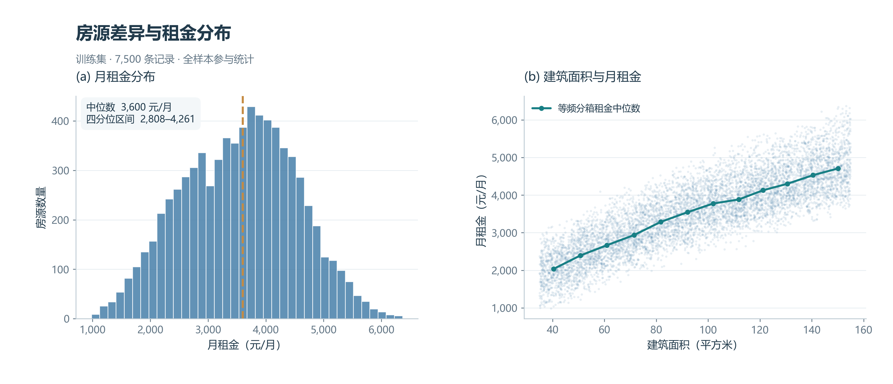
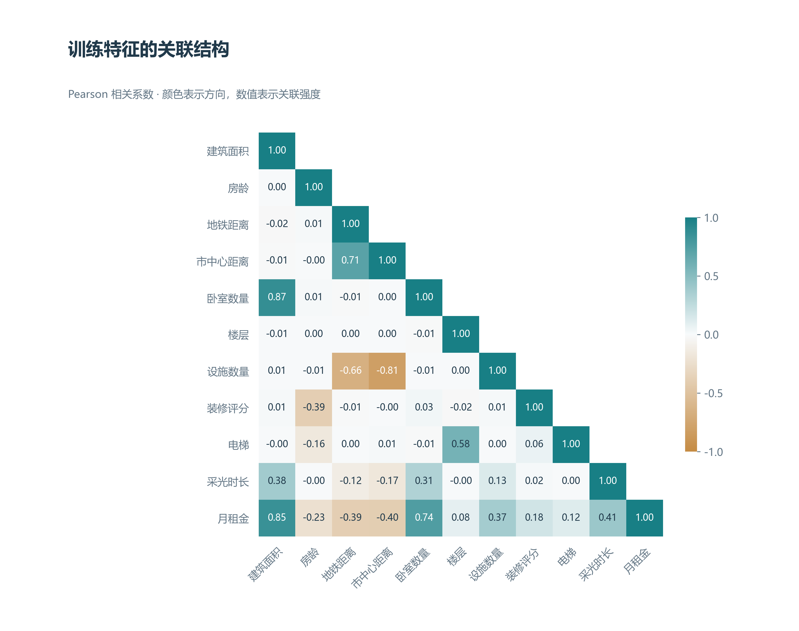
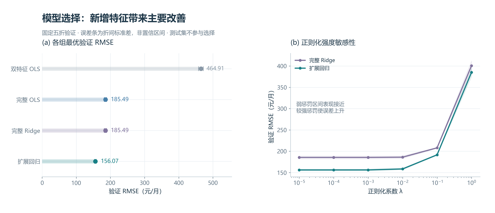
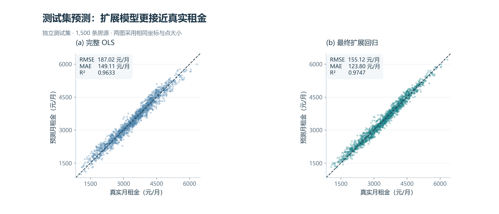
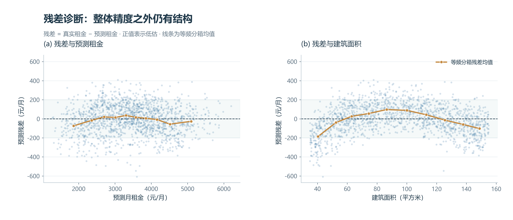
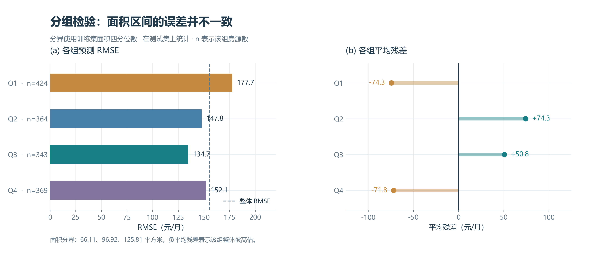
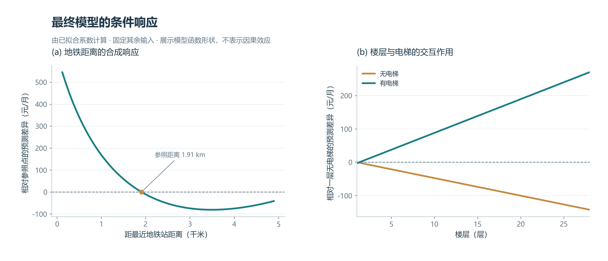
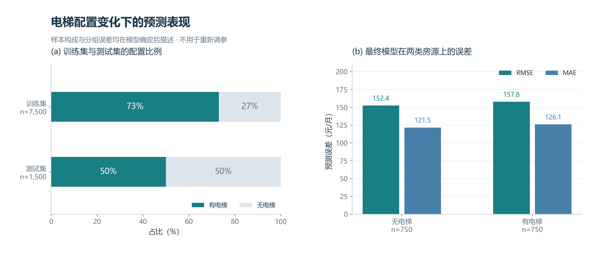

# 第二题：多特征房源租金预测与模型选择

> 本文依据本项目实际运行结果撰写。训练数据为 B_train.csv，测试数据为 B_test.csv；数值结果来自 `results/question2_complete`。数学公式使用可编辑 LaTeX，独立公式采用单独成行的 `$$` 定界符。插图为 300 dpi PNG，并提供同名 SVG。已对插图进行视觉检查；Markpad 和 Obsidian 的实际界面预览尚未核验。

**摘要：** 针对房源类型多样、输入特征存在相关性的租金预测任务，本文基于 7,500 条训练记录构建双特征线性模型、完整线性模型、Ridge 模型及少量特征扩展模型，通过固定五折交叉验证确定最终方案，并在 1,500 条测试记录上进行评价。结果表明，加入区位与配套信息后，验证 RMSE 由 464.91 元/月降至 185.49 元/月；进一步引入距离对数项及楼层与电梯的交互项后，验证 RMSE 降至 156.07 元/月。最终模型的测试 RMSE 为 155.12 元/月，MAE 为 123.80 元/月，决定系数为 0.9747。弱正则化与无正则扩展模型的验证表现几乎相同，主要收益来自特征信息和函数表达能力的改善。残差诊断仍发现面积相关的系统性偏差，提示较高的整体预测精度并不意味着各类房源均已得到充分拟合。

**关键词：** 房源租金预测；线性回归；特征扩展；Ridge；交叉验证；残差分析

## 2.1 问题分析与数据说明

### 2.1.1 研究目标与建模思路

本题以房源月租金为预测目标，综合利用房屋属性、地理位置和配套条件建立回归模型。与第一题主要分析参数求解和梯度下降过程不同，本题关注候选模型的构建、模型选择依据以及对新房源的预测表现。实验依次回答三个问题：增加输入信息能否改善预测，参数正则化是否带来实际收益，以及少量非线性项和交互项能否补充简单加性模型的表达能力。

实验以仅使用面积和房龄的模型作为基准，再纳入全部十个输入特征。考虑到部分特征可能相关，对完整模型增加 L2 正则化作为对照；同时构建包含两个距离对数项和一个楼层与电梯交互项的扩展模型。全部候选方案在训练集内部比较，最终确定模型后才使用测试集进行预测与评价。

### 2.1.2 数据与变量定义

题目提供 9,000 条模拟房源记录，其中训练集包含 7,500 条，测试集包含 1,500 条。房源编号仅用于记录对应关系，不作为输入特征。第二题的面积字段已采用平方米，不能沿用第一题对平方分米的换算。

**表1　输入变量、数学记号与处理方式。**

| 类别 | 字段 | 记号 | 模型中的含义与单位 |
| --- | --- | --- | --- |
| 房屋属性 | area_sqm | $a$ | 建筑面积，平方米 |
| 房屋属性 | building_age_years | $h$ | 房龄，年 |
| 区位条件 | metro_m | $m$ | 距最近地铁站距离，原值除以 1,000 后取千米数值 |
| 区位条件 | center_km | $c$ | 距市中心距离，千米 |
| 房屋属性 | bedrooms | $k$ | 卧室数量，间 |
| 房屋属性 | floor | $f$ | 所在楼层，层 |
| 配套条件 | amenities_1km | $u$ | 周边 1 km 内设施数量，个 |
| 配套条件 | renovation_score | $v$ | 装修评分，1～5 分 |
| 配套条件 | has_elevator | $e$ | 是否有电梯，0 或 1 |
| 配套条件 | sunlight_hours | $s$ | 日均采光时长，小时 |

目标变量记为 $y$，单位为元/月。计数变量按数值处理；装修评分采用数值编码，意味着本实验对相邻评分施加相同的线性增量假设。该选择便于解释，但不表示已经验证评分效应严格等距。

## 2.2 探索性分析与特征处理

### 2.2.1 数据质量与分布特征

程序检查了输入数值的有限性、房源编号唯一性、电梯和评分取值范围，以及训练测试编号交集。两组数据均无缺失值或重复编号，编号交集为空，训练集不存在十个输入特征完全相同的重复行。因此，本实验不进行缺失值填补或样本删除，也不根据测试误差剔除记录。

**表2　训练集描述性统计。** 本表标准差使用样本标准差；后续标准化采用总体标准差，即分母为该训练部分的样本数。

| 变量 | 均值 | 标准差 | 最小值 | 中位数 | 最大值 |
| --- | ---: | ---: | ---: | ---: | ---: |
| 建筑面积（平方米） | 96.126 | 34.538 | 35.009 | 96.917 | 154.991 |
| 房龄（年） | 16.173 | 9.487 | 0 | 16 | 32 |
| 地铁距离（米） | 1935.574 | 1124.048 | 120.000 | 1908.082 | 4900.000 |
| 市中心距离（千米） | 13.241 | 6.847 | 1.500 | 13.269 | 25.000 |
| 卧室数量（间） | 2.909 | 1.194 | 1 | 3 | 5 |
| 楼层（层） | 14.181 | 8.103 | 1 | 14 | 28 |
| 设施数量（个） | 7.756 | 3.787 | 0 | 8 | 16 |
| 装修评分 | 2.776 | 1.039 | 1 | 3 | 5 |
| 是否有电梯 | 0.730 | 0.444 | 0 | 1 | 1 |
| 采光时长（小时） | 5.586 | 1.129 | 2.400 | 5.588 | 8.600 |
| 月租金（元/月） | 3547.568 | 986.115 | 981.770 | 3600.283 | 6364.998 |



**图1　房源差异与租金分布。** 左图为训练集租金直方图，虚线标记中位数；右图展示全部训练样本的面积与租金关系，折线为面积等频分箱后的租金中位数。分箱仅用于描述数据，不参与模型训练。

训练租金的中间 50% 位于 2808.05～4260.66 元/月。面积与租金总体呈正相关，但相近面积下仍存在明显的租金差异，说明面积并不足以解释全部变动。区位、房龄及居住条件等变量有可能提供额外预测信息，其作用需要通过完整模型的验证结果检验。

### 2.2.2 特征关联与建模启示



**图2　训练特征的 Pearson 相关矩阵。** 展示下三角区域以避免重复；绿色表示正相关，金色表示负相关，单元格给出相关系数。月租金一行用于描述边际关联，不作为因果关系或特征选择的唯一依据。

面积与卧室数量的相关系数约为 0.868，地铁距离与市中心距离约为 0.707，市中心距离与设施数量约为 −0.809。这些关系表明，部分变量包含相近的信息，单个回归系数可能受到其他相关特征的影响。Ridge 因而具有比较价值，但存在相关性并不能直接推出正则化一定降低预测误差。

面积与租金的相关系数约为 0.851，房龄与租金约为 −0.231。楼层与租金的边际相关性仅约为 0.083，但楼层与电梯配置的相关系数约为 0.579。较弱的边际关联并不意味着楼层没有作用：其与租金的关系可能随电梯条件变化，因此将楼层与电梯的交互作用纳入候选模型具有明确解释。

### 2.2.3 预处理原则

首先将地铁距离由米转换为千米，再构造候选特征。距离变换使用自然对数，电梯保留 0/1 编码，月租金保持原单位。设构造后的第 $j$ 个特征为 $\phi_j(\boldsymbol x)$，标准化定义为：

$$
z_{ij}=\frac{\phi_j(\boldsymbol x_i)-\mu_j}{\sigma_j},
\qquad
\sigma_j=\sqrt{\frac{1}{n}\sum_{i=1}^{n}\left(\phi_j(\boldsymbol x_i)-\mu_j\right)^2}.
$$

每一折仅使用该折训练部分估计 $\mu_j$ 和 $\sigma_j$，再应用于对应验证部分。最终重拟合时，使用全部 7,500 条训练记录估计统计量，并将其应用于测试集。二元项和交互项也在构造完成后统一标准化，使 Ridge 惩罚作用于可比尺度。截距不参与惩罚。

## 2.3 候选回归模型的建立

### 2.3.1 基准模型与完整线性模型

双特征基准模型为：

$$
\hat y=\beta_0+\beta_a a+\beta_h h.
$$

该模型在 B 训练集上重新拟合，不直接使用第一题的系数。完整线性模型进一步加入全部十个输入：

$$
\hat y=\beta_0+\beta_a a+\beta_h h+\beta_m m+\beta_c c
+\beta_k k+\beta_f f+\beta_u u+\beta_v v+\beta_e e+\beta_s s.
$$

两者通过普通最小二乘法求解。数值实现调用 `LinearRegression`，不显式计算矩阵逆。第一题已讨论求解原理，第二题将关注点放在特征信息和预测效果的比较上。

### 2.3.2 Ridge 回归

在标准化特征矩阵 $Z$ 上，Ridge 的目标函数为：

$$
\min_{b,\boldsymbol w}
\frac{1}{2n}\left\|b\boldsymbol1+Z\boldsymbol w-\boldsymbol y\right\|_2^2
+\frac{\lambda}{2}\|\boldsymbol w\|_2^2.
$$

由于标准化后的每列特征均值为零，最优截距为 $b=\bar y$，斜率满足：

$$
\left(Z^{\mathsf T}Z+n\lambda I\right)\boldsymbol w
=Z^{\mathsf T}(\boldsymbol y-\bar y\boldsymbol1).
$$

L2 惩罚通过限制标准化系数的幅度控制模型复杂度。本文的 $\lambda$ 对应平均平方损失定义，而 scikit-learn 的 `Ridge` 使用平方误差之和，故程序设置 `alpha = n * penalty`。交叉验证的每折训练样本数为 6,000，最终拟合样本数为 7,500；相应调整库参数可保持同一个 $\lambda$ 的含义。

### 2.3.3 少量特征扩展

完整线性模型假定各特征的影响相加且斜率固定。为表达距离的非线性关联和电梯条件下不同的楼层响应，本实验预先限定三个扩展项：

$$
\phi_{11}(\boldsymbol x)=\ln(1+m),
\qquad
\phi_{12}(\boldsymbol x)=\ln(1+c),
\qquad
\phi_{13}(\boldsymbol x)=fe.
$$

这里 $m$ 和 $c$ 指以千米为单位的数值，因此对数内部为无量纲数值；等价地，可以理解为实际距离除以 1 km 后再加 1。对数项允许距离效应的斜率随距离变化；保留线性距离项后，模型可以组合线性和对数形状，但不保证响应处处单调。交互项则允许有无电梯时具有不同的楼层斜率。

扩展模型为：

$$
\hat y=\beta_0+\sum_{j=1}^{10}\beta_j x_j
+\beta_{11}\ln(1+m)+\beta_{12}\ln(1+c)+\beta_{13}fe.
$$

该模型对输入具有非线性表达，但仍对待估系数保持线性，属于线性回归的特征扩展。实验比较其无正则版本及多个 Ridge 强度，没有在查看测试残差后追加特征或重新选择模型。

**表3　候选模型与比较目的。** 参数数目包含截距，是名义参数数目，不等于 Ridge 的有效自由度。

| 模型 | 输入方案 | 名义参数数目 | 比较目的 |
| --- | --- | ---: | --- |
| 双特征 OLS | 面积、房龄 | 3 | 建立基础预测参照 |
| 完整 OLS | 全部十个输入 | 11 | 衡量新增信息的作用 |
| 完整 Ridge | 全部十个输入及 L2 惩罚 | 11 | 衡量参数收缩的作用 |
| 扩展回归 | 十个输入和三个扩展项，允许 L2 惩罚 | 14 | 衡量额外函数表达能力的作用 |

## 2.4 交叉验证与模型选择

### 2.4.1 验证方案与评价指标

对 7,500 条训练记录进行固定五折交叉验证，设置 `shuffle=True`、随机种子为 42。每折使用 6,000 条记录拟合，1,500 条记录验证，所有候选使用相同划分。每条训练记录仅出现在一次验证部分，其预测称为折外预测。

对于样本集合 $S$，定义：

$$
\operatorname{RMSE}(S)
=\sqrt{\frac{1}{|S|}\sum_{i\in S}(y_i-\hat y_i)^2},
\qquad
\operatorname{MAE}(S)
=\frac{1}{|S|}\sum_{i\in S}|y_i-\hat y_i|.
$$

RMSE 对较大误差更加敏感，作为主要选择指标；MAE 用于补充说明平均绝对偏差。折间汇总定义为：

$$
\overline{R}=\frac{1}{5}\sum_{k=1}^{5}R_k,
\qquad
s_R=\sqrt{\frac{1}{4}\sum_{k=1}^{5}(R_k-\overline{R})^2}.
$$

选择依据为五折 RMSE 的算术平均值。图表中的“均值 ± 标准差”反映本次折划分的离散程度，不是置信区间。交叉验证既用于选择超参数，也用于比较候选模型，因此所选模型的验证分数可能带有选择乐观偏差；独立测试评价用于补充检验最终表现。

完整 Ridge 的候选强度为：

$$
\lambda\in\{10^{-5},10^{-4},10^{-3},10^{-2},10^{-1},1\}.
$$

扩展回归在相同网格中额外包含 $\lambda=0$。连同两个 OLS 模型，共比较 15 个候选设置，完成 75 次折内拟合。各组先选取平均验证 RMSE 最小的设置，再在四组之间选取最小者；组内精确并列时优先较小惩罚，组间精确并列时优先较少参数。该规则没有另设“足够接近”的阈值，因此极小的数值差异也会影响最终保存的具体强度。

### 2.4.2 验证结果与模型确定

**表4　各模型组的最优交叉验证结果。** 单位均为元/月；标准差使用五个折分数计算。

| 模型 | 最优 $\lambda$ | 验证 RMSE | 验证 MAE | 参数数目 |
| --- | ---: | ---: | ---: | ---: |
| 双特征 OLS | 0 | 464.913 ± 6.852 | 384.014 | 3 |
| 完整 OLS | 0 | 185.488 ± 3.423 | 148.081 | 11 |
| 完整 Ridge | $10^{-5}$ | 185.488 ± 3.423 | 148.081 | 11 |
| 扩展回归 | $10^{-5}$ | 156.069 ± 2.124 | 124.575 | 14 |



**图3　模型选择与正则化敏感性。** 左图给出四个模型组的最优五折 RMSE 和折间标准差；右图展示两个正则化模型随正惩罚强度变化的验证误差，阴影为均值上下一个折间标准差。零惩罚结果另见表5，避免将零值放入对数坐标。

完整 OLS 相比双特征 OLS 的验证 RMSE 下降约 60.10%，表明区位和配套信息提供了明显的预测增益。扩展回归相对完整 OLS 再下降约 15.86%，说明仅增加原始输入还不足以表达全部关系，距离变换和交互项组成的扩展方案具有进一步价值。本实验没有逐项消融，因此无法将这部分提升分别归因于某一个扩展项。

**表5　正则化敏感性。** 单位为元/月。完整特征在 $\lambda=0$ 时对应完整 OLS。

| $\lambda$ | 完整特征的平均验证 RMSE | 扩展特征的平均验证 RMSE |
| ---: | ---: | ---: |
| 0 | 185.487941 | 156.069038 |
| $10^{-5}$ | 185.487936 | 156.069024 |
| $10^{-4}$ | 185.487948 | 156.069303 |
| $10^{-3}$ | 185.493593 | 156.109290 |
| $10^{-2}$ | 186.032398 | 158.426012 |
| $10^{-1}$ | 207.965424 | 191.565097 |
| 1 | 400.812556 | 385.123403 |

按既定最小均值规则，最终选择扩展特征、$\lambda=10^{-5}$ 的模型。其与同特征无正则模型的平均验证 RMSE 仅相差约 $1.42\times10^{-5}$ 元/月，远小于折间波动，不能据此宣称该强度具有实际优势。完整 Ridge 与完整 OLS 同样几乎重合。较强惩罚使验证误差明显上升，因此本数据下主要改善来自特征表示，缺少证据支持明显的正则化收益。所选强度位于最小正值边界，也不代表连续参数空间中的精确最优值。

程序先将选择结果保存为 `selection.json`，再在全部训练数据上重拟合四组已确定的模型，随后才读取测试集。测试结果仅用于最终评价和解释，不反馈到候选设置或选择规则中。

## 2.5 测试集预测与误差分析

### 2.5.1 整体预测效果

测试集评价同时报告 RMSE、MAE 和决定系数：

$$
R^2=1-\frac{\sum_{i=1}^{n_{\mathrm{test}}}(y_i-\hat y_i)^2}
{\sum_{i=1}^{n_{\mathrm{test}}}(y_i-\bar y_{\mathrm{test}})^2}.
$$

此处 $\bar y_{\mathrm{test}}$ 仅用于计算评价指标，没有参与模型训练或选择。四组模型使用各自已经通过训练集验证确定的设置，测试对照不改变最终选择。

**表6　训练与测试评价结果。** RMSE、MAE 的单位为元/月，$R^2$ 无量纲。

| 模型 | 训练 RMSE | 测试 RMSE | 测试 MAE | 测试 $R^2$ |
| --- | ---: | ---: | ---: | ---: |
| 双特征 OLS | 464.518 | 463.172 | 383.510 | 0.774784 |
| 完整 OLS | 185.070 | 187.024 | 149.113 | 0.963279 |
| 完整 Ridge | 185.070 | 187.024 | 149.112 | 0.963279 |
| 最终扩展回归 | 155.709 | 155.121 | 123.796 | 0.974739 |



**图4　测试集真实租金与预测租金。** 两图均包含全部 1,500 条测试记录，使用相同坐标范围、点大小和透明度；虚线为理想预测线。点位越接近虚线，预测误差越小。

最终模型的测试 RMSE 为 155.12 元/月，相比完整 OLS 下降约 17.06%，相比双特征基准下降约 66.51%。其训练、验证和测试 RMSE 分别为 155.71、156.07 和 155.12 元/月，三者接近，未显示明显的整体误差恶化。测试 $R^2$ 为 0.9747，说明模型相对于测试均值基准减少了约 97.47% 的平方误差；这一指标不能解释为“97.47% 的房源预测准确”。

### 2.5.2 预测文件与绝对误差

完整预测文件包含房源编号、真实租金、预测租金、残差及绝对误差，共 1,500 行。残差统一定义为：

$$
e_i=y_i-\hat y_i.
$$

正残差表示低估，负残差表示高估。表7按测试文件原始顺序展示前五条记录，不进行有利样本筛选。

**表7　最终模型预测示例。** 单位为元/月。

| 房源编号 | 真实租金 | 预测租金 | 残差 |
| --- | ---: | ---: | ---: |
| B0014756 | 3752.39 | 3677.13 | 75.26 |
| B0017557 | 3244.26 | 3107.10 | 137.16 |
| B0017753 | 3169.68 | 3006.26 | 163.41 |
| B0006044 | 4302.60 | 4404.93 | −102.33 |
| B0017162 | 3116.99 | 2983.41 | 133.58 |

测试绝对误差的中位数为 105.11 元/月，第 90 百分位为 254.31 元/月，第 95 百分位为 301.85 元/月。约 81.27% 的记录绝对误差不超过 200 元/月，94.80% 不超过 300 元/月。这些是本次测试样本的经验统计，不构成对单个新房源的概率保证或预测区间。

### 2.5.3 残差结构与面积分组



**图5　最终模型的残差诊断。** 左图为残差与预测租金，右图为残差与建筑面积。浅色区域标出 ±200 元/月，虚线为零残差；金色折线为相应横轴十个等频箱内的平均残差，仅用于描述结构，不是拟合修正或置信区间。

总体平均残差为 −9.04 元/月，表明平均而言预测略偏高。然而，面积方向的残差均值呈弯曲结构：小面积和大面积区间以负残差为主，中间区间以正残差为主。总体平均偏差较小，可能来自不同区间偏差的相互抵消，不能据此认为模型在所有房源类型上均无系统偏差。

进一步使用训练集面积的四分位数 66.108875、96.917300 和 125.809250 平方米划分测试样本。训练分界固定后直接应用于测试集，各组测试数量不要求相同；边界值归入左侧区间。

**表8　按训练面积四分位数划分的测试误差。** 面积区间的显示值经四舍五入，实际划分使用上文未舍入数值。

| 面积组 | 面积范围（平方米） | 样本数 | RMSE（元/月） | MAE（元/月） | 平均残差（元/月） |
| --- | --- | ---: | ---: | ---: | ---: |
| Q1 | $a\leq66.11$ | 424 | 177.71 | 140.66 | −74.34 |
| Q2 | $66.11<a\leq96.92$ | 364 | 147.77 | 117.86 | 74.26 |
| Q3 | $96.92<a\leq125.81$ | 343 | 134.66 | 108.78 | 50.80 |
| Q4 | $a>125.81$ | 369 | 152.09 | 124.23 | −71.79 |



**图6　面积区间的误差与偏差。** 左图对比各组 RMSE，并以虚线标出整体 RMSE；右图给出平均残差及方向。每组样本数同时标注，避免在不了解组规模的情况下比较误差。

Q1 的 RMSE 高于整体水平；Q2、Q3 的平均残差为正，Q1、Q4 为负，与图5中的弯曲趋势一致。这提示当前对面积的线性表达仍可能不足。面积平方项、分段项或其他有依据的变换可作为后续研究候选，但本次没有根据测试结果追加这些项或更新最终模型。若开展后续模型选择，应回到训练验证流程，并使用新的独立数据评价更新后的方案。

## 2.6 最终模型、解释与讨论

### 2.6.1 最终数学表达式

将标准化坐标中的参数还原到表1规定的输入单位后，得到最终模型：

$$
\begin{aligned}
\hat y={}&1706.150214
+22.318955a-19.703271h\\
&+218.290918m-24.175687c+45.314634k\\
&-5.279316f+31.720285u+80.953990v\\
&-18.269674e+28.236951s\\
&-981.374158\ln(1+m)+9.399002\ln(1+c)\\
&+15.406320fe.
\end{aligned}
$$

其中，$m$ 和 $c$ 均取距离的千米数值，输出为元/月。公式中的系数保留六位小数；完整精度保存在 `final_model.json` 和 `coefficients.csv` 中。上述表达式已包含标准化的逆变换，直接代入原单位变量即可预测，不应再次标准化后代入该式。

参数还原遵循：

$$
\beta_j=\frac{w_j}{\sigma_j},
\qquad
\beta_0=b-\sum_{j=1}^{13}\frac{w_j\mu_j}{\sigma_j}.
$$

由此可在保留训练数值稳定性的同时给出直接可用的模型表达。截距对应所有原变量为零的外推情形，其中部分条件超出训练范围，不单独赋予经济含义。

### 2.6.2 系数与条件响应

在其余输入固定的模型意义下，面积增加 1 平方米对应预测租金增加约 22.32 元/月，房龄增加 1 年对应下降约 19.70 元/月，装修评分增加 1 分对应增加约 80.95 元/月。由于特征之间存在关联，这些是模型的条件关联，不表示现实干预的因果效果，也不等同于变量的重要性排序。

楼层与电梯含有交互项，楼层的条件斜率为：

$$
\frac{\partial\hat y}{\partial f}
=-5.279316+15.406320e
=\begin{cases}
-5.279316, & e=0,\\
10.127004, & e=1.
\end{cases}
$$

因此，在模型内部，无电梯时更高楼层对应较低预测租金，有电梯时对应较高预测租金。电梯配置的预测差异也取决于楼层：

$$
\hat y(e=1)-\hat y(e=0)=-18.269674+15.406320f.
$$

不能仅看到电梯主项系数为负便断言“电梯降低租金”，因为该主项对应楼层为零时的条件差异，且零楼层不在数据范围内。

地铁距离同时含有线性项和对数项，其合成斜率为：

$$
\frac{\partial\hat y}{\partial m}
=218.290918-\frac{981.374158}{1+m}.
$$

因此，单独解释正的线性距离系数会遗漏对数项的作用。合成响应在约 3.50 km 以前下降，此后出现轻微回升；该拐点位于训练距离范围内，说明所用函数族并未施加单调性约束。该形状应视为模型诊断发现，不能据此推断远离地铁会提升真实市场租金。



**图7　最终模型的条件响应。** 左图固定其余输入，以训练集地铁距离中位数 1.908 km 为参照，展示地铁距离线性项和对数项的合成预测变化；右图固定其余输入，以“一层、无电梯”为共同参照，展示楼层和电梯项的合成变化。曲线由最终系数直接计算，不是原始样本的边际回归，也不表示因果效应。

### 2.6.3 样本构成变化与结果边界

模型确定后，对训练和测试样本构成进行补充检查。训练集有电梯房源占 73%，测试集占 50%，显示这一个特征的边际分布发生变化。为避免整体指标掩盖不同条件下的表现，分别计算测试集两类房源的误差。

**表9　按电梯配置划分的测试误差。**

| 房源类型 | 样本数 | RMSE（元/月） | MAE（元/月） | 平均残差（元/月） |
| --- | ---: | ---: | ---: | ---: |
| 无电梯 | 750 | 152.40 | 121.52 | −6.51 |
| 有电梯 | 750 | 157.79 | 126.07 | −11.57 |



**图8　电梯配置变化下的预测表现。** 左图比较训练集和测试集的有无电梯比例，右图报告最终模型在两类测试房源上的 RMSE 与 MAE。所有统计均在模型确定后进行，没有据此重调参数。

两类房源的测试误差处于相近水平，说明本次比例变化未伴随某一电梯组明显更大的整体误差。但单次划分和一个特征的边际比较不足以证明模型对任意分布变化均具有稳定性；也无法仅凭分组结果确认交互项单独贡献了多少改善。

本研究仍有四方面限制。第一，数据由题目模拟生成，结果主要适用于本实验分布，真实城市、区域和时间段中的预测能力需要额外验证。第二，候选扩展项较少，面积残差仍存在结构，距离响应也缺少单调约束。第三，正则化及模型比较采用同一组五折，未进行嵌套交叉验证或多次重复划分，不能将很小的分数差异解释为统计显著优势。第四，本实验提交点预测，没有构建校准后的预测区间，误差分位数只能作为测试样本的描述。

### 2.6.4 研究结论

实验支持使用包含房屋属性、区位和配套条件的多特征模型完成本题租金预测。相比双特征基准，完整线性模型明显降低误差；在完整输入上加入两个距离对数项和楼层与电梯交互项后，验证和测试表现进一步改善。最终扩展模型的测试 RMSE 为 155.12 元/月、MAE 为 123.80 元/月、$R^2$ 为 0.9747。正则化的额外收益在本数据上很小，参数规模受控的特征扩展是主要改进来源。残差与分组分析同时说明，最终模型仍存在面积相关偏差和函数形状限制，整体精度与模型解释需要结合使用。

## 附录A：核心实现与复现方法

### A.1 文件与运行环境

实验使用 Python 3.10.20、NumPy 2.2.6、scikit-learn 1.7.2、SciPy 1.15.3 和 Matplotlib 3.10.9。实际依赖版本及输入文件 SHA-256 保存于 `environment.json`；`fold_assignments.csv` 保存每条训练记录的验证折编号。

| 文件 | 功能 |
| --- | --- |
| [model.py](../question2/model.py) | 数据校验、固定特征映射、折内标准化、拟合与参数还原 |
| [run.py](../question2/run.py) | 五折验证、模型选择、最终训练和测试预测 |
| [plot.py](../question2/plot.py) | 读取已保存结果，生成八张论文插图 |
| [predict.py](../question2/predict.py) | 对只含编号和输入特征的新房源进行预测 |
| [verify.py](../question2/verify.py) | 独立求解核验、折外预测核验及文档检查 |
| [requirements.txt](../question2/requirements.txt) | 固定依赖版本 |

在 `HW2 线性回归` 目录下执行以下命令。复现输出使用新目录，防止覆盖已有结果。

```bash
python -m pip install -r question2/requirements.txt
python question2/run.py --output results/question2_reproduce
python question2/plot.py --output results/question2_reproduce
python question2/verify.py --output results/question2_reproduce
```

固定随机种子和相同依赖环境下，复现结果应与本文一致；跨平台的底层线性代数实现可能产生极小浮点差异。程序要求训练输出目录尚不存在。绘图采用 Microsoft YaHei 中文字体；其他系统可在字体配置中替换为可用中文字体。所有模型训练都使用完整的相应训练部分，绘图没有改变训练数据。

若输入新房源文件只有编号和表1的十个原始字段，不包含真实租金，可直接调用保存的模型：

```bash
python question2/predict.py --input data/new_listings.csv --output results/new_predictions.csv
```

输入地铁距离仍使用原 CSV 的米单位，预测脚本负责转换。该命令使用完整精度参数，不依赖人工抄写的舍入公式，且要求预测输出文件尚不存在。

### A.2 特征构造与模型拟合代码

以下代码摘自实际运行的 `model.py`。完整文件还包含字段定义、输入检查、预测和指标函数；固定特征变换与标准化明确分开，便于检查验证过程中是否使用了错误的数据统计量。

```python
def feature_matrix(x, kind):
    """变换不估计数据统计量；距离统一以千米代入模型。"""
    if kind == "basic":
        return x[:, :2].copy(), FEATURE_NAMES[:2]
    features = x.copy()
    features[:, 2] /= 1000
    if kind in {"full", "ridge"}:
        return features, FEATURE_NAMES.copy()
    if kind != "expanded":
        raise ValueError(f"未知模型：{kind}")
    extra = np.column_stack([np.log1p(features[:, 2]),
                             np.log1p(features[:, 3]),
                             features[:, 5] * features[:, 8]])
    return np.column_stack([features, extra]), FEATURE_NAMES + EXTRA_NAMES


def fit_model(x, y, kind, penalty=0.0):
    features, names = feature_matrix(x, kind)
    scaler = StandardScaler().fit(features)
    z = scaler.transform(features)
    # sklearn 使用平方误差之和，乘 n 后对应本文的平均损失定义。
    estimator = (Ridge(alpha=len(y) * penalty, solver="svd")
                 if penalty > 0 else LinearRegression())
    estimator.fit(z, y)
    beta = estimator.coef_ / scaler.scale_
    intercept = float(estimator.intercept_ - scaler.mean_ @ beta)
    error = np.max(np.abs(estimator.predict(z) - (intercept + features @ beta)))
    if error > 1e-7:
        raise AssertionError("原单位参数还原未通过核验。")
    return dict(kind=kind, penalty=float(penalty), features=names,
                intercept=intercept, coefficients=beta.tolist(),
                standardized_coefficients=estimator.coef_.tolist(),
                mean=scaler.mean_.tolist(), scale=scaler.scale_.tolist(),
                training_count=len(y), roundtrip_error=float(error))
```

### A.3 五折验证代码

以下函数在每次循环中重新拟合标准化器和模型，每条记录的折外预测均来自未使用该记录训练的模型。外层遍历四组候选及其正则化网格，按验证均值完成选择后，才读取测试文件。

```python
def cross_validate(x, y, splits, kind, penalty):
    oof = np.zeros(len(y))
    rows = []
    for fold, (training, validation) in enumerate(splits, 1):
        model = fit_model(x[training], y[training], kind, penalty)
        oof[validation] = predict(model, x[validation])
        rows.append(dict(model=kind, penalty=penalty, fold=fold,
                         **metrics(y[validation], oof[validation])))
    rmse = [row["rmse"] for row in rows]
    summary = dict(model=kind, label=MODEL_NAMES[kind], penalty=penalty,
                   rmse_mean=float(np.mean(rmse)),
                   rmse_std=float(np.std(rmse, ddof=1)),
                   mae_mean=float(np.mean([row["mae"] for row in rows])),
                   parameter_count=(3 if kind == "basic" else
                                    14 if kind == "expanded" else 11))
    return summary, rows, oof
```

### A.4 结果与核验

完整测试预测见 [test_predictions.csv](../results/question2_complete/test_predictions.csv)，精确参数见 [final_model.json](../results/question2_complete/final_model.json)，全部候选分数见 [cv_summary.csv](../results/question2_complete/cv_summary.csv)。测试文件保存完整精度，表格只为阅读进行舍入。

核验脚本采用 NumPy 增广矩阵最小二乘独立复算四组模型，并在每个验证折独立计算标准化和预测，检查与已保存结果的一致性；同时核对测试预测、评价指标、模型选择和数据哈希。独立复算的测试预测最大差异约为 $8.87\times10^{-12}$ 元/月，各折预测的最大差异约为 $1.64\times10^{-11}$ 元/月。报告中六位小数公式的最大预测舍入误差为 $1.78\times10^{-5}$ 元/月，小于 0.001 元/月的核验阈值。无真实租金标签的预测入口也已通过核对。核验结果写入 [verification.json](../results/question2_complete/verification.json)。

Markdown 检查覆盖独立公式定界符、行内定界符、公式花括号和图片路径。八张图均已逐张进行视觉检查；这些检查不等同于在 Markpad 或 Obsidian 中实际打开并验证公式渲染。

**数据与题目来源：** 本项目提供的 [HW2_线性回归.pdf](../HW2_线性回归.pdf)、[B_train.csv](../data/B_train.csv) 和 [B_test.csv](../data/B_test.csv)。文中结果来自本次保存的实验。
