# 多特征线性回归的房源租金预测：特征构造、模型选择与效果评价

## 摘要

针对房源类型多样、影响租金的因素较多的问题，本实验使用 7,500 条训练记录建立回归模型，并在 1,500 条独立测试记录上评价预测效果。首先以十个原始特征的普通最小二乘回归为基线，再通过类别编码、具有业务含义的组合、二次特征和加性样条比较不同特征表达的预测能力，随后考察正则化对精度和模型规模的影响。实验采用训练集内部的嵌套交叉验证，所有需要拟合的预处理均限制在相应训练折内。结果表明，固定普通最小二乘方法时，原始特征、二次特征和加性样条的平均外层 RMSE 分别为 185.49、129.87 和 129.04 元/月，主要精度收益来自非线性特征表达。正则化的额外精度收益较小，Lasso 的主要作用是减少非零模型项。综合验证误差与公式表达便利性，最终采用二次特征与 Lasso，保留 30 个非零项；测试 RMSE 为 127.21 元/月，MAE 为 102.20 元/月，$R^2$ 为 0.9830。降维方法作为辅助对照，没有进入最终预测流程。

**关键词：** 房源租金预测；线性回归；特征工程；Lasso；交叉验证

## 2.1 问题重述与总体建模思路

第二组数据包含房屋基本信息、地理位置及配套条件。任务是利用训练集 B_train.csv 中的 7,500 条历史记录建立回归模型，对测试集 B_test.csv 中的 1,500 条房源预测月租金，并评价预测误差。除预测结果外，还需要明确给出最终模型的数学表达式，通过实验过程、必要图表和实际结果说明模型选择依据，并提供与报告一致的可复现程序。

与只考虑面积和房龄的基础回归相比，本题需要处理更多类型的输入：连续变量可能具有弯曲关系，评分和计数变量未必满足固定增量假设，楼层与电梯等属性还可能共同影响租金。因此，本实验围绕“特征如何表达”和“模型如何取舍”组织分析。

具体路线为：首先检查训练数据并提出建模假设；其次建立原始特征线性回归基线，在统一验证设置下比较不同特征表达；再通过组合特征消融和正则化对照，分析改进来源与模型规模；最后确定回归模型，给出完整公式，并在独立测试集上评价预测表现。各项候选在统一实验框架内比较，以下章节按分析问题组织，不将它们描述为依次串联的特征处理步骤。

<!-- q2-section-code:2.1:begin -->

以下代码按对应内容插入，完整函数保留原实现，局部语句仅统一展示缩进。代码中的相对导入、config、output、训练折索引和绘图辅助函数沿用原项目上下文；完整程序及依赖见2.8.3节。绘图保存编号沿用原程序，正文图号以本报告题注为准。

**对应代码（question2/experiment.py，第 245—251 行）**

```python
def run_training(config, output, stage):
    with threadpool_limits(limits=1):
        if stage in {"all", "compare"}:
            audit(config, output)
            compare(config, output)
        if stage in {"all", "finalize"}:
            finalize(config, output)
```

<!-- q2-section-code:2.1:end -->

## 2.2 数据理解与建模假设

### 2.2.1 字段、单位与数据质量

**表1 输入变量及训练范围**

| 符号 | 程序变量 | 含义与单位 | 训练范围 |
| --- | --- | --- | --- |
| $x_1$ | area_sqm | 建筑面积，平方米 | 35.009—154.990 |
| $x_2$ | building_age_years | 房龄，年 | 0—32 |
| $x_3$ | metro_km | 距最近地铁站距离，千米 | 0.120—4.900 |
| $x_4$ | center_km | 距市中心距离，千米 | 1.500—25.000 |
| $x_5$ | bedrooms | 卧室数量，间 | 1—5 |
| $x_6$ | floor | 所在楼层，层 | 1—28 |
| $x_7$ | amenities_1km | 周边 1 千米内生活设施数量，个 | 0—16 |
| $x_8$ | renovation_score | 装修评分，分 | 1—5 |
| $x_9$ | has_elevator | 电梯状态，0 为无、1 为有 | 0 或 1 |
| $x_{10}$ | sunlight_hours | 日均采光时长，小时 | 2.400—8.600 |

目标变量 $y$ 为月租金，单位元/月。原始字段 metro_m 的单位为米，建模前除以 1,000，得到表1中的 metro_km；后续公式中的 $x_3$ 均使用千米。listing_id 只用于记录对齐，不作为预测特征。

训练集没有缺失值、重复编号或完全相同的特征行。数据中有 467 条无电梯且楼层不低于十层的记录；由于题目提供的是模拟数据，本实验没有仅凭生活经验删除这些记录。

原始租金偏度为 -0.0500，对数租金偏度为 -0.7714。本实验保留租金原尺度，主要是使平方误差目标与按元/月计算的 RMSE 评价保持一致，分布较对称则提供了辅助依据。线性回归不要求目标变量本身服从正态分布；上述偏度也不能单独证明对数变换在预测上一定无效。

<!-- q2-section-code:2.2.1:begin -->

**对应代码（question2/features.py，第 3—32 行）**

```python
import json
import warnings
import numpy as np
import pandas as pd
from sklearn.base import BaseEstimator, TransformerMixin, RegressorMixin
from sklearn.preprocessing import OneHotEncoder, PolynomialFeatures, SplineTransformer
from sklearn.linear_model import LinearRegression, Ridge, Lasso, ElasticNet
from sklearn.exceptions import ConvergenceWarning

NAMES = ["area_sqm", "building_age_years", "metro_km", "center_km", "bedrooms",
         "floor", "amenities_1km", "renovation_score", "has_elevator", "sunlight_hours"]
LABELS = ["面积", "房龄", "地铁距离", "市中心距离", "卧室数", "楼层", "配套数", "装修评分", "电梯", "日照"]
BLOCKS = ("space", "location", "access", "quality")
EXTRA = {"space": ["area_per_bedroom"], "location": ["log_metro", "log_center"],
         "access": ["floor_no_elevator"], "quality": ["area_renovation", "age_renovation"]}
SPLINE_COLS = [0, 1, 2, 3, 5, 6, 9]


def read_data(path, target=True):
    frame = pd.read_csv(path)
    frame["metro_km"] = frame["metro_m"] / 1000
    x = frame[NAMES].to_numpy(float)
    if not np.isfinite(x).all() or frame.listing_id.duplicated().any():
        raise ValueError("输入存在非有限值或重复房源编号。")
    if (x[:, 4] <= 0).any():
        raise ValueError("卧室数必须为正，才能计算每卧室面积。")
    y = frame.monthly_rent.to_numpy(float) if target else None
    if y is not None and not np.isfinite(y).all():
        raise ValueError("目标存在非有限值。")
    return frame.listing_id.to_numpy(dtype=str), x, y
```


**对应代码（question2/experiment.py，第 120—136 行）**

```python
def audit(config, output):
    path = ROOT / config["data"]["train"]
    ids, x, y = read_data(path)
    frame = pd.DataFrame(x, columns=NAMES)
    frame["monthly_rent"] = y
    frame.describe().T.to_csv(output / "descriptive.csv", encoding="utf-8-sig")
    frame.corr().to_csv(output / "correlations.csv", encoding="utf-8-sig")
    quality = dict(rows=len(y), predictors=x.shape[1], missing=int(frame.isna().sum().sum()),
                   duplicate_features=int(pd.DataFrame(x).duplicated().sum()),
                   target_skew=float(pd.Series(y).skew()), log_target_skew=float(pd.Series(np.log(y)).skew()),
                   no_elevator_high_floor=int(((x[:, 8] == 0) & (x[:, 5] >= 10)).sum()))
    save_json(output / "audit.json", quality)
    packages = ["numpy", "scipy", "pandas", "scikit-learn", "matplotlib", "PyYAML", "umap-learn", "numba"]
    provenance = dict(packages={p: version(p) for p in packages},
                      data_sha256={name: hashlib.sha256((ROOT / p).read_bytes()).hexdigest()
                                   for name, p in config["data"].items()})
    save_json(output / "environment.json", provenance)
```

<!-- q2-section-code:2.2.1:end -->

### 2.2.2 样本关系与建模线索

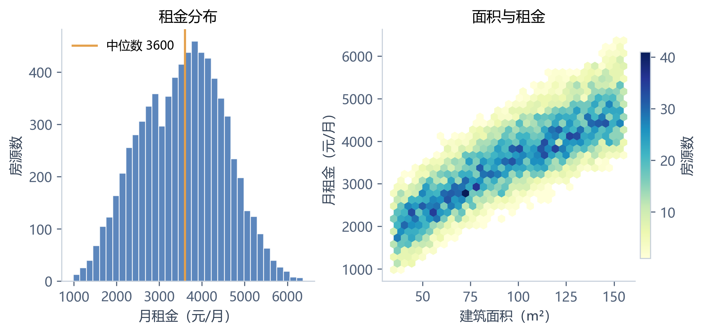

**图1 训练样本的租金分布与面积关系**

左图给出训练租金分布，中位数为 3600.28 元/月；右图为面积与租金的六边形分箱图，颜色表示房源数量。面积与租金总体呈正相关，但相近面积仍对应不同租金，说明面积具有预测价值，同时需要联合使用其他房源属性。

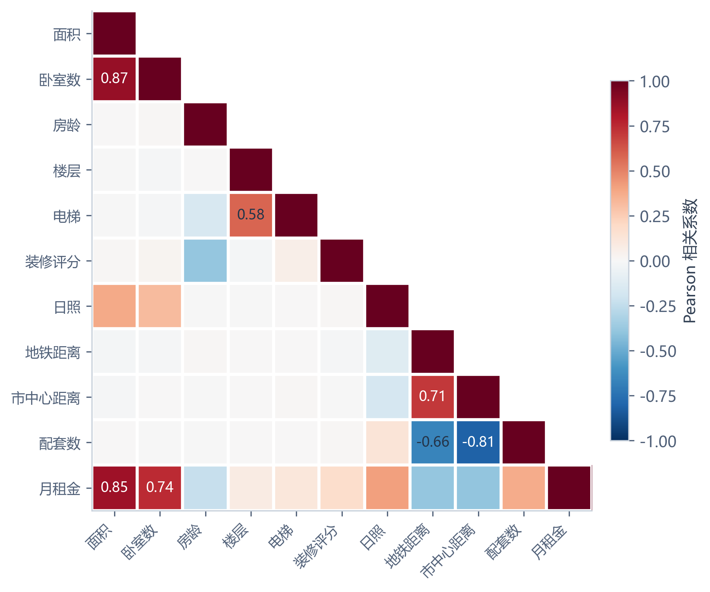

**图2 特征之间及其与租金的相关性**

图2展示 Pearson 相关系数。面积与卧室数的相关系数约为 0.868，市中心距离与配套数约为 -0.809，地铁距离与市中心距离约为 0.707。相关输入可能影响系数分配的稳定性，因此有必要比较正则化方法；但高相关性不等于某个变量没有预测价值，不能据此直接删除变量。楼层的单变量相关性较弱，也不能排除其与电梯状态共同发挥作用。

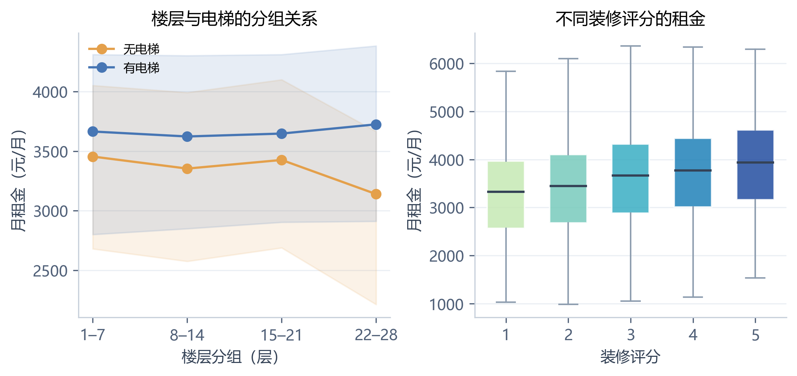

**图3 楼层、电梯及装修条件的分组分布**

左图的点线表示不同楼层组中的租金中位数，阴影为四分位区间；右图展示不同装修评分的租金箱线图。有无电梯房源的分组变化不同，装修评分提高时租金中位数总体上升，但组内仍存在较大离散程度。这些现象用于提出交互和编码假设，不用于直接认定变量的独立作用。箱线图省略离群点标记，实际训练样本均保留。

<!-- q2-section-code:2.2.2:begin -->

**对应代码（question2/plot.py，第 3—40 行）**

```python
import json
import joblib
import numpy as np
import pandas as pd
import matplotlib
matplotlib.use("Agg")
import matplotlib.pyplot as plt
from matplotlib.colors import Normalize
from matplotlib.cm import ScalarMappable
from matplotlib.patches import Patch
from . import ROOT
from .features import NAMES, LABELS, BLOCKS, read_data, save_json

COLORS = ["#4776B4", "#299A91", "#E4A04B", "#9975B6"]
FAMILY_LABEL = {"raw": "原始特征", "encoded": "类别编码", "domain": "含义组合",
                "quadratic": "二次特征", "spline": "加性样条", "pcr": "PCA 回归", "pls": "PLS 回归"}
METHOD_LABEL = {"ols": "OLS", "ridge": "Ridge", "lasso": "Lasso", "elastic": "Elastic Net", "pls": "PLS"}
BLOCK_LABEL = {"space": "空间", "location": "区位", "access": "通行", "quality": "品质"}


def style():
    plt.rcParams.update({"font.family": "Microsoft YaHei", "font.size": 10,
                         "axes.unicode_minus": False, "axes.spines.top": False,
                         "axes.spines.right": False, "axes.edgecolor": "#C7D0DB",
                         "axes.labelcolor": "#344256", "xtick.color": "#506078",
                         "ytick.color": "#506078", "grid.color": "#E7ECF2",
                         "axes.titleweight": "medium", "axes.titlesize": 11,
                         "legend.frameon": False, "legend.fontsize": 9,
                         "savefig.facecolor": "white", "svg.fonttype": "path"})


def axes_pair():
    return plt.subplots(1, 2, figsize=(7.2, 3.35), layout="constrained")


def light_grid(ax, axis="y"):
    ax.grid(axis=axis, alpha=0.8)
    ax.set_axisbelow(True)
```


**对应代码（question2/plot.py，第 163—232 行）**

```python
style()
folder = ROOT / "figures"
folder.mkdir(exist_ok=True)
manifest = []

def save(fig, number, title, description, panels):
    name = f"q2_{number}"
    for extension in ["png", "svg"]:
        fig.savefig(folder / f"{name}.{extension}", dpi=config["visualization"]["dpi"], bbox_inches="tight")
    manifest.append(dict(number=number, title=title, caption=title, description=description, panels=panels,
                         png=f"../figures/{name}.png", svg=f"../figures/{name}.svg"))
    plt.close(fig)
    print("FIGURE", number, title, flush=True)

_, x, y = read_data(ROOT / config["data"]["train"])
frame = pd.DataFrame(x, columns=NAMES)
frame["monthly_rent"] = y
fig, ax = axes_pair()
ax[0].hist(y, bins=35, color=COLORS[0], alpha=.88, edgecolor="white", linewidth=.6)
ax[0].axvline(np.median(y), color=COLORS[2], lw=1.6, label=f"中位数 {np.median(y):.0f}")
ax[0].set(xlabel="月租金（元/月）", ylabel="房源数", title="租金分布")
ax[0].legend()
image = ax[1].hexbin(x[:, 0], y, gridsize=32, mincnt=1, cmap="YlGnBu", linewidths=.15)
fig.colorbar(image, ax=ax[1], label="房源数", shrink=.82, pad=.02)
ax[1].set(xlabel="建筑面积（m²）", ylabel="月租金（元/月）", title="面积与租金")
save(fig, "01", "训练样本的租金分布与面积关系",
     f"训练集月租金中位数为 {np.median(y):.2f} 元/月，分布较对称。面积与租金呈明显正相关，但同一面积仍对应不同租金，说明需要联合使用其他特征。", 2)

order = [0, 4, 1, 5, 8, 7, 9, 2, 3, 6, 10]
corr = frame.corr().to_numpy()[np.ix_(order, order)]
labels = np.array(LABELS + ["月租金"])[order]
shown = np.ma.masked_where(np.triu(np.ones_like(corr), 1).astype(bool), corr)
fig, ax = plt.subplots(figsize=(6.6, 5.2), layout="constrained")
image = ax.imshow(shown, cmap="RdBu_r", vmin=-1, vmax=1)
ax.set_xticks(range(11), labels, rotation=45, ha="right", fontsize=9)
ax.set_yticks(range(11), labels, fontsize=9)
for i in range(11):
    for j in range(i):
        if abs(corr[i, j]) >= .55:
            ax.text(j, i, f"{corr[i,j]:.2f}", ha="center", va="center", fontsize=9,
                    color="white" if abs(corr[i,j]) > .7 else "#24354A")
ax.set_xticks(np.arange(-.5, 11, 1), minor=True)
ax.set_yticks(np.arange(-.5, 11, 1), minor=True)
ax.grid(which="minor", color="white", linewidth=2)
ax.tick_params(which="minor", bottom=False, left=False)
fig.colorbar(image, ax=ax, shrink=.72, label="Pearson 相关系数", pad=.03)
save(fig, "02", "特征之间及其与租金的相关性",
     "面积与卧室数、两类距离及配套数之间存在较强相关性。这为正则化与降维实验提供了依据，但相关性不能单独决定删留特征，也不能解释为因果关系。", 1)

fig, ax = axes_pair()
groups = np.clip(((x[:, 5]-1) // 7).astype(int), 0, 3)
for elevator, color in zip([0, 1], [COLORS[2], COLORS[0]]):
    values = [y[(groups == g) & (x[:, 8] == elevator)] for g in range(4)]
    quantiles = np.array([np.quantile(v, [.25, .5, .75]) for v in values])
    ax[0].plot(range(4), quantiles[:, 1], "o-", color=color, label="有电梯" if elevator else "无电梯")
    ax[0].fill_between(range(4), quantiles[:, 0], quantiles[:, 2], color=color, alpha=.13)
ax[0].set_xticks(range(4), ["1–7", "8–14", "15–21", "22–28"])
ax[0].set(xlabel="楼层分组（层）", ylabel="月租金（元/月）", title="楼层与电梯的分组关系")
ax[0].legend(loc="upper left", fontsize=8)
values = [y[x[:, 7] == k] for k in range(1, 6)]
boxes = ax[1].boxplot(values, patch_artist=True, showfliers=False, widths=.6,
                     medianprops=dict(color="#344256", linewidth=1.5),
                     whiskerprops=dict(color="#8D9DAF"), capprops=dict(color="#8D9DAF"))
for box, color in zip(boxes["boxes"], plt.cm.YlGnBu(np.linspace(.25, .8, 5))):
    box.set(facecolor=color, edgecolor="white", alpha=.85)
ax[1].set(xlabel="装修评分", ylabel="月租金（元/月）", title="不同装修评分的租金")
for a in ax:
    light_grid(a)
save(fig, "03", "楼层、电梯及装修条件的分组分布",
     "左图为分组中位数及四分位区间，右图为装修评分对应的租金箱线图。组内离散程度仍较大，因此这些现象仅用于提出交互和编码假设，是否有效还需交叉验证。箱线图未显示离群点标记，训练样本均保留。", 2)
```

<!-- q2-section-code:2.2.2:end -->

### 2.2.3 从数据分析形成待验证假设

**表2 建模假设及对应的验证方式**

| 数据线索或属性特点 | 待验证假设 | 对照方式 |
| --- | --- | --- |
| 卧室数和装修评分是离散取值 | 相邻取值未必对应相同的租金增量 | 数值输入与独热编码比较 |
| 距离、面积等可能具有非线性影响 | 固定斜率可能不能充分表达输入与租金的关系 | 对数变换、二次特征和样条比较 |
| 楼层作用可能依赖电梯状态 | 单独的楼层项和电梯项可能不足 | 加入通行组合并开展消融 |
| 多个输入之间存在相关性 | 系数需要适当约束，扩展项可能可以精简 | 比较 OLS、Ridge、Lasso 和 Elastic Net |

以上假设均通过训练集验证判断。辅助降维仅用于观察样本结构，相关图像与预测对照集中在附录B；二维点云的分组和租金颜色不参与最终特征筛选。

<!-- q2-section-code:2.2.3:begin -->

**对应代码（question2/features.py，第 12—18 行）**

```python
NAMES = ["area_sqm", "building_age_years", "metro_km", "center_km", "bedrooms",
         "floor", "amenities_1km", "renovation_score", "has_elevator", "sunlight_hours"]
LABELS = ["面积", "房龄", "地铁距离", "市中心距离", "卧室数", "楼层", "配套数", "装修评分", "电梯", "日照"]
BLOCKS = ("space", "location", "access", "quality")
EXTRA = {"space": ["area_per_bedroom"], "location": ["log_metro", "log_center"],
         "access": ["floor_no_elevator"], "quality": ["area_renovation", "age_renovation"]}
SPLINE_COLS = [0, 1, 2, 3, 5, 6, 9]
```


**对应代码（question2/experiment.py，第 40—43 行）**

```python
def domain_variants():
    variants = [tuple([b]) for b in BLOCKS] + [BLOCKS]
    variants += [tuple(b for b in BLOCKS if b != removed) for removed in BLOCKS]
    return variants
```


**对应代码（question2/experiment.py，第 46—69 行）**

```python
def search_grids(family, config):
    settings = config["search"]
    feature = {}
    if family == "encoded":
        feature["features__categories"] = [(4,), (7,), (4, 7)]
    elif family == "domain":
        feature["features__blocks"] = domain_variants()
    elif family == "spline":
        feature["features__knots"] = settings["knots"]
    elif family == "pcr":
        feature["pca__n_components"] = settings["components"]
    elif family == "pls":
        return [{"model__n_components": settings["components"]}]
    lo, hi, count = settings["lasso_exponents"]
    sparse_alpha = np.logspace(lo, hi, count).tolist()
    grids = []
    for method in (["ols", "ridge"] if family == "pcr" else METHODS):
        grid = dict(feature, model__kind=[method])
        if method != "ols":
            grid["model__alpha"] = settings["ridge"] if method == "ridge" else sparse_alpha
        if method == "elastic":
            grid["model__l1_ratio"] = settings["l1_ratio"]
        grids.append(grid)
    return grids
```

<!-- q2-section-code:2.2.3:end -->

## 2.3 统一实验设置与评价方法

### 2.3.1 评价指标

以均方根误差 RMSE 为主要模型选择指标，同时报告平均绝对误差 MAE 和决定系数 $R^2$：

$$
\begin{aligned}
\operatorname{RMSE}
&=\sqrt{\frac{1}{n}\sum_{i=1}^{n}(y_i-\hat y_i)^2},\\
\operatorname{MAE}
&=\frac{1}{n}\sum_{i=1}^{n}\lvert y_i-\hat y_i\rvert,\\
R^2
&=1-\frac{\sum_{i=1}^{n}(y_i-\hat y_i)^2}
{\sum_{i=1}^{n}(y_i-\bar y)^2}.
\end{aligned}
$$

其中，$n$ 为当前评价样本数，$\bar y$ 为这些样本的真实租金均值。RMSE 对较大误差更敏感，MAE 反映平均绝对偏差，两者单位均为元/月。$R^2$ 用于衡量相对于评价样本均值的拟合程度。

<!-- q2-section-code:2.3.1:begin -->

**对应代码（question2/experiment.py，第 14—14 行）**

```python
from sklearn.metrics import mean_absolute_error, mean_squared_error, r2_score
```


**对应代码（question2/experiment.py，第 26—28 行）**

```python
def metrics(y, pred):
    return dict(rmse=float(np.sqrt(mean_squared_error(y, pred))),
                mae=float(mean_absolute_error(y, pred)), r2=float(r2_score(y, pred)))
```

<!-- q2-section-code:2.3.1:end -->

### 2.3.2 数据划分与变换拟合

外层采用五折随机划分，随机种子为 42。每次用 6,000 条记录进行开发，1,500 条记录进行外层验证；开发部分再采用三折内层验证，种子为 2026，每次内层训练与验证样本数分别为 4,000 和 2,000。所有候选共享外层和内层划分。

每个“特征方案家族＋求解方法”构成一个候选，其编码方式、派生组、样条节点数、降维成分数和惩罚强度在内层选择，再使用对应外层验证集评价。每条训练记录对每个候选恰好获得一次折外预测。正文模型比较表报告五个外层折的指标均值；出现“均值 ± 标准差”时，标准差描述折间波动，不是置信区间。

设特征构造后的第 $j$ 列为 $\phi_j(\boldsymbol{x})$，采用当前训练折的均值 $\mu_j$ 和标准差 $s_j$ 进行标准化：

$$
z_j=\frac{\phi_j(\boldsymbol{x})-\mu_j}{s_j},
\qquad
\hat y=b+\sum_{j=1}^{p}\theta_jz_j.
$$

特征构造、标准化、样条和降维通过 Pipeline 管理。需要从数据估计的参数只在相应训练折拟合，验证折使用已有变换；PLS 使用目标信息寻找方向，也在训练折内部拟合。测试集不参与特征构造规则选择、预处理参数拟合或模型选择。

<!-- q2-section-code:2.3.2:begin -->

**对应代码（question2/experiment.py，第 3—23 行）**

```python
import hashlib
import json
import time
import warnings
from importlib.metadata import version
import joblib
import numpy as np
import pandas as pd
from sklearn.base import clone
from sklearn.cross_decomposition import PLSRegression
from sklearn.decomposition import PCA
from sklearn.metrics import mean_absolute_error, mean_squared_error, r2_score
from sklearn.model_selection import GridSearchCV, KFold
from sklearn.pipeline import Pipeline
from sklearn.preprocessing import StandardScaler
from threadpoolctl import threadpool_limits
from . import ROOT
from .features import FeatureMap, CheckedLinear, BLOCKS, NAMES, read_data, export_formula, save_json

FAMILIES = ["raw", "encoded", "domain", "quadratic", "spline", "pcr", "pls"]
METHODS = ["ols", "ridge", "lasso", "elastic"]
```


**对应代码（question2/experiment.py，第 31—37 行）**

```python
def pipeline_for(family):
    kind = "raw" if family in {"pcr", "pls"} else family
    steps = [("features", FeatureMap(kind)), ("scale", StandardScaler())]
    if family == "pcr":
        steps.append(("pca", PCA(svd_solver="full")))
    model = PLSRegression(scale=False) if family == "pls" else CheckedLinear()
    return Pipeline(steps + [("model", model)])
```


**对应代码（question2/experiment.py，第 139—211 行）**

```python
def compare(config, output):
    ids, x, y = read_data(ROOT / config["data"]["train"])
    validation = config["validation"]
    folds = list(KFold(validation["outer_folds"], shuffle=True,
                       random_state=validation["outer_seed"]).split(x))
    save_json(output / "folds.json", [dict(train=a, valid=b) for a, b in folds])
    rows, predictions, coefficients = [], {}, {}
    for fold, (train, valid) in enumerate(folds):
        fold_dir = output / f"fold_{fold + 1}"
        fold_dir.mkdir(exist_ok=True)
        inner = list(KFold(validation["inner_folds"], shuffle=True,
                           random_state=validation["inner_seed"]).split(x[train]))
        save_json(fold_dir / "inner_folds.json", [dict(train=a, valid=b) for a, b in inner])
        for family in FAMILIES:
            start = time.time()
            destination = fold_dir / f"{family}_search.json"
            if destination.exists():
                records = json.loads(destination.read_text(encoding="utf-8"))["records"]
                # JSON 数组恢复为 sklearn 参数所需的不可变特征组。
                for r in records:
                    for key in ["features__categories", "features__blocks"]:
                        if key in r["params"]:
                            r["params"][key] = tuple(r["params"][key])
            else:
                records = tune(family, x[train], y[train], inner, config, destination)
            selections = {}
            methods = ["pls"] if family == "pls" else (["ols", "ridge"] if family == "pcr" else METHODS)
            for method in methods:
                filters = {} if method == "pls" else {"model__kind": method}
                selections[f"{family}:{method}"] = best_record(records, **filters)
            if family in {"pcr", "pls"}:
                key = "pca__n_components" if family == "pcr" else "model__n_components"
                for k in config["search"]["components"]:
                    selections[f"dimension:{family}:{k}"] = best_record(records, **{key: k})
            if family == "domain":
                for blocks in domain_variants():
                    key = "ablation:" + "+".join(blocks)
                    selections[key] = best_record(records, model__kind="ridge", features__blocks=blocks)
            for key, record in selections.items():
                model = pipeline_for(family).set_params(**record["params"]).fit(x[train], y[train])
                prediction = model.predict(x[valid]).reshape(-1)
                formula = export_formula(model)
                nonzero = np.count_nonzero(np.abs(formula["standardized_coefficients"]) > 1e-8)
                row = dict(candidate=key, family=family, fold=fold + 1, nonzero=int(nonzero),
                           train_rmse=metrics(y[train], model.predict(x[train]).reshape(-1))["rmse"],
                           params=json.dumps(record["params"], ensure_ascii=False), **metrics(y[valid], prediction))
                rows.append(row)
                predictions.setdefault(key, np.zeros(len(y)))[valid] = prediction
                coefficients.setdefault(key, []).append(formula)
            print(f"fold={fold+1} {family:10s} candidates={len(records):4d} seconds={time.time()-start:.1f}", flush=True)
        key = "mean:mean"
        pred = np.full(len(valid), y[train].mean())
        predictions.setdefault(key, np.zeros(len(y)))[valid] = pred
        rows.append(dict(candidate=key, family="mean", fold=fold+1, nonzero=0, params="{}",
                         train_rmse=float(y[train].std()), **metrics(y[valid], pred)))
        pd.DataFrame(rows).to_csv(output / "fold_metrics.csv", index=False, encoding="utf-8-sig")
    np.savez_compressed(output / "oof_predictions.npz", listing_id=ids, y=y, **predictions)
    save_json(output / "fold_coefficients.json", coefficients)
    frame = pd.DataFrame(rows)
    summary = frame.groupby(["candidate", "family"]).agg(
        rmse=("rmse", "mean"), rmse_std=("rmse", "std"), mae=("mae", "mean"),
        r2=("r2", "mean"), nonzero=("nonzero", "mean"), train_rmse=("train_rmse", "mean")).reset_index()
    summary.to_csv(output / "comparison.csv", index=False, encoding="utf-8-sig")
    eligible = summary[~summary.candidate.str.startswith(("dimension:", "ablation:", "mean:"))].copy()
    best = eligible.loc[eligible.rmse.idxmin()]
    threshold = best.rmse + best.rmse_std / np.sqrt(len(folds))
    rank = {"raw": 0, "pcr": 0, "pls": 0, "encoded": 1, "domain": 1, "quadratic": 2, "spline": 3}
    shortlist = eligible[eligible.rmse <= threshold].copy()
    shortlist["complexity"] = shortlist.family.map(rank)
    chosen = shortlist.sort_values(["complexity", "nonzero", "rmse", "candidate"]).iloc[0]
    save_json(output / "selection.json", dict(lowest_rmse=best.candidate, selected=chosen.candidate,
              threshold=float(threshold), eligible=shortlist.candidate.tolist(), test_used=False))
    print("SELECTED", chosen.candidate, "LOWEST", best.candidate, flush=True)
```

<!-- q2-section-code:2.3.2:end -->

### 2.3.3 调参与最终取舍规则

**表3 主要搜索设置**

| 项目 | 设置 |
| --- | --- |
| Ridge 的初始惩罚强度 | $10^{-4}$ 至 $10^4$，每数量级一点 |
| Lasso、Elastic Net 的初始惩罚强度 | $10^{-3}$ 至 $10^3$，每半数量级一点 |
| Elastic Net 的 L1 比例 | 0.1、0.5、0.9 |
| 样条节点数 | 3、4、5 |
| PCA、PLS 成分数 | 1—10 |
| 惩罚强度边界处理 | 某种惩罚的最优值位于边界时，向对应方向扩展两个数量级一次 |
| Lasso、Elastic Net 收敛设置 | 迭代上限 50,000，容差 $10^{-6}$；收敛警告时重试至 200,000 次，仍失败则排除 |

全部边界扩展仅使用内层信息。外层共完成 35 个特征家族搜索任务，包含扩展后的 6,910 个候选配置记录，每个配置在三折内层验证，失败候选数为 0。

最终选择沿用原实验的一个标准误规则。设外层平均 RMSE 最低候选的均值和折间标准差为 $\bar e_{\min}$ 和 $s_{\min}$，建立候选阈值：

$$
T=\bar e_{\min}+\frac{s_{\min}}{\sqrt{5}}.
$$

在平均 RMSE 不超过 $T$ 的候选中，按照原始线性表达、编码或少量组合、二次表达、样条表达的优先级进行取舍；PCA、PLS 归入线性表达类。同类再优先平均非零项较少者，仍相同时比较误差。该规则用于兼顾精度与表达便利性，五折结果并非完全独立，因此不将它视为模型统计等价的检验。

外层结果参与了候选选择，最小外层误差仍存在选择效应。确定候选后，使用全部 7,500 条训练记录进行五折调参并重拟合，锁定模型后才进入独立测试评价。

<!-- q2-section-code:2.3.3:begin -->

**对应代码（configs/q2.yaml）**

```yaml
data:
  train: data/B_train.csv
  test: data/B_test.csv
validation:
  outer_folds: 5
  inner_folds: 3
  outer_seed: 42
  inner_seed: 2026
  jobs: 4
search:
  ridge: [0.0001, 0.001, 0.01, 0.1, 1, 10, 100, 1000, 10000]
  lasso_exponents: [-3, 3, 13]
  l1_ratio: [0.1, 0.5, 0.9]
  components: [1, 2, 3, 4, 5, 6, 7, 8, 9, 10]
  knots: [3, 4, 5]
visualization:
  sample_size: 3000
  seeds: [42, 2026, 3407]
  perplexities: [15, 30, 50]
  neighbors: [15, 30, 60]
  min_dist: [0.1, 0.3]
  dpi: 300
output: results/complete
```


**对应代码（question2/experiment.py，第 72—84 行）**

```python
def grid_records(pipeline, grids, x, y, cv, jobs):
    search = GridSearchCV(pipeline, grids, scoring="neg_root_mean_squared_error", cv=cv,
                          n_jobs=jobs, refit=False, return_train_score=True, error_score=np.nan)
    with warnings.catch_warnings(record=True) as caught:
        warnings.simplefilter("always")
        search.fit(x, y)
    records = []
    for i, params in enumerate(search.cv_results_["params"]):
        valid = np.isfinite(search.cv_results_["mean_test_score"][i])
        records.append(dict(params=params, valid=bool(valid),
                            rmse=float(-search.cv_results_["mean_test_score"][i]) if valid else None,
                            train_rmse=float(-search.cv_results_["mean_train_score"][i]) if valid else None))
    return records, [str(w.message) for w in caught]
```


**对应代码（question2/experiment.py，第 87—112 行）**

```python
def tune(family, x, y, cv, config, destination):
    grids = search_grids(family, config)
    pipeline = pipeline_for(family)
    records, messages = grid_records(pipeline, grids, x, y, cv, config["validation"]["jobs"])
    extensions = []
    # 分别检查每种惩罚的最佳值，扩展搜索仍只使用内层训练/验证数据。
    for grid in grids:
        if "model__alpha" not in grid:
            continue
        method = grid["model__kind"][0]
        subset = [r for r in records if r["valid"] and r["params"].get("model__kind") == method]
        best = min(subset, key=lambda r: r["rmse"])
        value = best["params"]["model__alpha"]
        low, high = min(grid["model__alpha"]), max(grid["model__alpha"])
        if value not in {low, high}:
            continue
        step = 1 if method == "ridge" else 0.5
        offsets = np.arange(step, 2 + step / 2, step)
        values = value * (10 ** (offsets if value == high else -offsets))
        expanded = dict(grid, model__alpha=values.tolist())
        more, caught = grid_records(pipeline, [expanded], x, y, cv, config["validation"]["jobs"])
        records.extend(more)
        messages.extend(caught)
        extensions.append(dict(method=method, boundary=value, added=values.tolist()))
    save_json(destination, dict(records=records, warnings=messages, extensions=extensions))
    return records
```


**对应代码（question2/experiment.py，第 115—117 行）**

```python
def best_record(records, **conditions):
    subset = [r for r in records if r["valid"] and all(r["params"].get(k) == v for k, v in conditions.items())]
    return min(subset, key=lambda r: r["rmse"])
```

<!-- q2-section-code:2.3.3:end -->

## 2.4 原始特征线性回归：建立比较基准

原始模型直接使用表1的十个输入：

$$
\hat y=\beta_0+\sum_{j=1}^{10}\beta_jx_j.
$$

在训练时对输入标准化，采用普通最小二乘法（OLS）最小化：

$$
J(b,\boldsymbol{\theta})
=\frac{1}{2n}\sum_{i=1}^{n}
\left(y_i-b-\sum_{j=1}^{10}\theta_jz_{ij}\right)^2.
$$

该模型中，每个输入的影响由固定系数表示：例如，地铁距离每增加一千米的预测变化不随距离本身变化，楼层的影响也不依赖电梯状态。

**表4 基线模型的外层验证表现**

| 模型 | RMSE：均值 ± 标准差（元/月） | MAE（元/月） | $R^2$ |
| --- | --- | --- | --- |
| 预测当前训练折租金均值 | 986.039 ± 25.835 | 810.627 | -0.00155 |
| 十个原始特征＋OLS | 185.488 ± 3.423 | 148.081 | 0.96449 |

均值基线仅使用当前外层训练部分的租金均值，不使用验证标签。加入房源属性后，验证误差明显下降，说明输入具有较强的预测信息。原始模型为后续比较建立了基准；但是否需要更复杂的表达，应由候选对照决定。下面检验放宽等级增量、距离线性关系及变量独立加和等限制，是否能够进一步降低误差。

<!-- q2-section-code:2.4:begin -->

**对应代码（question2/experiment.py，第 31—37 行）**

```python
def pipeline_for(family):
    kind = "raw" if family in {"pcr", "pls"} else family
    steps = [("features", FeatureMap(kind)), ("scale", StandardScaler())]
    if family == "pcr":
        steps.append(("pca", PCA(svd_solver="full")))
    model = PLSRegression(scale=False) if family == "pls" else CheckedLinear()
    return Pipeline(steps + [("model", model)])
```


**对应代码（question2/features.py，第 87—114 行）**

```python
class CheckedLinear(RegressorMixin, BaseEstimator):
    """统一参数入口；收敛警告必须重试，仍失败则排除该候选。"""
    def __init__(self, kind="ols", alpha=1.0, l1_ratio=0.5):
        self.kind = kind
        self.alpha = alpha
        self.l1_ratio = l1_ratio

    def fit(self, x, y):
        estimators = {"ols": LinearRegression(), "ridge": Ridge(alpha=self.alpha),
                      "lasso": Lasso(alpha=self.alpha, max_iter=50000, tol=1e-6),
                      "elastic": ElasticNet(alpha=self.alpha, l1_ratio=self.l1_ratio,
                                            max_iter=50000, tol=1e-6)}
        self.estimator_ = estimators[self.kind]
        self.retried_ = False
        with warnings.catch_warnings():
            warnings.simplefilter("error", ConvergenceWarning)
            try:
                self.estimator_.fit(x, y)
            except ConvergenceWarning:
                self.estimator_.set_params(max_iter=200000)
                self.retried_ = True
                self.estimator_.fit(x, y)
        self.coef_ = self.estimator_.coef_
        self.intercept_ = self.estimator_.intercept_
        return self

    def predict(self, x):
        return self.estimator_.predict(x)
```


**对应代码（读取已保存的结果，不重新训练）**

```python
import pandas as pd

comparison = pd.read_csv(output / "comparison.csv")
baseline_keys = ["mean:mean", "raw:ols"]
baseline_results = comparison.set_index("candidate").loc[
    baseline_keys, ["rmse", "rmse_std", "mae", "r2"]
]
print(baseline_results)
```

<!-- q2-section-code:2.4:end -->

## 2.5 模型改进与选择

### 2.5.1 改变特征表达能否提高预测精度

为区分特征表达与惩罚方式的作用，首先从已有实验结果中固定 OLS，比较以下五个特征方案家族。

**表5 特征表达方案**

| 方案 | 具体构造 | 需要检验的作用 |
| --- | --- | --- |
| 原始特征 | 十个原始输入 | 建立直接线性表达基线 |
| 类别编码 | 对卧室数、装修评分分别或同时独热编码，以取值 1 为参照 | 放宽相邻取值的等增量假设 |
| 含义组合 | 原始输入加空间、区位、通行、品质派生组 | 用少量有含义的变换补足表达 |
| 二次特征 | 一次项、平方项、两两交互项；移除重复的电梯平方项 | 同时表达弯曲与交互关系 |
| 加性样条 | 对面积、房龄、两种距离、楼层、配套数和日照使用三次样条，其余三个变量保留数值输入 | 灵活表达单变量非线性关系 |

数值编码基线与三种独热编码方案共同构成四种编码对照。含义组合在单组、完整组合及逐组移除方案中选择；样条节点位置由当前训练折分位数确定，端点外采用线性延伸。二次特征由十个一次项、九个平方项和四十五个交互项组成，共 64 项；电梯为二元变量，其平方等于自身，因此删除重复项。

这些方案可以统一表示为：

$$
\hat y=\beta_0+\sum_{j=1}^{p}\beta_j\phi_j(\boldsymbol{x}).
$$

其中 $\phi_j$ 可以是原始输入、哑变量、乘积或样条基函数。模型可以对输入非线性，但仍对待估系数线性。加性样条不包含变量间交互，与二次方案提供了不同的表达方式。

**表6 固定 OLS 时不同特征方案的外层验证结果**

| 特征方案 | RMSE：均值 ± 标准差（元/月） | MAE（元/月） | $R^2$ |
| --- | --- | --- | --- |
| 原始特征 | 185.488 ± 3.423 | 148.081 | 0.96449 |
| 类别编码 | 179.417 ± 3.292 | 142.604 | 0.96679 |
| 含义组合 | 155.588 ± 2.130 | 124.305 | 0.97502 |
| 二次特征 | 129.865 ± 3.932 | 103.375 | 0.98260 |
| 加性样条 | 129.040 ± 3.083 | 102.711 | 0.98282 |

表6固定了回归求解方法，各家族内部的编码、派生组和节点数仍按统一规则在内层选择。编码的改善较小；含义组合进一步降低误差；二次特征和样条则将 RMSE 降至约 129 元/月。原始特征到二次特征的 RMSE 降幅约为 30.0%，说明特征表达是主要改进来源。

这组结果更直接地支持非线性表达的价值。二次方案同时加入平方项和交互项，尚不能分别归因两者的贡献；不包含变量间交互的加性样条也获得了良好表现，因此不能据此认定大量交互项都是必要的。

<!-- q2-section-code:2.5.1:begin -->

**对应代码（question2/features.py，第 12—18 行）**

```python
NAMES = ["area_sqm", "building_age_years", "metro_km", "center_km", "bedrooms",
         "floor", "amenities_1km", "renovation_score", "has_elevator", "sunlight_hours"]
LABELS = ["面积", "房龄", "地铁距离", "市中心距离", "卧室数", "楼层", "配套数", "装修评分", "电梯", "日照"]
BLOCKS = ("space", "location", "access", "quality")
EXTRA = {"space": ["area_per_bedroom"], "location": ["log_metro", "log_center"],
         "access": ["floor_no_elevator"], "quality": ["area_renovation", "age_renovation"]}
SPLINE_COLS = [0, 1, 2, 3, 5, 6, 9]
```


**对应代码（question2/features.py，第 35—84 行）**

```python
class FeatureMap(TransformerMixin, BaseEstimator):
    def __init__(self, kind="raw", categories=(), blocks=BLOCKS, knots=4):
        self.kind = kind
        self.categories = categories
        self.blocks = blocks
        self.knots = knots

    def fit(self, x, y=None):
        self.names_ = list(NAMES)
        if self.kind == "encoded":
            self.keep_ = [j for j in range(10) if j not in self.categories]
            self.encoder_ = OneHotEncoder(categories=[np.arange(1, 6)] * len(self.categories),
                                         drop="first", sparse_output=False)
            self.encoder_.fit(x[:, self.categories])
            self.names_ = [NAMES[j] for j in self.keep_]
            for j in self.categories:
                self.names_ += [f"{NAMES[j]}={k}" for k in range(2, 6)]
        elif self.kind == "domain":
            for block in self.blocks:
                self.names_ += EXTRA[block]
        elif self.kind == "quadratic":
            self.poly_ = PolynomialFeatures(2, include_bias=False).fit(x)
            names = self.poly_.get_feature_names_out(NAMES)
            self.keep_ = np.flatnonzero(names != "has_elevator^2")
            self.names_ = names[self.keep_].tolist()
        elif self.kind == "spline":
            self.spline_ = SplineTransformer(n_knots=self.knots, degree=3, knots="quantile",
                                            include_bias=False, extrapolation="linear")
            self.spline_.fit(x[:, SPLINE_COLS])
            self.names_ = self.spline_.get_feature_names_out(np.array(NAMES)[SPLINE_COLS]).tolist()
            self.names_ += [NAMES[j] for j in [4, 7, 8]]
        return self

    def transform(self, x):
        if self.kind == "encoded":
            return np.column_stack([x[:, self.keep_], self.encoder_.transform(x[:, self.categories])])
        if self.kind == "quadratic":
            return self.poly_.transform(x)[:, self.keep_]
        if self.kind == "spline":
            return np.column_stack([self.spline_.transform(x[:, SPLINE_COLS]), x[:, [4, 7, 8]]])
        if self.kind == "domain":
            extras = {"space": [x[:, 0] / x[:, 4]],
                      "location": [np.log1p(x[:, 2]), np.log1p(x[:, 3])],
                      "access": [x[:, 5] * (1 - x[:, 8])],
                      "quality": [x[:, 0] * x[:, 7], x[:, 1] * x[:, 7]]}
            columns = [x]
            for block in self.blocks:
                columns.extend(extras[block])
            return np.column_stack(columns)
        return np.asarray(x, dtype=float)
```


**对应代码（question2/experiment.py，第 46—69 行）**

```python
def search_grids(family, config):
    settings = config["search"]
    feature = {}
    if family == "encoded":
        feature["features__categories"] = [(4,), (7,), (4, 7)]
    elif family == "domain":
        feature["features__blocks"] = domain_variants()
    elif family == "spline":
        feature["features__knots"] = settings["knots"]
    elif family == "pcr":
        feature["pca__n_components"] = settings["components"]
    elif family == "pls":
        return [{"model__n_components": settings["components"]}]
    lo, hi, count = settings["lasso_exponents"]
    sparse_alpha = np.logspace(lo, hi, count).tolist()
    grids = []
    for method in (["ols", "ridge"] if family == "pcr" else METHODS):
        grid = dict(feature, model__kind=[method])
        if method != "ols":
            grid["model__alpha"] = settings["ridge"] if method == "ridge" else sparse_alpha
        if method == "elastic":
            grid["model__l1_ratio"] = settings["l1_ratio"]
        grids.append(grid)
    return grids
```


**对应代码（读取已保存的结果，不重新训练）**

```python
import pandas as pd

comparison = pd.read_csv(output / "comparison.csv")
families = ["raw", "encoded", "domain", "quadratic", "spline"]
ols_keys = [family + ":ols" for family in families]
ols_results = comparison.set_index("candidate").loc[
    ols_keys, ["rmse", "rmse_std", "mae", "r2"]
]
print(ols_results)
```

<!-- q2-section-code:2.5.1:end -->

### 2.5.2 哪些具有明确含义的组合有帮助

为理解含义组合的改进来源，先明确四组派生项。

**表7 组合特征及其假设**

| 特征组 | 新增项 | 逻辑依据 |
| --- | --- | --- |
| 空间 | $x_1/x_5$ | 面积相同时，卧室数量可能对应不同空间分配 |
| 区位 | $\log(1+x_3)$、$\log(1+x_4)$ | 距离增加时的边际影响可能减弱 |
| 通行 | $x_6(1-x_9)$ | 无电梯房源可能具有不同的楼层影响 |
| 品质 | $x_1x_8$、$x_2x_8$ | 装修影响可能随面积和房龄变化 |

派生项不使用租金信息。消融实验固定使用 Ridge，惩罚强度在内层调优，同时开展两类对照：仅在原始特征上加入某一组，以及从完整四组组合中移除某一组。前者检查单组的预测增益，后者检查其他组已存在时该组的额外贡献。

**表8 组合特征消融结果，单位为元/月**

| 特征组 | 仅加入该组的 RMSE | 完整组合移除该组的 RMSE | 相对完整组合的误差增量 |
| --- | --- | --- | --- |
| 空间 | 185.478 | 155.671 | +0.083 |
| 区位 | 160.064 | 181.765 | +26.177 |
| 通行 | 182.255 | 159.595 | +4.007 |
| 品质 | 185.021 | 155.987 | +0.399 |

完整组合 Ridge 的 RMSE 为 155.588 元/月。移除区位组后误差增幅最大，移除通行组次之，支持距离变换与楼层—电梯组合在当前表达中的价值。空间组与品质组的额外改善较小，不能仅凭业务直觉认为所有组合都有明显收益。

该消融对应固定派生组的 Ridge 对照，与表6中在家族内部选择方案的 OLS 对照分别报告。结论针对当前组别和模型，不等于单个变量的独立重要性，也不能证明每个派生项都不可替代。

<!-- q2-section-code:2.5.2:begin -->

**对应代码（question2/experiment.py，第 40—43 行）**

```python
def domain_variants():
    variants = [tuple([b]) for b in BLOCKS] + [BLOCKS]
    variants += [tuple(b for b in BLOCKS if b != removed) for removed in BLOCKS]
    return variants
```


**对应代码（question2/experiment.py，第 173—187 行）**

```python
if family == "domain":
    for blocks in domain_variants():
        key = "ablation:" + "+".join(blocks)
        selections[key] = best_record(records, model__kind="ridge", features__blocks=blocks)
for key, record in selections.items():
    model = pipeline_for(family).set_params(**record["params"]).fit(x[train], y[train])
    prediction = model.predict(x[valid]).reshape(-1)
    formula = export_formula(model)
    nonzero = np.count_nonzero(np.abs(formula["standardized_coefficients"]) > 1e-8)
    row = dict(candidate=key, family=family, fold=fold + 1, nonzero=int(nonzero),
               train_rmse=metrics(y[train], model.predict(x[train]).reshape(-1))["rmse"],
               params=json.dumps(record["params"], ensure_ascii=False), **metrics(y[valid], prediction))
    rows.append(row)
    predictions.setdefault(key, np.zeros(len(y)))[valid] = prediction
    coefficients.setdefault(key, []).append(formula)
```


**对应代码（question2/report.py，第 12—16 行）**

```python
def table(headers, rows):
    lines = ["| " + " | ".join(headers) + " |", "| " + " | ".join(["---"] * len(headers)) + " |"]
    for row in rows:
        lines.append("| " + " | ".join(str(v) for v in row) + " |")
    return "\n".join(lines)
```


**对应代码（question2/report.py，第 192—199 行）**

```python
full_key = "ablation:" + "+".join(BLOCKS)
full = by_key.loc[full_key, "rmse"]
ablation_rows = []
for block in BLOCKS:
    single = by_key.loc["ablation:"+block, "rmse"]
    removed = by_key.loc["ablation:"+"+".join(b for b in BLOCKS if b != block), "rmse"]
    ablation_rows.append([BLOCK_LABEL[block], f"{single:.3f}", f"{removed:.3f}", f"{removed-full:+.3f}"])
add(table(["特征组", "仅加入该组的 RMSE", "完整组合移除该组的 RMSE", "移除后的误差增量"], ablation_rows))
```

<!-- q2-section-code:2.5.2:end -->

### 2.5.3 正则化能否改善精度或精简模型

特征扩展增加了模型项数，也可能增加项间相关性。因此，在相同特征方案家族内比较 OLS、Ridge、Lasso 和 Elastic Net。其目标可统一写为：

$$
J(b,\boldsymbol{\theta})
=\frac{1}{2n}\sum_{i=1}^{n}(y_i-\hat y_i)^2
+\lambda_1\sum_{j=1}^{p}\lvert\theta_j\rvert
+\frac{\lambda_2}{2}\sum_{j=1}^{p}\theta_j^2.
$$

OLS 的两个惩罚系数均为零；Ridge 缩小系数；Lasso 可以将部分系数压为零；Elastic Net 同时采用两种惩罚。截距不惩罚，特征标准化后再施加惩罚。

在 sklearn 的定义下，Ridge 对应 $\lambda_2=\alpha/n$，Lasso 对应 $\lambda_1=\alpha$，Elastic Net 对应 $\lambda_1=\alpha\rho$、$\lambda_2=\alpha(1-\rho)$，其中 $\rho$ 为 L1 比例。因此，各方法分别调参，相同数值的 alpha 不代表相同惩罚强度。

**表9 不同回归方法的外层平均 RMSE，单位为元/月**

| 特征方案 | OLS | Ridge | Lasso | Elastic Net |
| --- | --- | --- | --- | --- |
| 原始特征 | 185.488 | 185.490 | 185.497 | 185.491 |
| 含义组合 | 155.588 | 155.588 | 155.591 | 155.588 |
| 二次特征 | 129.865 | 129.862 | 129.591 | 129.861 |
| 加性样条 | 129.040 | 129.046 | 128.940 | 129.046 |

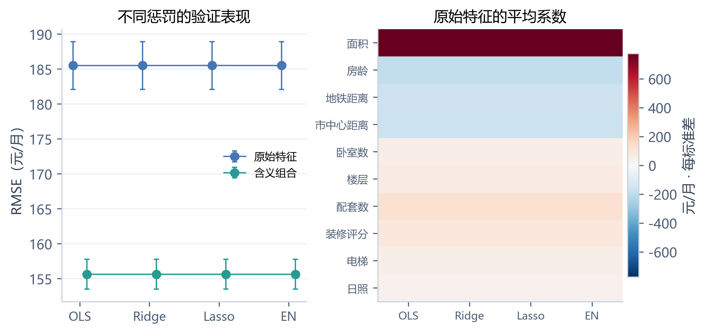

**图4 正则化的预测表现与原始特征系数**

左图展示原始特征及内层选择后的含义组合，误差线表示五折标准差；右图展示原始特征模型的折间平均标准化系数，色标单位为元/月·每标准差。两种特征家族中，各求解方法的误差与系数分配都很接近，说明正则化在当前样本规模下没有自动带来明显精度收益。

在二次特征中，Lasso 将外层平均非零项数从 OLS 的 64 项减至 36.6 项，RMSE 从 129.865 降至 129.591 元/月。与改变特征表达带来的收益相比，这一误差改善较小，主要支持用更少的项表达近似的预测关系。外层平均项数描述不同训练折的结果，不能与全训练集最终项数混为一谈。

Lasso 对相关项的选择可能随训练样本变化，因此非零项不等于稳定识别出的真实影响因素；其稀疏性首先是预测公式的性质。

<!-- q2-section-code:2.5.3:begin -->

**对应代码（question2/features.py，第 87—114 行）**

```python
class CheckedLinear(RegressorMixin, BaseEstimator):
    """统一参数入口；收敛警告必须重试，仍失败则排除该候选。"""
    def __init__(self, kind="ols", alpha=1.0, l1_ratio=0.5):
        self.kind = kind
        self.alpha = alpha
        self.l1_ratio = l1_ratio

    def fit(self, x, y):
        estimators = {"ols": LinearRegression(), "ridge": Ridge(alpha=self.alpha),
                      "lasso": Lasso(alpha=self.alpha, max_iter=50000, tol=1e-6),
                      "elastic": ElasticNet(alpha=self.alpha, l1_ratio=self.l1_ratio,
                                            max_iter=50000, tol=1e-6)}
        self.estimator_ = estimators[self.kind]
        self.retried_ = False
        with warnings.catch_warnings():
            warnings.simplefilter("error", ConvergenceWarning)
            try:
                self.estimator_.fit(x, y)
            except ConvergenceWarning:
                self.estimator_.set_params(max_iter=200000)
                self.retried_ = True
                self.estimator_.fit(x, y)
        self.coef_ = self.estimator_.coef_
        self.intercept_ = self.estimator_.intercept_
        return self

    def predict(self, x):
        return self.estimator_.predict(x)
```


**对应代码（question2/report.py，第 203—210 行）**

```python
rows = []
for family in ["raw", "domain", "quadratic", "spline"]:
    row = [FAMILY_LABEL[family]]
    for method in ["ols", "ridge", "lasso", "elastic"]:
        result = by_key.loc[f"{family}:{method}"]
        row.append(f"{result.rmse:.3f}")
    rows.append(row)
add(table(["特征方案", "OLS RMSE", "Ridge RMSE", "Lasso RMSE", "Elastic Net RMSE"], rows))
```


**对应代码（question2/plot.py，第 276—278 行）**

```python
comparison = pd.read_csv(output / "comparison.csv")
folds = pd.read_csv(output / "fold_metrics.csv")
coef = json.loads((output / "fold_coefficients.json").read_text(encoding="utf-8"))
```


**对应代码（question2/plot.py，第 304—322 行）**

```python
fig, ax = axes_pair()
methods = ["ols", "ridge", "lasso", "elastic"]
for shift, family, color in [(-.1, "raw", COLORS[0]), (.1, "domain", COLORS[1])]:
    rows = comparison.set_index("candidate").loc[[f"{family}:{m}" for m in methods]]
    ax[0].errorbar(np.arange(4)+shift, rows.rmse, yerr=rows.rmse_std, fmt="o-", color=color,
                   label=FAMILY_LABEL[family], capsize=2, lw=1)
ax[0].set_xticks(range(4), ["OLS", "Ridge", "Lasso", "EN"], fontsize=9)
ax[0].set(ylabel="RMSE（元/月）", title="不同惩罚的验证表现")
ax[0].legend(fontsize=8)
light_grid(ax[0])
weights = np.array([np.mean([r["standardized_coefficients"] for r in coef[f"raw:{m}"]], axis=0) for m in methods]).T
limit = np.abs(weights).max()
image = ax[1].imshow(weights, cmap="RdBu_r", vmin=-limit, vmax=limit, aspect="auto")
ax[1].set_yticks(range(10), LABELS, fontsize=8)
ax[1].set_xticks(range(4), ["OLS", "Ridge", "Lasso", "EN"], fontsize=8)
ax[1].set_title("原始特征的平均系数")
fig.colorbar(image, ax=ax[1], label="元/月 · 每标准差", shrink=.82, pad=.02)
save(fig, "08", "正则化的预测表现与系数变化",
     "左图比较原始特征和内层选择后的组合特征，误差线为五折标准差。右图为原始特征模型的折间平均标准化系数，反映方向和量级。惩罚强度均独立调优，不把相同 alpha 解释为相同惩罚。", 2)
```

<!-- q2-section-code:2.5.3:end -->

### 2.5.4 综合比较与最终模型选择

**表10 各主要特征家族的最低外层平均误差**

| 特征家族 | 最低误差方法 | RMSE：均值 ± 标准差（元/月） |
| --- | --- | --- |
| 原始特征 | OLS | 185.488 ± 3.423 |
| 类别编码 | Elastic Net | 179.411 ± 3.278 |
| 含义组合 | Elastic Net | 155.588 ± 2.129 |
| 二次特征 | Lasso | 129.591 ± 4.047 |
| 加性样条 | Lasso | 128.940 ± 3.038 |

表10用于最终候选取舍，与表6固定 OLS 的比较回答不同问题。最低外层平均误差来自样条＋Lasso，精确均值为 128.939771 元/月，折间标准差为 3.037577。按2.3节的规则，阈值为：

$$
T=128.939771+\frac{3.037577}{\sqrt{5}}
\approx130.298217\ \text{元/月}.
$$

二次＋Lasso 的平均 RMSE 为 129.591027 元/月，在阈值内，且在二次方案中平均非零项更少，因此确定为最终方案。其验证误差比最低值高约 0.651 元/月，换取无需保存样条节点、可直接代入的显式多项式。这是沿用选择规则作出的取舍，不表示二次模型取得了最低误差，也不表示两个模型已被证明统计等价。

另有 PCA 和 PLS 预测对照：PCA 保留两个、九个和十个成分时，平均外层 RMSE 分别约为 410.25、262.15 和 185.49 元/月；PLS 五个成分约为 188.04 元/月，最佳结果接近原始 OLS。它们没有改善预测，因此未进入最终流程，详细结果见附录B。

最终预测步骤为：原始十个变量输入、生成 64 个二次候选项、按训练参数标准化、使用 Lasso 预测月租金。降维投影不参与这条流程。

<!-- q2-section-code:2.5.4:begin -->

**对应代码（question2/experiment.py，第 195—211 行）**

```python
np.savez_compressed(output / "oof_predictions.npz", listing_id=ids, y=y, **predictions)
save_json(output / "fold_coefficients.json", coefficients)
frame = pd.DataFrame(rows)
summary = frame.groupby(["candidate", "family"]).agg(
    rmse=("rmse", "mean"), rmse_std=("rmse", "std"), mae=("mae", "mean"),
    r2=("r2", "mean"), nonzero=("nonzero", "mean"), train_rmse=("train_rmse", "mean")).reset_index()
summary.to_csv(output / "comparison.csv", index=False, encoding="utf-8-sig")
eligible = summary[~summary.candidate.str.startswith(("dimension:", "ablation:", "mean:"))].copy()
best = eligible.loc[eligible.rmse.idxmin()]
threshold = best.rmse + best.rmse_std / np.sqrt(len(folds))
rank = {"raw": 0, "pcr": 0, "pls": 0, "encoded": 1, "domain": 1, "quadratic": 2, "spline": 3}
shortlist = eligible[eligible.rmse <= threshold].copy()
shortlist["complexity"] = shortlist.family.map(rank)
chosen = shortlist.sort_values(["complexity", "nonzero", "rmse", "candidate"]).iloc[0]
save_json(output / "selection.json", dict(lowest_rmse=best.candidate, selected=chosen.candidate,
          threshold=float(threshold), eligible=shortlist.candidate.tolist(), test_used=False))
print("SELECTED", chosen.candidate, "LOWEST", best.candidate, flush=True)
```


**对应代码（question2/report.py，第 182—189 行）**

```python
family_rows = []
for family in FAMILY_LABEL:
    subset = eligible[eligible.family == family]
    best = subset.loc[subset.rmse.idxmin()]
    method = best.candidate.split(":")[1]
    family_rows.append([FAMILY_LABEL[family], METHOD_LABEL[method], f"{best.rmse:.3f} ± {best.rmse_std:.3f}",
                        f"{best.mae:.3f}", f"{best.r2:.5f}"])
add(table(["特征家族", "最低误差方法", "外层 RMSE：均值 ± 标准差", "MAE", "$R^2$"], family_rows))
```

<!-- q2-section-code:2.5.4:end -->

## 2.6 最终模型及其含义

### 2.6.1 全训练集拟合与项数

确定二次＋Lasso 后，在全部 7,500 条训练记录内部重新进行五折调参，种子为 2026。最终 alpha 为 0.316227766017，模型从 64 个候选项中保留 30 个非零项。

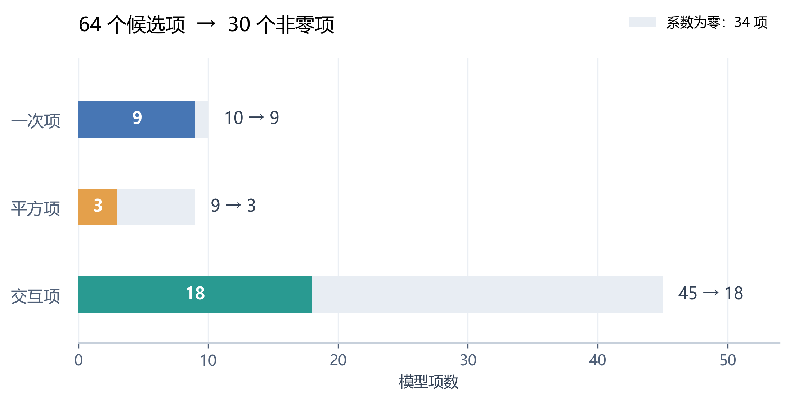

**图5 Lasso 对二次候选项的筛选结果**

条形总长度为候选项数，彩色部分为最终非零项，浅灰部分为系数为零的项。一次项由 10 项保留 9 项，平方项由 9 项保留 3 项，交互项由 45 项保留 18 项，合计保留 30 项，另有 34 项为零；截距不计入项数。

三十项由同时拟合全部候选项后得到，并非预先指定保留数量或按系数大小截取。电梯一次项被置零，但电梯仍出现在交互项中，不能解释为电梯没有作用。

<!-- q2-section-code:2.6.1:begin -->

**对应代码（question2/experiment.py，第 214—242 行）**

```python
def finalize(config, output):
    if (output / "final_metrics.json").exists():
        print("Final evaluation already exists; use saved results.", flush=True)
        return
    selection = json.loads((output / "selection.json").read_text(encoding="utf-8"))
    family, method = selection["selected"].split(":")
    ids, x, y = read_data(ROOT / config["data"]["train"])
    cv = list(KFold(5, shuffle=True, random_state=2026).split(x))
    records = tune(family, x, y, cv, config, output / "final_search.json")
    filters = {} if method == "pls" else {"model__kind": method}
    record = best_record(records, **filters)
    model = pipeline_for(family).set_params(**record["params"]).fit(x, y)
    formula = export_formula(model)
    joblib.dump(model, output / "final_model.joblib")
    save_json(output / "final_formula.json", formula)
    save_json(output / "model_lock.json", dict(candidate=selection["selected"], params=record["params"],
              model_sha256=hashlib.sha256((output / "final_model.joblib").read_bytes()).hexdigest()))
    # 模型与参数已经锁定，现在才进入测试评价。
    test_ids, x_test, y_test = read_data(ROOT / config["data"]["test"])
    if set(ids) & set(test_ids):
        raise ValueError("训练集与测试集编号重叠。")
    prediction = model.predict(x_test).reshape(-1)
    pd.DataFrame(dict(listing_id=test_ids, actual_rent=y_test, predicted_rent=prediction,
                      residual=y_test-prediction)).to_csv(output / "test_predictions.csv", index=False,
                                                        encoding="utf-8-sig", float_format="%.10f")
    result = dict(train=metrics(y, model.predict(x).reshape(-1)), test=metrics(y_test, prediction),
                  inner_cv_rmse=record["rmse"], test_rows=len(y_test))
    save_json(output / "final_metrics.json", result)
    print("FINAL", result, flush=True)
```


**对应代码（question2/plot.py，第 112—121 行）**

```python
def term_counts(formula):
    """按实际保存的项名分类；系数恰为零表示该项被移除。"""
    counts = {name: [0, 0] for name in ["一次项", "平方项", "交互项"]}
    for name, coefficient in zip(formula["names"], formula["coefficients"]):
        group = "交互项" if " " in name else "一次项"
        if "^2" in name:
            group = "平方项"
        counts[group][0] += 1
        counts[group][1] += int(coefficient != 0)
    return counts
```


**对应代码（question2/plot.py，第 124—144 行）**

```python
def lasso_selection(formula):
    counts = term_counts(formula)
    total = sum(row[0] for row in counts.values())
    retained = sum(row[1] for row in counts.values())
    fig, ax = plt.subplots(figsize=(7.2, 3.6), layout="constrained")
    colors = [COLORS[0], COLORS[2], COLORS[1]]
    for i, ((label, (before, after)), color) in enumerate(zip(counts.items(), colors)):
        ax.barh(i, before, height=.42, color="#E8EDF3", zorder=2)
        ax.barh(i, after, height=.42, color=color, zorder=3)
        ax.text(after / 2, i, str(after), ha="center", va="center",
                 color="white", fontweight="bold", fontsize=11)
        ax.text(before + 1.2, i, f"{before} → {after}", va="center", color="#344256", fontsize=11)
    ax.set_yticks(range(3), counts.keys(), fontsize=11)
    ax.set(xlabel="模型项数", xlim=(0, 54), ylim=(2.55, -.7), xticks=range(0, 51, 10))
    ax.set_title(f"{total} 个候选项  →  {retained} 个非零项", loc="left", fontsize=13, pad=18)
    ax.legend(handles=[Patch(facecolor="#E8EDF3", label=f"系数为零：{total-retained} 项")],
               loc="upper right", bbox_to_anchor=(1, 1.19), fontsize=9)
    ax.spines["left"].set_visible(False)
    ax.tick_params(axis="y", length=0, pad=12)
    light_grid(ax, "x")
    return fig
```


**对应代码（question2/plot.py，第 325—341 行）**

```python
model = joblib.load(output / "final_model.joblib")
final = json.loads((output / "final_metrics.json").read_text(encoding="utf-8"))
pred = pd.read_csv(output / "test_predictions.csv")
formula = json.loads((output / "final_formula.json").read_text(encoding="utf-8"))
counts = term_counts(formula)
total = sum(row[0] for row in counts.values())
retained = sum(row[1] for row in counts.values())
transitions = "、".join(f"{label} {before}→{after}" for label, (before, after) in counts.items())
fig = lasso_selection(formula)
save(fig, "09", "Lasso 对二次候选项的筛选结果",
     f"图中每根条的总长度表示该类候选项数，彩色部分表示最终非零项，浅灰部分表示系数为零的项。"
     f"具体为{transitions}，共由 {total} 项减少为 {retained} 项，另有 {total-retained} 项系数为零。"
     "候选集中未重复加入电梯平方项，因为二元电梯变量的平方等于自身。\n\n"
     "这些数量来自全训练集上已锁定模型的实际系数，截距不计入项数。Lasso 同时拟合全部候选项，"
     "在交叉验证选定的惩罚强度下使部分系数变为零，并未预先指定保留 30 项，也不是按系数大小截取前 30 项。"
     "电梯一次项虽被置零，仍通过交互项参与预测；因此，30 个模型项不能理解为 30 个原始变量。"
     "该图说明公式如何简化，不把项数或保留比例解释为变量的重要性。", 1)
```

<!-- q2-section-code:2.6.1:end -->

### 2.6.2 原始单位下的完整数学表达式

训练模型采用标准化输入。为直接使用原始单位，将系数还原：

$$
\beta_j=\frac{\theta_j}{s_j},
\qquad
\beta_0=b-\sum_{j=1}^{p}\frac{\theta_j\mu_j}{s_j},
\qquad
\hat y=\beta_0+\sum_{j=1}^{p}\beta_j\phi_j(\boldsymbol{x}).
$$

以下变量含义与单位见表1，$x_3$ 必须为千米，预测结果单位为元/月。代入该式时无需再次标准化：

$$
\begin{aligned}
\hat y={}&771.8941993+37.27739901x_{1} -6.50204899x_{2}\\
&-252.9461064x_{3} -23.0206845x_{4} +39.44256598x_{5}\\
&-3.189508257x_{6} +34.35867426x_{7} +80.66526914x_{8}\\
&+24.62660816x_{10} -0.06939873912x_{1}^{2} -0.9771502422x_{1} x_{3}\\
&+0.01695847509x_{1} x_{8} -0.4179799691x_{2}^{2} +0.07550647529x_{2} x_{5}\\
&+0.2879721423x_{2} x_{9} +55.13342819x_{3}^{2} -0.09030808934x_{3} x_{6}\\
&-2.610393559x_{3} x_{7} -1.012338683x_{3} x_{8} -3.831144181x_{3} x_{9}\\
&+0.02190216272x_{4} x_{6} +0.1940312942x_{5} x_{7} +2.144601723x_{5} x_{8}\\
&+1.436045211x_{5} x_{9} -0.2683207743x_{6} x_{8} +13.95234617x_{6} x_{9}\\
&-0.01622982817x_{6} x_{10} -0.7951801483x_{7} x_{9} +0.4895634312x_{7} x_{10}\\
&-1.719834572x_{8} x_{9}
\end{aligned}
$$

系数显示为十位有效数字，完整浮点参数保存在 [final_formula.json](附件/HW2_第二题/results/complete/final_formula.json)。其余未出现的候选项系数为零。

<!-- q2-section-code:2.6.2:begin -->

**对应代码（question2/features.py，第 117—137 行）**

```python
def export_formula(pipeline):
    feature = pipeline.named_steps["features"]
    scale = pipeline.named_steps["scale"]
    model = pipeline.named_steps["model"]
    coef = np.asarray(model.coef_).reshape(-1)
    intercept = float(np.asarray(model.intercept_).reshape(-1)[0])
    if "pca" in pipeline.named_steps:
        pca = pipeline.named_steps["pca"]
        coef = pca.components_.T @ coef
        intercept -= float(pca.mean_ @ coef)
    if hasattr(model, "_x_mean"):
        intercept -= float(model._x_mean @ coef)
    raw_coef = coef / scale.scale_
    intercept -= float(scale.mean_ @ raw_coef)
    result = dict(intercept=intercept, coefficients=raw_coef.tolist(), names=feature.names_,
                  feature_spec=feature.get_params(), scale_mean=scale.mean_.tolist(),
                  scale_std=scale.scale_.tolist(), standardized_coefficients=coef.tolist())
    if feature.kind == "spline":
        result["spline_knots"] = [b.t.tolist() for b in feature.spline_.bsplines_]
        result["spline_degree"] = 3
    return result
```


**对应代码（question2/report.py，第 19—28 行）**

```python
def term_math(name):
    tokens = []
    for part in name.split(" "):
        base, *power = part.split("^")
        j = NAMES.index(base) + 1
        token = "x_{" + str(j) + "}"
        if power:
            token += "^{" + power[0] + "}"
        tokens.append(token)
    return " ".join(tokens)
```


**对应代码（question2/report.py，第 31—43 行）**

```python
def polynomial_expression(formula):
    terms = []
    for name, value in zip(formula["names"], formula["coefficients"]):
        if value == 0:
            continue
        sign = "+" if value > 0 else "-"
        terms.append(f"{sign}{abs(value):.10g}" + term_math(name))
    lines = [r"\begin{aligned}", r"\hat y={}&" + f"{formula['intercept']:.10g}" + " ".join(terms[:2]) + r"\\"]
    for start in range(2, len(terms), 3):
        suffix = r"\\" if start + 3 < len(terms) else ""
        lines.append("&" + " ".join(terms[start:start+3]) + suffix)
    lines.append(r"\end{aligned}")
    return "$$\n" + "\n".join(lines) + "\n$$"
```

<!-- q2-section-code:2.6.2:end -->

### 2.6.3 单条房源复算与模型影响

以测试房源 B0014756 为例，输入按表1顺序排列为：

$$
\boldsymbol{x}
=(76.8549,\ 25,\ 0.12,\ 3.504,\ 2,\ 13,\ 15,\ 3,\ 0,\ 5.7784).
$$

代入最终模型得到预测租金 3673.921592 元/月，实际租金为 3752.392900 元/月，残差为 78.471308 元/月。该示例用于说明公式应用，全部测试样本的评价见2.7节。

含交互项和平方项时，一次项系数不能单独解释为固定边际影响。例如，由上述公式可得面积的模型偏导：

$$
\frac{\partial\hat y}{\partial x_1}
=37.27739901
-0.13879747824x_1
-0.9771502422x_3
+0.01695847509x_8.
$$

面积影响随面积、地铁距离和装修评分变化。因此，用局部累积效应（ALE）进一步观察模型形状。

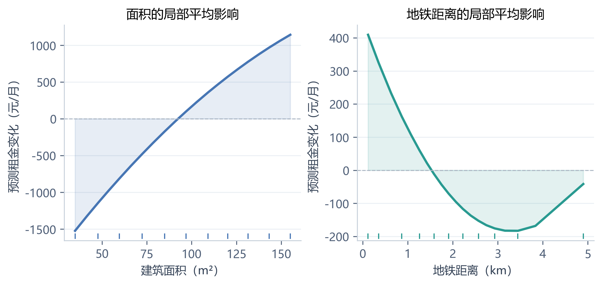

**图6 最终模型的局部平均影响曲线**

曲线依据训练数据的 20 个分位区间，比较区间内的局部预测差异，累积并中心化；底部短线标示特征分位位置，纵轴为相对预测租金变化。填色表示曲线与零线之间的区域，不是置信区间。面积曲线整体上升且逐渐放缓，符合该模型中面积平方项为负的弯曲形式。

地铁距离曲线在约 3—4 千米后回升，显示二次近似在尾部的局限，也受到不同局部样本中其他变量分布的影响。ALE 减少了全范围替换造成的不合理房源组合，但仍描述模型而非因果效应；不能据此认为远离地铁会导致租金上涨。

<!-- q2-section-code:2.6.3:begin -->

**对应代码（question2/verify.py，第 17—29 行）**

```python
def independent_polynomial(x, formula, rounded=False):
    """按导出的项名逐项计算，不调用特征变换器或模型预测。"""
    intercept = float(f"{formula['intercept']:.10g}") if rounded else formula["intercept"]
    result = np.full(len(x), intercept)
    for name, coefficient in zip(formula["names"], formula["coefficients"]):
        coefficient = float(f"{coefficient:.10g}") if rounded else coefficient
        column = np.ones(len(x))
        for token in name.split():
            base, *power = token.split("^")
            exponent = int(power[0]) if power else 1
            column *= x[:, NAMES.index(base)] ** exponent
        result += coefficient * column
    return result
```


**对应代码（question2/report.py，第 229—231 行）**

```python
values = r",\ ".join(f"{v:.12g}" for v in test_x[0])
add(f"以测试房源 **{test_ids[0]}** 为例，按字段顺序的输入为：\n\n$$\n\\boldsymbol{{x}}=({values}).\n$$")
add(f"将上述输入代入完整公式，得到预测租金 {pred.predicted_rent.iloc[0]:.6f} 元/月；实际租金为 {test_y[0]:.6f} 元/月，残差（实际减预测）为 {pred.residual.iloc[0]:.6f} 元/月。所有 1,500 条预测均保存在单独 CSV 中，不只展示示例。")
```


**对应代码（question2/plot.py，第 147—159 行）**

```python
def ale_curve(model, x, column, bins=20):
    edges = np.unique(np.quantile(x[:, column], np.linspace(0, 1, bins + 1)))
    membership = np.clip(np.searchsorted(edges, x[:, column], side="right") - 1, 0, len(edges)-2)
    increments = []
    for b in range(len(edges)-1):
        subset = x[membership == b].copy()
        lower, upper = subset.copy(), subset.copy()
        lower[:, column], upper[:, column] = edges[b], edges[b+1]
        change = model.predict(upper).reshape(-1) - model.predict(lower).reshape(-1)
        increments.append(float(change.mean()))
    values = np.r_[0, np.cumsum(increments)]
    values -= np.interp(x[:, column], edges, values).mean()
    return edges, values
```


**对应代码（question2/plot.py，第 342—353 行）**

```python
fig, ax = axes_pair()
for a, j, xlabel, color in zip(ax, [0, 2], ["建筑面积（m²）", "地铁距离（km）"], COLORS):
    edges, effects = ale_curve(model, x, j)
    a.fill_between(edges, 0, effects, color=color, alpha=.13)
    a.plot(edges, effects, color=color, lw=2)
    a.axhline(0, color="#AAB5C2", lw=.8, ls="--")
    a.set(xlabel=xlabel, ylabel="预测租金变化（元/月）", title=LABELS[j]+"的局部平均影响")
    a.plot(np.quantile(x[:, j], np.linspace(0, 1, 11)), np.full(11, .02), "|", color=color,
           transform=a.get_xaxis_transform(), markersize=5)
    light_grid(a)
save(fig, "10", "最终模型的局部平均影响曲线",
     "曲线依据 20 个分位数区间内的局部预测差异累积并中心化，底部短线表示特征分位位置。纵轴反映模型预测随特征变化的相对增减，减少远离真实房源组合的替换；它不是因果效应。", 2)
```

<!-- q2-section-code:2.6.3:end -->

## 2.7 测试集预测与误差分析

### 2.7.1 整体预测表现

模型及参数锁定后，对全部 1,500 条测试记录生成预测。

**表11 最终模型的训练、验证与测试表现**

| 数据范围 | RMSE（元/月） | MAE（元/月） | $R^2$ |
| --- | --- | --- | --- |
| 五折外层验证均值 | 129.591027 | 103.194754 | 0.982671 |
| 全训练集重拟合 | 128.788695 | 102.594021 | 0.982941 |
| 独立测试集 | 127.210978 | 102.195522 | 0.983011 |

外层一行对应二次＋Lasso 候选在不同训练折上独立调参拟合的结果，并非最终固定系数模型的重复评价。测试误差与外层验证误差接近，表明本次独立样本上的表现与开发阶段估计一致，没有观察到明显性能下降。训练重拟合误差仅作补充，不能替代验证误差。

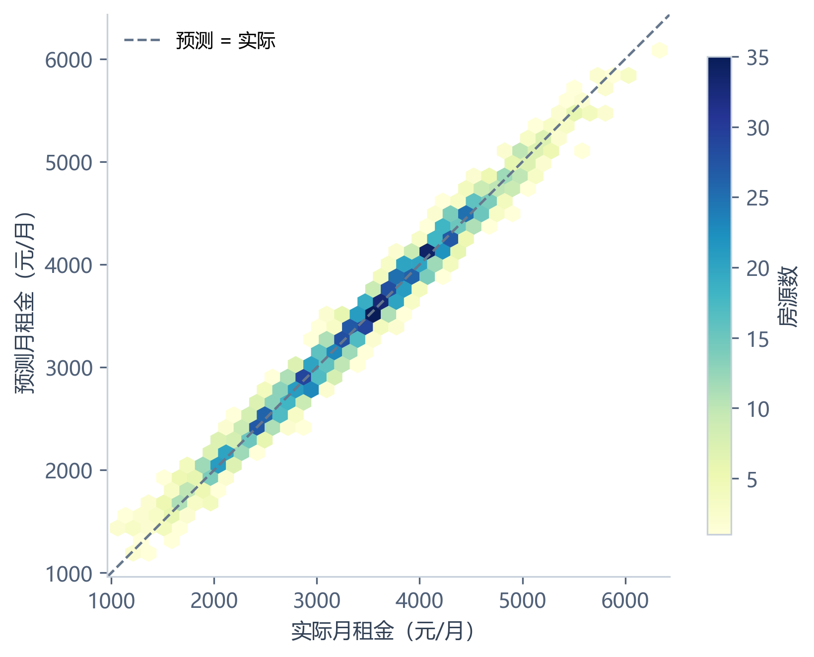

**图7 测试集实际租金与最终预测**

图7使用六边形分箱展示全部测试记录，颜色表示房源数量，虚线表示预测等于实际。样本总体沿参考线分布，说明模型捕捉了主要租金变化；测试 MAE 为 102.20 元/月，反映平均绝对预测偏差的量级，但不保证每条房源都达到这一误差水平。

<!-- q2-section-code:2.7.1:begin -->

**对应代码（question2/experiment.py，第 26—28 行）**

```python
def metrics(y, pred):
    return dict(rmse=float(np.sqrt(mean_squared_error(y, pred))),
                mae=float(mean_absolute_error(y, pred)), r2=float(r2_score(y, pred)))
```


**对应代码（question2/experiment.py，第 214—242 行）**

```python
def finalize(config, output):
    if (output / "final_metrics.json").exists():
        print("Final evaluation already exists; use saved results.", flush=True)
        return
    selection = json.loads((output / "selection.json").read_text(encoding="utf-8"))
    family, method = selection["selected"].split(":")
    ids, x, y = read_data(ROOT / config["data"]["train"])
    cv = list(KFold(5, shuffle=True, random_state=2026).split(x))
    records = tune(family, x, y, cv, config, output / "final_search.json")
    filters = {} if method == "pls" else {"model__kind": method}
    record = best_record(records, **filters)
    model = pipeline_for(family).set_params(**record["params"]).fit(x, y)
    formula = export_formula(model)
    joblib.dump(model, output / "final_model.joblib")
    save_json(output / "final_formula.json", formula)
    save_json(output / "model_lock.json", dict(candidate=selection["selected"], params=record["params"],
              model_sha256=hashlib.sha256((output / "final_model.joblib").read_bytes()).hexdigest()))
    # 模型与参数已经锁定，现在才进入测试评价。
    test_ids, x_test, y_test = read_data(ROOT / config["data"]["test"])
    if set(ids) & set(test_ids):
        raise ValueError("训练集与测试集编号重叠。")
    prediction = model.predict(x_test).reshape(-1)
    pd.DataFrame(dict(listing_id=test_ids, actual_rent=y_test, predicted_rent=prediction,
                      residual=y_test-prediction)).to_csv(output / "test_predictions.csv", index=False,
                                                        encoding="utf-8-sig", float_format="%.10f")
    result = dict(train=metrics(y, model.predict(x).reshape(-1)), test=metrics(y_test, prediction),
                  inner_cv_rmse=record["rmse"], test_rows=len(y_test))
    save_json(output / "final_metrics.json", result)
    print("FINAL", result, flush=True)
```


**对应代码（question2/plot.py，第 355—366 行）**

```python
fig, ax = plt.subplots(figsize=(6, 4.3), layout="constrained")
image = ax.hexbin(pred.actual_rent, pred.predicted_rent, gridsize=35, mincnt=1,
                  cmap="YlGnBu", linewidths=.15)
low = min(pred.actual_rent.min(), pred.predicted_rent.min())-100
high = max(pred.actual_rent.max(), pred.predicted_rent.max())+100
ax.plot([low, high], [low, high], color="#66778D", ls="--", lw=1.2, label="预测 = 实际")
ax.set(xlabel="实际月租金（元/月）", ylabel="预测月租金（元/月）", xlim=(low, high), ylim=(low, high))
ax.set_aspect("equal", adjustable="box")
ax.legend(loc="upper left")
fig.colorbar(image, ax=ax, label="房源数", shrink=.85)
save(fig, "11", "测试集实际租金与最终预测",
     f"对全部 1,500 条测试房源，最终模型的 RMSE 为 {final['test']['rmse']:.2f} 元/月，MAE 为 {final['test']['mae']:.2f} 元/月，R² 为 {final['test']['r2']:.4f}。参考线上的点表示预测与实际一致。", 1)
```

<!-- q2-section-code:2.7.1:end -->

### 2.7.2 残差与分组诊断

定义残差为：

$$
e_i=y_i-\hat y_i.
$$

正残差表示低估，负残差表示高估。

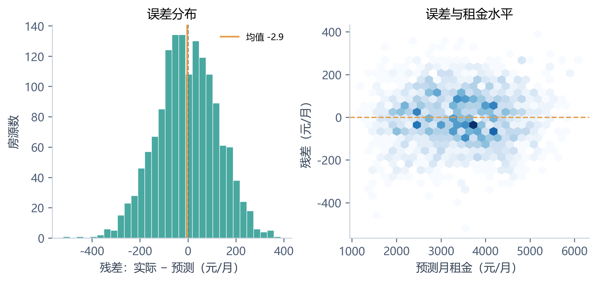

**图8 最终模型的测试残差诊断**

左图展示残差分布，右图展示残差与预测租金的关系，分箱颜色越深表示样本越集中。残差总体集中在零附近，均值为 -2.88 元/月，说明整体平均偏向较小，但仍存在较大的个别误差。

**表12 测试误差分布，单位为元/月**

| 绝对误差中位数 | 绝对误差90%分位数 | 绝对误差95%分位数 | 最大绝对误差 | 残差均值 |
| --- | --- | --- | --- | --- |
| 86.230 | 209.092 | 247.534 | 520.486 | -2.883 |

约九成测试房源的绝对误差不超过 209.09 元/月；最大绝对误差为 520.49 元/月，提示平均误差之外仍需关注尾部样本。

使用训练租金的三分位数 3095.933 和 4026.923 元/月作为阈值，按测试记录的实际租金分组：

**表13 不同实际租金组的测试误差**

| 测试分组 | 样本数 | RMSE（元/月） | MAE（元/月） | 平均残差（元/月） |
| --- | --- | --- | --- | --- |
| 低租金组 | 558 | 132.738 | 104.320 | -19.819 |
| 中租金组 | 498 | 121.160 | 98.319 | 1.758 |
| 高租金组 | 444 | 126.739 | 103.873 | 13.196 |

低租金组平均略被高估，高租金组平均略被低估，中租金组的 RMSE 较低。这是按实际租金条件分组后的描述性结果，不单独证明模型偏差的成因。测试诊断不用于后续调参。

<!-- q2-section-code:2.7.2:begin -->

**对应代码（question2/report.py，第 242—255 行）**

```python
absolute = np.abs(pred.residual)
add(table(["绝对误差中位数", "90% 分位数", "95% 分位数", "最大值", "残差均值"],
          [[f"{absolute.median():.3f}", f"{absolute.quantile(.9):.3f}", f"{absolute.quantile(.95):.3f}",
            f"{absolute.max():.3f}", f"{pred.residual.mean():.3f}"]]))
# 分组边界由训练集分位数确定，测试分组仅用于最终误差描述。
cuts = np.quantile(y, [1/3, 2/3])
group = np.digitize(test_y, cuts)
group_rows = []
for i, label in enumerate(["低租金组", "中租金组", "高租金组"]):
    residual = pred.residual.to_numpy()[group == i]
    group_rows.append([label, len(residual), f"{np.sqrt(np.mean(residual**2)):.3f}",
                       f"{np.mean(np.abs(residual)):.3f}", f"{residual.mean():.3f}"])
add(f"按训练租金三分位数 {cuts[0]:.3f} 和 {cuts[1]:.3f} 元/月划分测试样本，分组结果如下。这是模型锁定后的描述性诊断，不反向调整模型。")
add(table(["测试分组", "样本数", "RMSE", "MAE", "平均残差"], group_rows))
```


**对应代码（question2/plot.py，第 368—379 行）**

```python
fig, ax = axes_pair()
residual = pred.residual.to_numpy()
ax[0].hist(residual, bins=32, color=COLORS[1], alpha=.85, edgecolor="white", linewidth=.5)
ax[0].axvline(0, color="#52647B", ls="--", lw=1)
ax[0].axvline(residual.mean(), color=COLORS[2], lw=1.5, label=f"均值 {residual.mean():.1f}")
ax[0].set(xlabel="残差：实际 − 预测（元/月）", ylabel="房源数", title="误差分布")
ax[0].legend(fontsize=8)
ax[1].hexbin(pred.predicted_rent, residual, gridsize=27, mincnt=1, cmap="Blues", linewidths=.1)
ax[1].axhline(0, color=COLORS[2], ls="--", lw=1.2)
ax[1].set(xlabel="预测月租金（元/月）", ylabel="残差（元/月）", title="误差与租金水平")
save(fig, "12", "最终模型的测试残差诊断",
     f"残差定义为实际租金减预测租金，正值表示低估。测试残差均值为 {residual.mean():.2f} 元/月。两图用于检查整体偏向、尾部误差及误差是否随租金水平变化；测试诊断不再用于调参。", 2)
```

<!-- q2-section-code:2.7.2:end -->

### 2.7.3 最终预测结果

**表14 部分测试房源预测，金额单位为元/月**

| 房源编号 | 实际租金 | 预测租金 | 残差 |
| --- | --- | --- | --- |
| B0014756 | 3752.393 | 3673.922 | 78.471 |
| B0017557 | 3244.259 | 3128.629 | 115.630 |
| B0017753 | 3169.679 | 3098.878 | 70.801 |
| B0006044 | 4302.596 | 4483.334 | -180.738 |
| B0017162 | 3116.994 | 2935.596 | 181.398 |
| B0007310 | 2234.207 | 2268.828 | -34.621 |
| B0018976 | 6333.889 | 6084.343 | 249.547 |
| B0011752 | 1954.211 | 1703.914 | 250.297 |

表14用于展示输出格式和不同记录的预测误差，整体评价基于全部测试样本。完整结果见 [test_predictions.csv](附件/HW2_第二题/results/complete/test_predictions.csv)，包含房源编号、实际租金、预测租金及残差。

<!-- q2-section-code:2.7.3:begin -->

**对应代码（question2/experiment.py，第 232—242 行）**

```python
test_ids, x_test, y_test = read_data(ROOT / config["data"]["test"])
if set(ids) & set(test_ids):
    raise ValueError("训练集与测试集编号重叠。")
prediction = model.predict(x_test).reshape(-1)
pd.DataFrame(dict(listing_id=test_ids, actual_rent=y_test, predicted_rent=prediction,
                  residual=y_test-prediction)).to_csv(output / "test_predictions.csv", index=False,
                                                    encoding="utf-8-sig", float_format="%.10f")
result = dict(train=metrics(y, model.predict(x).reshape(-1)), test=metrics(y_test, prediction),
              inner_cv_rmse=record["rmse"], test_rows=len(y_test))
save_json(output / "final_metrics.json", result)
print("FINAL", result, flush=True)
```


**对应代码（question2/report.py，第 256—257 行）**

```python
add(table(["房源编号", "实际租金", "预测租金", "残差"],
          [[r.listing_id, f"{r.actual_rent:.3f}", f"{r.predicted_rent:.3f}", f"{r.residual:.3f}"] for r in pred.head(8).itertuples()]))
```

<!-- q2-section-code:2.7.3:end -->

## 2.8 结论、局限与实验复现

### 2.8.1 主要结论

本实验以原始线性回归为基线，通过统一验证逐项比较特征表达与正则化的作用。原始特征 OLS 的外层 RMSE 为 185.49 元/月，已明显优于均值基线；固定 OLS 后，二次特征和加性样条进一步将误差降至约 129 元/月，说明主要改进来自对输入关系的非线性表达。

组合特征消融表明，区位变换在当前候选中贡献较大，通行组也具有额外价值，空间和品质组的增益较小。正则化对精度的额外改善有限，Lasso 更突出的作用是减少非零模型项。因此，本题的模型改进不能简单归结为采用了更强的惩罚方法。

样条＋Lasso 取得最低验证误差；按已有选择规则，最终采用误差接近且可直接给出多项式表达的二次＋Lasso。全训练集模型保留 30 个非零项，在独立测试集上取得 RMSE 127.21 元/月、MAE 102.20 元/月和 $R^2=0.9830$。

<!-- q2-section-code:2.8.1:begin -->

**对应代码（读取已保存的结果，不重新训练）**

```python
import json
import pandas as pd

comparison = pd.read_csv(output / "comparison.csv").set_index("candidate")
selection = json.loads((output / "selection.json").read_text(encoding="utf-8"))
final = json.loads((output / "final_metrics.json").read_text(encoding="utf-8"))
formula = json.loads((output / "final_formula.json").read_text(encoding="utf-8"))
retained = sum(value != 0 for value in formula["coefficients"])
print("最低验证误差方案：", selection["lowest_rmse"])
print("最终选择方案：", selection["selected"])
print("最终候选的验证指标：")
print(comparison.loc[selection["selected"], ["rmse", "mae", "r2"]])
print("最终非零项数：", retained)
print("测试指标：", final["test"])
```

<!-- q2-section-code:2.8.1:end -->

### 2.8.2 适用范围与局限

结论限定于本次模拟数据、候选范围和评价指标，不能直接推广至其他城市、年份或分布。二次模型在地铁距离尾部出现回升，不宜在训练输入范围外进行无约束外推。Lasso 保留的项可能受相关性及训练样本影响，系数、ALE 曲线和降维分组均不能直接解释为因果关系。

现有对照确认了非线性表达的价值，但没有独立拆分二次模型中平方项与交互项的贡献；对于最终每个保留项是否稳定必要，也不能仅凭非零系数下结论。

<!-- q2-section-code:2.8.2:begin -->

以下代码提供模型项保留情况与局部影响分析的依据；数据适用范围和因果解释限制属于讨论，不由程序自动判定。

**对应代码（question2/plot.py，第 112—121 行）**

```python
def term_counts(formula):
    """按实际保存的项名分类；系数恰为零表示该项被移除。"""
    counts = {name: [0, 0] for name in ["一次项", "平方项", "交互项"]}
    for name, coefficient in zip(formula["names"], formula["coefficients"]):
        group = "交互项" if " " in name else "一次项"
        if "^2" in name:
            group = "平方项"
        counts[group][0] += 1
        counts[group][1] += int(coefficient != 0)
    return counts
```


**对应代码（question2/plot.py，第 147—159 行）**

```python
def ale_curve(model, x, column, bins=20):
    edges = np.unique(np.quantile(x[:, column], np.linspace(0, 1, bins + 1)))
    membership = np.clip(np.searchsorted(edges, x[:, column], side="right") - 1, 0, len(edges)-2)
    increments = []
    for b in range(len(edges)-1):
        subset = x[membership == b].copy()
        lower, upper = subset.copy(), subset.copy()
        lower[:, column], upper[:, column] = edges[b], edges[b+1]
        change = model.predict(upper).reshape(-1) - model.predict(lower).reshape(-1)
        increments.append(float(change.mean()))
    values = np.r_[0, np.cumsum(increments)]
    values -= np.interp(x[:, column], edges, values).mean()
    return edges, values
```

<!-- q2-section-code:2.8.2:end -->

### 2.8.3 程序、配置与结果入口

主实验使用 Python 3.10；主要依赖版本为 numpy 2.2.6、scipy 1.15.3、pandas 2.3.3、scikit-learn 1.7.2、matplotlib 3.10.9、PyYAML 6.0.3、umap-learn 0.5.9.post2 和 numba 0.61.2。原运行环境为 medsafety，可运行项目与固定依赖见 [第二题完整复现包](附件/HW2_第二题/HW2_第二题_完整交付.zip)。

将复现包解压，在项目根目录执行：

~~~powershell
conda activate medsafety
python -m pip install -r requirements-q2.txt
python -m question2.run --stage all
~~~

compare 执行训练集验证，finalize 确定参数并锁定模型后评价测试集，embedding 计算投影，plot 读取结果重绘，report 生成原程序报告，verify 执行核验。已有最终结果时 finalize 读取已有结果；修改实验配置时应使用新的输出目录。原实验完整结果位于 results/complete。

复现包保存划分索引、搜索记录、边界扩展、逐折系数、折外预测、模型参数和数据哈希。正文所用选择记录见 [selection.json](附件/HW2_第二题/results/complete/selection.json)，完整系数及预测见2.6、2.7节附件。附录C摘录关键实现，完整程序以复现包为准。

本报告依据既有实验记录重组论证顺序，未新增训练或重新选择模型。复现包内 report 命令生成的是原实验报告结构；本稿的章节与附录为重新编排的呈现，实验设置与数值沿用原结果。

<!-- q2-section-code:2.8.3:begin -->

**对应代码（question2/__init__.py）**

```python
"""问题二：独立、可复现的房源租金实验。"""

import os
import sys
from pathlib import Path

ROOT = Path(__file__).resolve().parents[1]
if (ROOT / ".deps").exists():
    sys.path.insert(0, str(ROOT / ".deps"))
for name in ["OMP_NUM_THREADS", "OPENBLAS_NUM_THREADS", "MKL_NUM_THREADS"]:
    os.environ.setdefault(name, "1")
os.environ.setdefault("NUMBA_NUM_THREADS", "1")
os.environ.setdefault("NUMBA_CACHE_DIR", str(ROOT / "results" / "numba_cache"))
```


**对应代码（question2/run.py）**

```python
"""运行入口：python -m question2.run --stage compare。"""

import argparse
import yaml
from . import ROOT


def main():
    parser = argparse.ArgumentParser()
    parser.add_argument("--config", default="configs/q2.yaml")
    parser.add_argument("--stage", choices=["all", "compare", "finalize", "embedding", "plot", "report", "verify"], default="all")
    args = parser.parse_args()
    config = yaml.safe_load((ROOT / args.config).read_text(encoding="utf-8"))
    output = ROOT / config["output"]
    output.mkdir(parents=True, exist_ok=True)
    snapshot = output / "config.yaml"
    current = yaml.safe_dump(config, allow_unicode=True, sort_keys=False)
    if snapshot.exists() and snapshot.read_text(encoding="utf-8") != current:
        raise ValueError("输出目录已有不同配置；请在配置中指定新的 output 目录。")
    snapshot.write_text(current, encoding="utf-8")
    if args.stage in {"all", "compare", "finalize"}:
        from .experiment import run_training
        run_training(config, output, args.stage)
    if args.stage in {"all", "embedding"}:
        from .embedding import run_embeddings
        run_embeddings(config, output)
    if args.stage in {"all", "plot"}:
        from .plot import draw_all
        draw_all(config, output)
    if args.stage in {"all", "report"}:
        from .report import build_report
        build_report(config, output)
    if args.stage in {"all", "verify"}:
        from .verify import verify
        verify(config, output)


if __name__ == "__main__":
    main()
```


**对应代码（question2/features.py，第 140—148 行）**

```python
def save_json(path, value):
    def convert(obj):
        if isinstance(obj, np.ndarray):
            return obj.tolist()
        if isinstance(obj, np.generic):
            return obj.item()
        raise TypeError(type(obj).__name__)
    path.write_text(json.dumps(value, ensure_ascii=False, indent=2, default=convert,
                               allow_nan=False), encoding="utf-8")
```


**对应代码（requirements-q2.txt）**

```text
numpy==2.2.6
scipy==1.15.3
pandas==2.3.3
scikit-learn==1.7.2
matplotlib==3.10.9
PyYAML==6.0.3
joblib==1.5.3
threadpoolctl==3.6.0
umap-learn==0.5.9.post2
numba==0.61.2
llvmlite==0.44.0
pynndescent==0.5.13
tqdm==4.67.1
```


**对应代码（question2/verify.py）**

```python
"""验证数据隔离、数值表达、样本对齐和交付文件的一致性。"""

import hashlib
import json
import re
import joblib
import numpy as np
import pandas as pd
from PIL import Image
from sklearn.base import clone
from . import ROOT
from .features import NAMES, read_data, export_formula, save_json
from .experiment import pipeline_for, metrics
from .plot import ale_curve


def independent_polynomial(x, formula, rounded=False):
    """按导出的项名逐项计算，不调用特征变换器或模型预测。"""
    intercept = float(f"{formula['intercept']:.10g}") if rounded else formula["intercept"]
    result = np.full(len(x), intercept)
    for name, coefficient in zip(formula["names"], formula["coefficients"]):
        coefficient = float(f"{coefficient:.10g}") if rounded else coefficient
        column = np.ones(len(x))
        for token in name.split():
            base, *power = token.split("^")
            exponent = int(power[0]) if power else 1
            column *= x[:, NAMES.index(base)] ** exponent
        result += coefficient * column
    return result


def verify(config, output):
    def load(name):
        return json.loads((output / name).read_text(encoding="utf-8"))
    passed = []
    ids, x, y = read_data(ROOT / config["data"]["train"])
    test_ids, xt, yt = read_data(ROOT / config["data"]["test"])
    assert len(y) == 7500 and len(yt) == 1500 and not set(ids) & set(test_ids)
    assert x.shape[1] == 10 and "listing_id" not in NAMES and "monthly_rent" not in NAMES
    for name, path in config["data"].items():
        actual = hashlib.sha256((ROOT / path).read_bytes()).hexdigest()
        assert actual == load("environment.json")["data_sha256"][name]
    passed.append("数据未改变；编号独立；仅使用十个合法输入")

    coverage = np.zeros(len(y), int)
    for i, fold in enumerate(load("folds.json")):
        train, valid = np.array(fold["train"]), np.array(fold["valid"])
        assert len(train) == 6000 and len(valid) == 1500 and not set(train) & set(valid)
        coverage[valid] += 1
        inner_coverage = np.zeros(len(train), int)
        for inner in load(f"fold_{i+1}/inner_folds.json"):
            a, b = np.array(inner["train"]), np.array(inner["valid"])
            assert len(a) == 4000 and len(b) == 2000 and not set(a) & set(b)
            assert not set(train[a]) & set(valid) and not set(train[b]) & set(valid)
            inner_coverage[b] += 1
        assert np.all(inner_coverage == 1)
    assert np.all(coverage == 1)
    assert load("selection.json")["test_used"] is False
    passed.append("五折外层与三折内层覆盖完整、无交叉；选择记录未使用测试集")

    model = joblib.load(output / "final_model.joblib")
    formula = load("final_formula.json")
    pred = model.predict(xt).reshape(-1)
    direct = independent_polynomial(xt, formula)
    equation_error = float(np.max(np.abs(pred-direct)))
    rounded_error = float(np.max(np.abs(pred-independent_polynomial(xt, formula, rounded=True))))
    assert equation_error < 1e-7 and rounded_error < 1e-4
    train_direct = independent_polynomial(x, formula)
    assert np.max(np.abs(train_direct-model.predict(x).reshape(-1))) < 1e-7
    stored = pd.read_csv(output / "test_predictions.csv")
    assert np.array_equal(stored.listing_id, test_ids)
    assert np.allclose(stored.actual_rent, yt, atol=1e-9, rtol=0)
    assert np.allclose(stored.predicted_rent, pred, atol=1e-7, rtol=0)
    assert np.allclose(stored.residual, yt-pred, atol=1e-7, rtol=0)
    permutation = np.random.default_rng(42).permutation(len(xt))
    assert np.allclose(model.predict(xt[permutation]).reshape(-1), pred[permutation], atol=1e-8)
    assert hashlib.sha256((output / "final_model.joblib").read_bytes()).hexdigest() == load("model_lock.json")["model_sha256"]
    for key, value in metrics(yt, pred).items():
        assert np.isclose(value, load("final_metrics.json")["test"][key], atol=1e-9)
    passed.append("独立多项式与报告舍入公式可复算；1500 条预测、残差、指标与模型锁定文件一致")

    # 在较小训练子集上检查代数恒等性，不重复执行完整搜索。
    raw = pipeline_for("raw").fit(x[:600], y[:600])
    pcr = pipeline_for("pcr").set_params(pca__n_components=10).fit(x[:600], y[:600])
    assert np.max(np.abs(raw.predict(x[600:800])-pcr.predict(x[600:800]))) < 1e-7
    for family in ["raw", "encoded", "domain", "quadratic", "spline", "pcr", "pls"]:
        candidate = pipeline_for(family)
        if family == "encoded":
            candidate.set_params(features__categories=(4, 7))
        candidate.fit(x[:600], y[:600])
        exported = export_formula(candidate)
        design = candidate.named_steps["features"].transform(x[600:800])
        manual = exported["intercept"] + design @ exported["coefficients"]
        assert np.max(np.abs(manual-candidate.predict(x[600:800]).reshape(-1))) < 1e-7
        expected_mean = candidate.named_steps["features"].transform(x[:600]).mean(axis=0)
        assert np.allclose(candidate.named_steps["scale"].mean_, expected_mean)
        before = candidate.named_steps["scale"].mean_.copy()
        changed = x[600:800].copy()
        changed[:, 0] += 100
        candidate.predict(changed)
        assert np.array_equal(before, candidate.named_steps["scale"].mean_)
    raw_formula = export_formula(raw)
    for j in [0, 2]:
        edges, effect = ale_curve(raw, x[:600], j)
        expected = raw_formula["coefficients"][j] * (edges-x[:600, j].mean())
        assert np.max(np.abs(effect-expected)) < 1e-7
    passed.append("全成分 PCR 与 OLS 一致；七类参数还原正确；预测不重拟合尺度；线性 ALE 与解析式一致")

    oof = np.load(output / "oof_predictions.npz")
    rows = pd.read_csv(output / "fold_metrics.csv")
    for row in rows.itertuples():
        valid = load("folds.json")[row.fold-1]["valid"]
        actual = metrics(y[valid], oof[row.candidate][valid])
        assert np.isclose(actual["rmse"], row.rmse, atol=1e-8)
    assert np.array_equal(oof["listing_id"], ids)
    passed.append("全部逐折误差可从保存的折外预测重新计算")

    pca_data = np.load(output / "pca.npz")
    assert len(pca_data["sample"]) == 3000 and len(np.unique(pca_data["sample"])) == 3000
    assert np.array_equal(pca_data["y"], y[pca_data["sample"]])
    embedding = pd.read_csv(output / "embedding_metrics.csv")
    assert len(embedding) == 30
    for file in embedding.file:
        z = np.load(output / "embeddings" / file)["coords"]
        assert z.shape == (3000, 2) and np.isfinite(z).all()
    passed.append("三种投影共用训练样本；30 组投影记录完整")

    report_path = ROOT / "docs/第二题_实验报告.md"
    report = report_path.read_text(encoding="utf-8")
    for item in load("report_sources.json"):
        path = ROOT / item["path"]
        assert hashlib.sha256(path.read_bytes()).hexdigest() == item["sha256"]
        source = path.read_text(encoding="utf-8").rstrip()
        assert source in report
    plain = re.sub(r"(?ms)^```[^\n]*\n.*?^```[ \t]*$", "", report)
    assert r"\(" not in plain and r"\[" not in plain
    math_lines = [line for line in plain.splitlines() if "$$" in line]
    assert all(line.strip() == "$$" for line in math_lines) and len(math_lines) % 2 == 0
    for document in (ROOT / "docs").glob("*.md"):
        contents = document.read_text(encoding="utf-8")
        for path in re.findall(r"!\[[^\]]*\]\(([^)]+)\)", contents):
            assert (document.parent / path).exists()
    figures = load("figures.json")
    assert {f["number"] for f in figures} == {f"{i:02d}" for i in range(1, 13)} | {"S1", "S2", "S3"}
    for fig in figures:
        assert fig["panels"] <= 2
        for field in ["png", "svg"]:
            assert (report_path.parent / fig[field]).is_file()
        with Image.open(report_path.parent / fig["png"]) as im:
            assert im.width >= 1400 and im.height >= 700
    passed.append("15 张 PNG/SVG 完整；图片路径、公式定界符、正文源码与实际文件相符")
    result = dict(passed=passed, equation_max_error=equation_error,
                  report_rounded_equation_max_error=rounded_error,
                  reader_preview="未实际打开 Markpad/Obsidian；仅核验语法、路径及 PNG 图像")
    save_json(output / "verification.json", result)
    print(json.dumps(result, ensure_ascii=False, indent=2), flush=True)
```

<!-- q2-section-code:2.8.3:end -->

## 附录A 补充模型比较

### A.1 完整候选结果

下表列出主要候选的外层五折均值，RMSE、标准差和 MAE 的单位均为元/月。平均非零项不包括截距。原始特征、组合特征等具有明确的模型项；PCA、PLS 行的非零项统计来自还原至输入坐标后的系数，不代表保留成分数。

| 候选 | RMSE | 折间标准差 | MAE | $R^2$ | 平均非零项 |
| --- | --- | --- | --- | --- | --- |
| spline:lasso | 128.939771 | 3.037577 | 102.622185 | 0.982846 | 36.4 |
| spline:ols | 129.040478 | 3.082784 | 102.711015 | 0.982817 | 36.6 |
| spline:elastic | 129.045715 | 3.124313 | 102.707954 | 0.982816 | 36.6 |
| spline:ridge | 129.046081 | 3.100280 | 102.712061 | 0.982816 | 36.6 |
| quadratic:lasso | 129.591027 | 4.046845 | 103.194754 | 0.982671 | 36.6 |
| quadratic:elastic | 129.860915 | 3.965882 | 103.365211 | 0.982599 | 64.0 |
| quadratic:ridge | 129.861592 | 3.950113 | 103.371871 | 0.982599 | 64.0 |
| quadratic:ols | 129.865023 | 3.932183 | 103.374881 | 0.982598 | 64.0 |
| domain:elastic | 155.588017 | 2.129423 | 124.307753 | 0.975024 | 16.0 |
| domain:ols | 155.588393 | 2.130375 | 124.304737 | 0.975024 | 16.0 |
| domain:ridge | 155.588422 | 2.130267 | 124.305798 | 0.975024 | 16.0 |
| domain:lasso | 155.590648 | 2.133170 | 124.308091 | 0.975024 | 15.8 |
| encoded:elastic | 179.410591 | 3.277623 | 142.595737 | 0.966790 | 14.2 |
| encoded:ridge | 179.416735 | 3.287907 | 142.602542 | 0.966788 | 14.2 |
| encoded:ols | 179.417341 | 3.292220 | 142.603793 | 0.966788 | 14.2 |
| encoded:lasso | 179.422909 | 3.296956 | 142.606250 | 0.966786 | 14.2 |
| raw:ols | 185.487941 | 3.423255 | 148.081347 | 0.964490 | 10.0 |
| pcr:ols | 185.487941 | 3.423255 | 148.081347 | 0.964490 | 10.0 |
| pcr:ridge | 185.489581 | 3.418460 | 148.078375 | 0.964490 | 10.0 |
| raw:ridge | 185.489581 | 3.418460 | 148.078375 | 0.964490 | 10.0 |
| raw:elastic | 185.490697 | 3.412422 | 148.071765 | 0.964489 | 10.0 |
| raw:lasso | 185.496881 | 3.427610 | 148.088946 | 0.964487 | 10.0 |
| pls:pls | 185.500091 | 3.410422 | 148.096101 | 0.964486 | 10.0 |
| mean:mean | 986.038548 | 25.834597 | 810.626671 | -0.001551 | 0.0 |

<!-- q2-section-code:A.1:begin -->

**对应代码（question2/report.py，第 12—16 行）**

```python
def table(headers, rows):
    lines = ["| " + " | ".join(headers) + " |", "| " + " | ".join(["---"] * len(headers)) + " |"]
    for row in rows:
        lines.append("| " + " | ".join(str(v) for v in row) + " |")
    return "\n".join(lines)
```


**对应代码（question2/report.py，第 47—64 行）**

```python
load = lambda name: json.loads((output / name).read_text(encoding="utf-8"))
comparison = pd.read_csv(output / "comparison.csv")
folds = pd.read_csv(output / "fold_metrics.csv")
formula, final, selection = load("final_formula.json"), load("final_metrics.json"), load("selection.json")
locked, audit = load("model_lock.json"), load("audit.json")
figures = {r["number"]: r for r in load("figures.json")}
pred = pd.read_csv(output / "test_predictions.csv")
_, x, y = read_data(ROOT / config["data"]["train"])
test_ids, test_x, test_y = read_data(ROOT / config["data"]["test"])
eligible = comparison[~comparison.candidate.str.startswith(("dimension:", "ablation:"))].copy()
by_key = comparison.set_index("candidate")
chosen = by_key.loc[selection["selected"]]
lowest = by_key.loc[selection["lowest_rmse"]]
docs = ROOT / "docs"
parts = []

def add(text):
    parts.append(text.strip() + "\n")
```


**对应代码（question2/report.py，第 287—289 行）**

```python
add(table(["候选", "RMSE", "折间标准差", "MAE", "$R^2$", "平均非零项"],
          [[r.candidate, f"{r.rmse:.6f}", f"{r.rmse_std:.6f}", f"{r.mae:.6f}", f"{r.r2:.6f}", f"{r.nonzero:.1f}"]
           for r in eligible.sort_values("rmse").itertuples()]))
```

<!-- q2-section-code:A.1:end -->

### A.2 家族比较与消融的图形补充

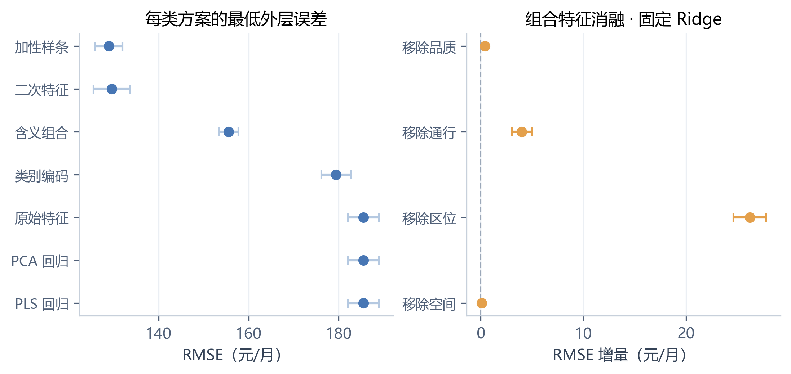

**图A1 特征家族最优结果与组合特征消融**

左图汇总各家族最低平均外层 RMSE，对应正文表10及降维对照，不是表6固定 OLS 的比较。右图为固定 Ridge 的组合消融，显示移除某组后相对完整组合的配对 RMSE 增量，对应表8。误差线表示折间标准差，不用于显著性判断。图中非线性表达具有较低误差，区位组移除后的损失最明显，与正文两类对照一致。

<!-- q2-section-code:A.2:begin -->

**对应代码（question2/plot.py，第 275—302 行）**

```python
if (output / "comparison.csv").exists():
    comparison = pd.read_csv(output / "comparison.csv")
    folds = pd.read_csv(output / "fold_metrics.csv")
    coef = json.loads((output / "fold_coefficients.json").read_text(encoding="utf-8"))
    fig, ax = axes_pair()
    best = []
    for family in FAMILY_LABEL:
        subset = comparison[comparison.candidate.str.startswith(f"{family}:")]
        best.append(subset.loc[subset.rmse.idxmin()])
    best = pd.DataFrame(best).sort_values("rmse", ascending=False)
    ax[0].errorbar(best.rmse, range(len(best)), xerr=best.rmse_std, fmt="o", color=COLORS[0],
                   ecolor="#B5C9E1", capsize=3)
    ax[0].set_yticks(range(len(best)), best.family.map(FAMILY_LABEL), fontsize=9)
    ax[0].set(xlabel="RMSE（元/月）", title="每类方案的最低外层误差")
    full_key = "ablation:" + "+".join(BLOCKS)
    full = folds[folds.candidate == full_key].sort_values("fold").rmse.to_numpy()
    for i, block in enumerate(BLOCKS):
        key = "ablation:" + "+".join(b for b in BLOCKS if b != block)
        without = folds[folds.candidate == key].sort_values("fold").rmse.to_numpy()
        diff = without-full
        ax[1].errorbar(diff.mean(), i, xerr=diff.std(ddof=1), fmt="o", color=COLORS[2], capsize=3)
    ax[1].axvline(0, color="#9AA7B8", ls="--", lw=1)
    ax[1].set_yticks(range(4), ["移除"+BLOCK_LABEL[b] for b in BLOCKS], fontsize=9)
    ax[1].set(xlabel="RMSE 增量（元/月）", title="组合特征消融 · 固定 Ridge")
    for a in ax:
        light_grid(a, "x")
    save(fig, "07", "特征方案比较与组合特征消融",
         "左图展示各特征方案的最低平均外层 RMSE；右图比较移除某一组派生特征后，相对于完整组合的配对 RMSE 变化。增量为正表示移除后变差。误差线为折间标准差，不能解释为显著性检验。", 2)
```

<!-- q2-section-code:A.2:end -->

### A.3 惩罚强度与系数稳定性

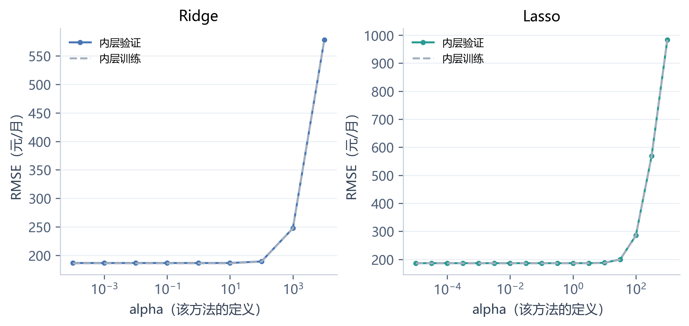

**图A2 Ridge 与 Lasso 的正则强度曲线**

图中使用第一外层折的开发数据，展示三折内层训练和验证误差；其他外层折独立执行同类搜索。横轴遵循各算法自身的 alpha 定义，不能跨方法按相同数值直接比较惩罚强弱。该图补充调参过程，最终结论仍使用五个外层折的汇总结果。

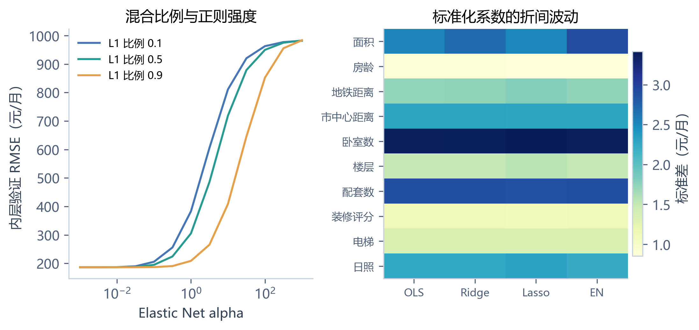

**图A3 Elastic Net 调参与系数稳定性**

左图沿用第一外层折的内层验证，比较三个 L1 比例；右图为原始特征模型五折标准化系数的标准差。稳定性反映本次划分下的系数波动，不等于因果解释更可靠，也不是最终三十个二次项的入选稳定性分析。

<!-- q2-section-code:A.3:begin -->

**对应代码（question2/plot.py，第 405—441 行）**

```python
raw_search = output / "fold_1" / "raw_search.json"
if raw_search.exists() and (output / "fold_coefficients.json").exists():
    records = json.loads(raw_search.read_text(encoding="utf-8"))["records"]
    fig, ax = axes_pair()
    for a, method, color in zip(ax, ["ridge", "lasso"], COLORS):
        rows = [r for r in records if r["valid"] and r["params"].get("model__kind") == method]
        rows.sort(key=lambda r: r["params"]["model__alpha"])
        alpha = [r["params"]["model__alpha"] for r in rows]
        a.semilogx(alpha, [r["rmse"] for r in rows], "o-", color=color, ms=3, label="内层验证")
        a.semilogx(alpha, [r["train_rmse"] for r in rows], "--", color="#A3AFBF", label="内层训练")
        a.set(xlabel="alpha（该方法的定义）", ylabel="RMSE（元/月）", title=METHOD_LABEL[method])
        a.legend(fontsize=8)
        light_grid(a)
    save(fig, "S2", "Ridge 与 Lasso 的正则强度曲线",
         "以第一外层折的训练部分为例，展示三折内层训练及验证误差。其他外层折独立执行相同搜索。横轴分别遵循各算法的 alpha 定义，不能跨方法直接比较惩罚强弱。", 2)
    fig, ax = axes_pair()
    for rho, color in zip([.1, .5, .9], COLORS):
        rows = [r for r in records if r["valid"] and r["params"].get("model__kind") == "elastic"
                and r["params"].get("model__l1_ratio") == rho]
        rows.sort(key=lambda r: r["params"]["model__alpha"])
        ax[0].semilogx([r["params"]["model__alpha"] for r in rows], [r["rmse"] for r in rows],
                       color=color, label=f"L1 比例 {rho}")
    ax[0].set(xlabel="Elastic Net alpha", ylabel="内层验证 RMSE（元/月）", title="混合比例与正则强度")
    ax[0].legend(fontsize=8)
    coeff = json.loads((output / "fold_coefficients.json").read_text(encoding="utf-8"))
    spread = []
    for method in ["ols", "ridge", "lasso", "elastic"]:
        matrix = np.array([r["standardized_coefficients"] for r in coeff[f"raw:{method}"]])
        spread.append(matrix.std(axis=0, ddof=1))
    weights = np.array(spread).T
    im = ax[1].imshow(weights, cmap="YlGnBu", aspect="auto")
    ax[1].set_yticks(range(10), LABELS, fontsize=8)
    ax[1].set_xticks(range(4), ["OLS", "Ridge", "Lasso", "EN"], fontsize=8)
    ax[1].set_title("标准化系数的折间波动")
    fig.colorbar(im, ax=ax[1], label="标准差（元/月）", shrink=.82, pad=.02)
    save(fig, "S3", "Elastic Net 调参与系数稳定性",
         "左图沿用第一外层折的内层验证设置，比较三个 L1 比例；右图为原始特征模型五折标准化系数的标准差。较小波动代表在本次划分下更稳定，不等同于因果解释更可靠。", 2)
```

<!-- q2-section-code:A.3:end -->

## 附录B 降维预测与辅助可视化

### B.1 PCA 与 PLS 的预测对照

PCA 在标准化输入上寻找保留输入方差较多的正交方向，不使用租金；PCA 回归再以这些方向预测租金。PLS 利用训练输入与目标寻找预测方向，属于有监督降维。两者均在交叉验证训练折内部拟合。

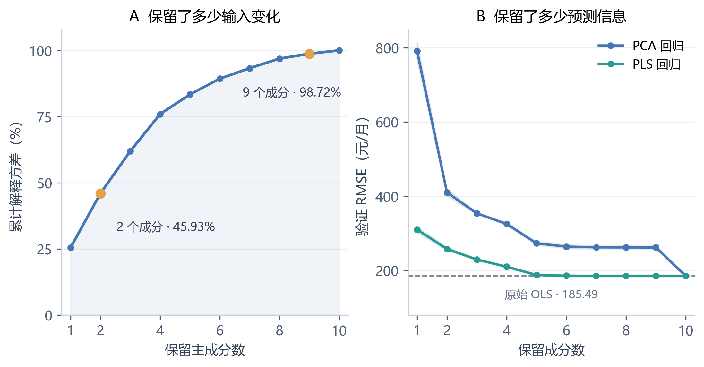

**图B1 PCA 方差保留与降维回归的预测表现**

左图使用固定 3,000 条训练子样本作描述性分析，前两个成分保留 45.93% 的输入方差，九个成分保留 98.72%。右图使用全部训练数据的五折外层验证：PCA 保留九个成分时的 RMSE 仍为 262.15 元/月，保留全部十个成分时才接近原始 OLS 的 185.49 元/月。输入方差小的方向仍可能承载预测信息，因此高方差保留率不能代替预测验证。

右图中 PCA 在内层选择 OLS 或 Ridge 及惩罚强度，阴影表示折间标准差；左右图并不共用一个拟合好的 PCA。PLS 用五个成分达到约 188.04 元/月，较快接近完整原始模型，但未明显改善预测。该组实验支持保留原始输入，再通过特征构造改进表达。

<!-- q2-section-code:B.1:begin -->

**对应代码（question2/experiment.py，第 31—37 行）**

```python
def pipeline_for(family):
    kind = "raw" if family in {"pcr", "pls"} else family
    steps = [("features", FeatureMap(kind)), ("scale", StandardScaler())]
    if family == "pcr":
        steps.append(("pca", PCA(svd_solver="full")))
    model = PLSRegression(scale=False) if family == "pls" else CheckedLinear()
    return Pipeline(steps + [("model", model)])
```


**对应代码（question2/experiment.py，第 46—69 行）**

```python
def search_grids(family, config):
    settings = config["search"]
    feature = {}
    if family == "encoded":
        feature["features__categories"] = [(4,), (7,), (4, 7)]
    elif family == "domain":
        feature["features__blocks"] = domain_variants()
    elif family == "spline":
        feature["features__knots"] = settings["knots"]
    elif family == "pcr":
        feature["pca__n_components"] = settings["components"]
    elif family == "pls":
        return [{"model__n_components": settings["components"]}]
    lo, hi, count = settings["lasso_exponents"]
    sparse_alpha = np.logspace(lo, hi, count).tolist()
    grids = []
    for method in (["ols", "ridge"] if family == "pcr" else METHODS):
        grid = dict(feature, model__kind=[method])
        if method != "ols":
            grid["model__alpha"] = settings["ridge"] if method == "ridge" else sparse_alpha
        if method == "elastic":
            grid["model__l1_ratio"] = settings["l1_ratio"]
        grids.append(grid)
    return grids
```


**对应代码（question2/embedding.py，第 16—17 行）**

```python
def neighborhood(z, k=15):
    return NearestNeighbors(n_neighbors=k).fit(z).kneighbors(return_distance=False)
```


**对应代码（question2/embedding.py，第 20—83 行）**

```python
def run_embeddings(config, output):
    _, x, y = read_data(ROOT / config["data"]["train"])
    settings = config["visualization"]
    sample = np.sort(np.random.default_rng(42).choice(len(x), settings["sample_size"], replace=False))
    z = StandardScaler().fit_transform(x[sample])
    base = PCA(svd_solver="full").fit(z)
    np.savez_compressed(output / "pca.npz", sample=sample, y=y[sample], z=z,
                        scores=base.transform(z), components=base.components_, variance=base.explained_variance_ratio_)
    folder = output / "embeddings"
    folder.mkdir(exist_ok=True)
    original_neighbors = neighborhood(z)
    specs = []
    for seed in settings["seeds"]:
        for p in settings["perplexities"]:
            specs.append(dict(method="tsne", seed=seed, perplexity=p))
        for k in settings["neighbors"]:
            for distance in settings["min_dist"]:
                specs.append(dict(method="umap", seed=seed, neighbors=k, min_dist=distance))
    # PCA 初始化在十维输入下可能不受种子影响，另检验三次随机初始化。
    for seed in settings["seeds"]:
        specs.append(dict(method="tsne", seed=seed, perplexity=30, init="random"))
    # 固定正文参数优先运行，便于先检查图形。
    specs.sort(key=lambda s: (s["seed"] != 42, s.get("perplexity", 30) != 30,
                             s.get("neighbors", 30) != 30, s.get("min_dist", 0.1) != 0.1))
    results = []
    with threadpool_limits(limits=1):
        for spec in specs:
            name = "_".join(str(v) for v in spec.values())
            path = folder / f"{name}.npz"
            start = time.time()
            if path.exists():
                coords = np.load(path)["coords"]
            elif spec["method"] == "tsne":
                coords = TSNE(n_components=2, perplexity=spec["perplexity"], init=spec.get("init", "pca"),
                              learning_rate="auto", max_iter=2000, random_state=spec["seed"], n_jobs=1).fit_transform(z)
                np.savez_compressed(path, coords=coords)
            else:
                coords = UMAP(n_components=2, n_neighbors=spec["neighbors"], min_dist=spec["min_dist"],
                              random_state=spec["seed"], transform_seed=spec["seed"], n_jobs=1).fit_transform(z)
                np.savez_compressed(path, coords=coords)
            neighbors = neighborhood(coords)
            overlap = np.mean([len(set(a) & set(b)) / 15 for a, b in zip(original_neighbors, neighbors)])
            result = dict(spec, file=path.name, trustworthiness=float(trustworthiness(z, coords, n_neighbors=15)),
                          neighbor_overlap=float(overlap), seconds=time.time()-start)
            results.append(result)
            pd.DataFrame(results).to_csv(output / "embedding_metrics.csv", index=False, encoding="utf-8-sig")
            print("EMBED", name, f"trust={result['trustworthiness']:.4f} overlap={overlap:.4f}", flush=True)
    # 随机种子稳定性：同一设置在不同种子下的二维近邻重合比例。
    stability = []
    for method in ["tsne", "umap"]:
        subset = [r for r in results if r["method"] == method]
        for setting in subset:
            if setting["seed"] != 42:
                continue
            keys = ["perplexity", "init"] if method == "tsne" else ["neighbors", "min_dist"]
            baseline = neighborhood(np.load(folder / setting["file"])["coords"])
            for other in subset:
                if other["seed"] == 42 or not all(other.get(k, "pca") == setting.get(k, "pca") for k in keys):
                    continue
                neighbor = neighborhood(np.load(folder / other["file"])["coords"])
                overlap = np.mean([len(set(a) & set(b)) / 15 for a, b in zip(baseline, neighbor)])
                stability.append(dict(method=method, seed=other["seed"], overlap=float(overlap),
                                      **{k: setting.get(k, "pca") for k in keys}))
    save_json(output / "embedding_stability.json", stability)
```


**对应代码（question2/plot.py，第 43—74 行）**

```python
def pca_analysis(data, comparison):
    fig, ax = plt.subplots(1, 2, figsize=(7.2, 3.7), layout="constrained")
    k = np.arange(1, len(data["variance"]) + 1)
    cumulative = np.cumsum(data["variance"]) * 100
    ax[0].fill_between(k, 0, cumulative, color=COLORS[0], alpha=.08)
    ax[0].plot(k, cumulative, "o-", color=COLORS[0], lw=2, ms=4)
    for index, offset in [(1, (12, -28)), (8, (-50, -32))]:
        ax[0].scatter(k[index], cumulative[index], s=44, color=COLORS[2], zorder=4)
        ax[0].annotate(f"{k[index]} 个成分 · {cumulative[index]:.2f}%",
                       (k[index], cumulative[index]), xytext=offset,
                       textcoords="offset points", fontsize=9, color="#344256")
    ax[0].set(xlabel="保留主成分数", ylabel="累计解释方差（%）",
              title="A  保留了多少输入变化", xlim=(.7, 10.3), ylim=(0, 108),
              xticks=[1, 2, 4, 6, 8, 10], yticks=[0, 25, 50, 75, 100])
    for family, color in zip(["pcr", "pls"], COLORS):
        rows = comparison[comparison.candidate.str.startswith(f"dimension:{family}:")].copy()
        rows["k"] = rows.candidate.str.split(":").str[-1].astype(int)
        rows = rows.sort_values("k")
        ax[1].plot(rows.k, rows.rmse, "o-", color=color, label=FAMILY_LABEL[family], ms=4, lw=1.8)
        ax[1].fill_between(rows.k, rows.rmse-rows.rmse_std, rows.rmse+rows.rmse_std,
                           color=color, alpha=.12)
    reference = comparison.set_index("candidate").loc["raw:ols", "rmse"]
    ax[1].axhline(reference, color="#7C899A", ls="--", lw=1, zorder=1)
    ax[1].text(5.5, reference-36, f"原始 OLS · {reference:.2f}",
               ha="center", va="top", color="#65748A", fontsize=8.5)
    ax[1].set(xlabel="保留成分数", ylabel="验证 RMSE（元/月）",
              title="B  保留了多少预测信息", xlim=(.7, 10.3), ylim=(80, 850),
              xticks=[1, 2, 4, 6, 8, 10], yticks=[200, 400, 600, 800])
    ax[1].legend(loc="upper right")
    for a in ax:
        light_grid(a)
    return fig
```

<!-- q2-section-code:B.1:end -->

### B.2 t-SNE 与 UMAP 的结构观察

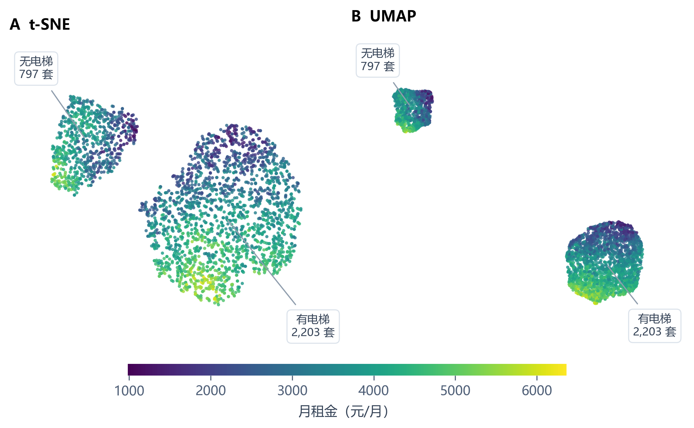

**图B2 t-SNE 与 UMAP 投影中的电梯分组和租金分布**

两图采用相同的固定 3,000 条训练子样本和标准化输入，颜色表示月租金，租金未参与投影拟合。t-SNE 的困惑度为 30，采用 PCA 初始化；UMAP 的邻居数为 30、最小距离为 0.1，两者种子均为 42。图中的水平与竖直方向分别表示二维嵌入的两个坐标，没有原始物理单位，刻度已省略。UMAP 坐标整体旋转了 35°以适应版面，两图均保持等比例，旋转不改变点间距离。

子样本中无电梯房源为 797 套，有电梯房源为 2,203 套，租金中位数分别为 3481.59 和 3679.52 元/月。引线指向真实属性组的坐标中位位置，不表示算法识别的聚类边界。两种投影均呈现与电梯分组大致对应的区域，但组内仍有租金梯度和局部重叠，表明电梯状态不能单独决定租金。

簇间空隙、面积和距离不能直接解释为原始空间的密度或差异。该图辅助理解样本结构，不用于删留预测变量，也不能用点云分离程度判断回归精度。

**表B1 不同参数与种子运行的邻域指标**

| 方法 | 运行数 | 邻域可信度均值 | 范围 | 原始近邻重合比例 |
| --- | --- | --- | --- | --- |
| t-SNE | 12 | 0.9782 | 0.9769—0.9791 | 0.4199 |
| UMAP | 18 | 0.9298 | 0.9162—0.9506 | 0.2468 |

指标使用 15 个近邻。原计划 27 组运行完成后，因 PCA 初始化的 t-SNE 更换种子得到相同投影，增加三次随机初始化检查，共 30 次。相同结果说明该设置可重复，不能推广为对任意初始化都稳定。

<!-- q2-section-code:B.2:begin -->

**对应代码（question2/embedding.py）**

```python
"""训练子样本上的无监督投影及敏感性实验；租金仅用于后续着色。"""

import time
import numpy as np
import pandas as pd
from sklearn.decomposition import PCA
from sklearn.manifold import TSNE, trustworthiness
from sklearn.neighbors import NearestNeighbors
from sklearn.preprocessing import StandardScaler
from threadpoolctl import threadpool_limits
from umap import UMAP
from . import ROOT
from .features import read_data, save_json


def neighborhood(z, k=15):
    return NearestNeighbors(n_neighbors=k).fit(z).kneighbors(return_distance=False)


def run_embeddings(config, output):
    _, x, y = read_data(ROOT / config["data"]["train"])
    settings = config["visualization"]
    sample = np.sort(np.random.default_rng(42).choice(len(x), settings["sample_size"], replace=False))
    z = StandardScaler().fit_transform(x[sample])
    base = PCA(svd_solver="full").fit(z)
    np.savez_compressed(output / "pca.npz", sample=sample, y=y[sample], z=z,
                        scores=base.transform(z), components=base.components_, variance=base.explained_variance_ratio_)
    folder = output / "embeddings"
    folder.mkdir(exist_ok=True)
    original_neighbors = neighborhood(z)
    specs = []
    for seed in settings["seeds"]:
        for p in settings["perplexities"]:
            specs.append(dict(method="tsne", seed=seed, perplexity=p))
        for k in settings["neighbors"]:
            for distance in settings["min_dist"]:
                specs.append(dict(method="umap", seed=seed, neighbors=k, min_dist=distance))
    # PCA 初始化在十维输入下可能不受种子影响，另检验三次随机初始化。
    for seed in settings["seeds"]:
        specs.append(dict(method="tsne", seed=seed, perplexity=30, init="random"))
    # 固定正文参数优先运行，便于先检查图形。
    specs.sort(key=lambda s: (s["seed"] != 42, s.get("perplexity", 30) != 30,
                             s.get("neighbors", 30) != 30, s.get("min_dist", 0.1) != 0.1))
    results = []
    with threadpool_limits(limits=1):
        for spec in specs:
            name = "_".join(str(v) for v in spec.values())
            path = folder / f"{name}.npz"
            start = time.time()
            if path.exists():
                coords = np.load(path)["coords"]
            elif spec["method"] == "tsne":
                coords = TSNE(n_components=2, perplexity=spec["perplexity"], init=spec.get("init", "pca"),
                              learning_rate="auto", max_iter=2000, random_state=spec["seed"], n_jobs=1).fit_transform(z)
                np.savez_compressed(path, coords=coords)
            else:
                coords = UMAP(n_components=2, n_neighbors=spec["neighbors"], min_dist=spec["min_dist"],
                              random_state=spec["seed"], transform_seed=spec["seed"], n_jobs=1).fit_transform(z)
                np.savez_compressed(path, coords=coords)
            neighbors = neighborhood(coords)
            overlap = np.mean([len(set(a) & set(b)) / 15 for a, b in zip(original_neighbors, neighbors)])
            result = dict(spec, file=path.name, trustworthiness=float(trustworthiness(z, coords, n_neighbors=15)),
                          neighbor_overlap=float(overlap), seconds=time.time()-start)
            results.append(result)
            pd.DataFrame(results).to_csv(output / "embedding_metrics.csv", index=False, encoding="utf-8-sig")
            print("EMBED", name, f"trust={result['trustworthiness']:.4f} overlap={overlap:.4f}", flush=True)
    # 随机种子稳定性：同一设置在不同种子下的二维近邻重合比例。
    stability = []
    for method in ["tsne", "umap"]:
        subset = [r for r in results if r["method"] == method]
        for setting in subset:
            if setting["seed"] != 42:
                continue
            keys = ["perplexity", "init"] if method == "tsne" else ["neighbors", "min_dist"]
            baseline = neighborhood(np.load(folder / setting["file"])["coords"])
            for other in subset:
                if other["seed"] == 42 or not all(other.get(k, "pca") == setting.get(k, "pca") for k in keys):
                    continue
                neighbor = neighborhood(np.load(folder / other["file"])["coords"])
                overlap = np.mean([len(set(a) & set(b)) / 15 for a, b in zip(baseline, neighbor)])
                stability.append(dict(method=method, seed=other["seed"], overlap=float(overlap),
                                      **{k: setting.get(k, "pca") for k in keys}))
    save_json(output / "embedding_stability.json", stability)
```


**对应代码（question2/plot.py，第 77—109 行）**

```python
def embedding_comparison(data, files, elevator, norm):
    fig, ax = plt.subplots(1, 2, figsize=(7.2, 4.2), layout="constrained")
    label_positions = [(.08, .94), (.91, .08)]
    for i, (a, path, title) in enumerate(zip(ax, files, ["A  t-SNE", "B  UMAP"])):
        coords = np.load(path)["coords"]
        if i == 1:
            # 仅旋转显示方向，保持点间距离；不改变保存的投影结果。
            angle = np.deg2rad(35)
            rotation = [[np.cos(angle), -np.sin(angle)], [np.sin(angle), np.cos(angle)]]
            coords = coords @ np.array(rotation)
        a.scatter(coords[:, 0], coords[:, 1], c=data["y"], cmap="viridis", norm=norm,
                  s=6, alpha=.82, linewidths=0, rasterized=True)
        for value, label in [(0, "无电梯"), (1, "有电梯")]:
            subset = coords[elevator == value]
            anchor = np.median(subset, axis=0)
            a.annotate(f"{label}\n{len(subset):,} 套", anchor,
                       xytext=label_positions[value], textcoords="axes fraction",
                       ha="center", va="center", fontsize=8.5, color="#344256",
                       bbox=dict(boxstyle="round,pad=.4", fc="white", ec="#DCE3EB", lw=.8),
                       arrowprops=dict(arrowstyle="-", color="#8F9DAD", lw=.9,
                                       shrinkA=5, shrinkB=4))
        a.set(xticks=[], yticks=[])
        a.set_title(title, loc="left", fontweight="bold", pad=16)
        a.set_aspect("equal", adjustable="box")
        a.set_anchor("N")
        a.margins(x=.17, y=.22)
        for spine in a.spines.values():
            spine.set_visible(False)
    colorbar = fig.colorbar(ScalarMappable(norm=norm, cmap="viridis"), ax=ax,
                            orientation="horizontal", fraction=.038, shrink=.65, pad=.04, aspect=38)
    colorbar.set_label("月租金（元/月）", labelpad=5)
    colorbar.outline.set_visible(False)
    return fig
```


**对应代码（question2/plot.py，第 234—273 行）**

```python
if (output / "pca.npz").exists():
    data = np.load(output / "pca.npz")
    comparison = pd.read_csv(output / "comparison.csv")
    fig = pca_analysis(data, comparison)
    var2 = data["variance"][:2].sum() * 100
    var9 = data["variance"][:9].sum() * 100
    scores = comparison.set_index("candidate").rmse
    save(fig, "04", "PCA 方差保留与降维回归的预测表现",
         f"左图显示累计解释方差：前两个成分保留 {var2:.2f}%，九个成分已保留 {var9:.2f}%。"
         f"右图中，PCA 回归保留九个成分时的验证 RMSE 仍为 {scores['dimension:pcr:9']:.2f} 元/月，"
         f"全部十个成分时才降至 {scores['dimension:pcr:10']:.2f} 元/月，接近原始 OLS。"
         "这说明保留大部分输入变化不等于保留全部预测信息，输入方差较小的方向也可能有用。"
         "PLS 利用训练租金寻找方向，用较少成分即可接近原始线性模型，但没有明显降低其预测误差。\n\n"
         "左图使用固定的 3,000 条训练子样本作描述性分析；右图使用全部 7,500 条训练记录的五折外层验证，"
         "各折分别拟合预处理与降维，阴影表示折间标准差。PCA 回归在内层选择 OLS 或 Ridge 及惩罚强度；"
         "左右图不共用一个拟合好的 PCA，方差比例也不用于替代预测验证。", 2)
    norm = Normalize(vmin=float(data["y"].min()), vmax=float(data["y"].max()))
    fig, ax = plt.subplots(figsize=(6, 4.1), layout="constrained")
    points = ax.scatter(data["scores"][:, 0], data["scores"][:, 1], c=data["y"], cmap="viridis",
                        norm=norm, s=8, alpha=.8, linewidths=0, rasterized=True)
    ax.set(xlabel="第一主成分 PC1", ylabel="第二主成分 PC2")
    fig.colorbar(points, ax=ax, label="月租金（元/月）", shrink=.85)
    save(fig, "05", "PCA 二维投影中的租金分布",
         "颜色表示租金，坐标仅由房源特征决定。投影可用于观察整体结构和租金梯度，但二维重叠不意味着原始空间的特征没有预测价值。", 1)
    files = [output / "embeddings" / "tsne_42_30.npz", output / "embeddings" / "umap_42_30_0.1.npz"]
    if all(p.exists() for p in files):
        elevator = x[data["sample"], NAMES.index("has_elevator")]
        fig = embedding_comparison(data, files, elevator, norm)
        counts = [int(np.sum(elevator == value)) for value in [0, 1]]
        medians = [float(np.median(data["y"][elevator == value])) for value in [0, 1]]
        save(fig, "06", "t-SNE 与 UMAP 投影中的电梯分组和租金分布",
             f"两图使用相同的 3,000 条训练房源，其中无电梯 {counts[0]:,} 套、有电梯 {counts[1]:,} 套。"
             "标签来自真实电梯字段，数量统计整个子样本中的该类房源；引线指向各类坐标的中位位置，"
             "并不表示算法识别出的聚类边界。t-SNE 的左上区域与无电梯房源对应，右下区域主要为有电梯房源；"
             "UMAP 也呈现相近分区，但有少量交叠，不能将分区视为完全分离的类别。\n\n"
             f"共用色标显示每个电梯组内部仍有明显的租金变化；无电梯、有电梯组的租金中位数分别为 "
             f"{medians[0]:.2f}、{medians[1]:.2f} 元/月。电梯状态只能解释部分样本结构，不能单独决定租金，"
             "组间差异也可能同时反映面积、楼层等属性。租金仅在投影完成后着色，未参与降维拟合；"
             "这两种投影没有用于筛选最终多项式项，也不以点云分离程度判断预测精度。"
             "为适应版面，UMAP 显示坐标整体旋转了 35°，未改变点间距离；两图均采用等比例坐标，未拉伸点云。", 2)
```

<!-- q2-section-code:B.2:end -->

### B.3 PaCMAP 的补充对照

PaCMAP 同时考虑近邻、中等距离和较远的样本对。本对照复用相同 3,000 条训练房源及十维标准化输入，保留原预测模型和测试结果；编号与租金不进入降维拟合。

主设置为 30 个近邻，另比较 10 个近邻，种子均为 42、2026、3407。其余设置为 MN_ratio=0.5、FP_ratio=2.0、二维 PCA 初始化、学习率 1.0，三阶段迭代次数 100、100、250，使用欧氏距离和 FAISS 近邻后端。UMAP 坐标直接读取原结果。

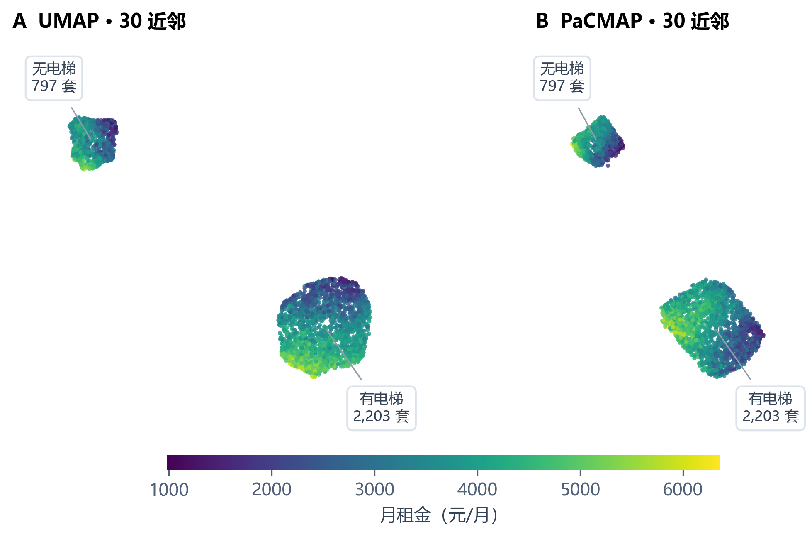

**图B3 PaCMAP 与 UMAP 的房源结构对照**

两图使用相同样本、色标、点大小和透明度，坐标等比例。横纵方向均为没有物理单位的二维嵌入坐标；标签来自真实电梯属性。两图都呈现与电梯状态基本对应的主体分组，组内仍有租金梯度。PaCMAP 改变了组内排列，但没有提供额外房源类别的独立证据。

**表B2 PaCMAP 与 UMAP 的结构指标**

| 方法 | 近邻数 | 邻域可信度 | 原始近邻重合率 | 距离秩相关 | 随机种子稳定性 |
| --- | --- | --- | --- | --- | --- |
| UMAP | 30 | 0.9370 ± 0.0009 | 0.2657 ± 0.0013 | 0.5398 ± 0.0021 | 0.6167 ± 0.0132 |
| PaCMAP | 30 | 0.9184 ± 0.0082 | 0.1747 ± 0.0059 | 0.5521 ± 0.0112 | 0.4380 ± 0.0834 |
| PaCMAP | 10 | 0.9297 ± 0.0009 | 0.2248 ± 0.0020 | 0.5348 ± 0.0027 | 0.4035 ± 0.0129 |

邻域可信度与原始近邻重合率使用 15 个近邻，距离秩相关使用固定抽取的 20,000 对不同房源，比较高维与二维距离的 Spearman 相关。前三项报告三个种子的均值与标准差；随机种子稳定性为三个种子两两之间二维近邻重合率的均值与标准差。它们衡量结构保留的不同方面，不合成为预测准确率。此处 UMAP 只包括固定 30 近邻、最小距离 0.1 的三个种子，与表B1的统计范围不同。

PaCMAP 的 30 近邻设置在距离秩相关上略高于 UMAP，但原始近邻重合率从 26.57% 降至 17.47%，种子间稳定性也较弱。改为 10 近邻后局部表现改善，仍未超过当前 UMAP。因此，本次对照未显示 PaCMAP 的全面优势，该结论限于所用输入、设置和指标。

逐次指标见 [metrics.csv](附件/HW2_第二题/results/pacmap_trial/metrics.csv)，种子稳定性见 [stability.csv](附件/HW2_第二题/results/pacmap_trial/stability.csv)。扩展实验在复现包根目录运行：

~~~powershell
python -m pip install -r requirements-pacmap.txt
python -m experiments.pacmap_trial --stage all
~~~

<!-- q2-section-code:B.3:begin -->

**对应代码（configs/pacmap_trial.yaml）**

```yaml
source: results/complete
output: results/pacmap_trial
seeds: [42, 2026, 3407]
neighbors: [30, 10]
primary_neighbors: 30
pacmap:
  n_components: 2
  MN_ratio: 0.5
  FP_ratio: 2.0
  lr: 1.0
  num_iters: [100, 100, 250]
  distance: euclidean
  knn_backend: faiss
  apply_pca: true
evaluation:
  neighbors: 15
  pair_count: 20000
  pair_seed: 2026
dpi: 300
```


**对应代码（requirements-pacmap.txt）**

```text
-r requirements-q2.txt
pacmap==0.9.1
faiss-cpu==1.15.1
```


**对应代码（experiments/pacmap_trial.py）**

```python
"""PaCMAP 可视化试验：复用训练子样本与 UMAP，不重新拟合租金模型。"""

import argparse
import hashlib
import json
import sys
import time
from importlib.metadata import version
from itertools import combinations
from question2 import ROOT
import numpy as np
import pandas as pd
import yaml
from scipy.stats import spearmanr
from sklearn.manifold import trustworthiness
from sklearn.neighbors import NearestNeighbors
from threadpoolctl import threadpool_limits
from question2.features import NAMES, read_data, save_json
from question2.plot import style
import matplotlib.pyplot as plt
from matplotlib.cm import ScalarMappable
from matplotlib.colors import Normalize


def neighbors(points, k):
    return NearestNeighbors(n_neighbors=k).fit(points).kneighbors(return_distance=False)


def overlap(first, second):
    values = [len(set(a) & set(b)) / len(a) for a, b in zip(first, second)]
    return float(np.mean(values))


def sample_pairs(size, count, seed):
    rng = np.random.default_rng(seed)
    pairs = set()
    while len(pairs) < count:
        a, b = rng.choice(size, 2, replace=False)
        pairs.add(tuple(sorted((int(a), int(b)))))
    return np.array(sorted(pairs))


def run_embeddings(config, output, data):
    from pacmap import PaCMAP

    source = ROOT / config["source"]
    z = data["z"]
    settings = config["evaluation"]
    k = settings["neighbors"]
    pairs = sample_pairs(len(z), settings["pair_count"], settings["pair_seed"])
    np.savez_compressed(output / "evaluation_pairs.npz", pairs=pairs, sample=data["sample"])
    original_neighbors = neighbors(z, k)
    original_distances = np.linalg.norm(z[pairs[:, 0]] - z[pairs[:, 1]], axis=1)
    results, neighbor_records = [], {}
    specs = [("UMAP", 30, seed) for seed in config["seeds"]]
    specs += [("PaCMAP", n, seed) for n in config["neighbors"] for seed in config["seeds"]]
    with threadpool_limits(limits=1):
        for method, n, seed in specs:
            if method == "UMAP":
                path = source / "embeddings" / f"umap_{seed}_30_0.1.npz"
                coords = np.load(path)["coords"]
                seconds = None
            else:
                path = output / f"pacmap_{seed}_{n}.npz"
                if not path.exists():
                    start = time.perf_counter()
                    model = PaCMAP(n_neighbors=n, random_state=seed, **config["pacmap"])
                    coords = model.fit_transform(z.copy(), init="pca", save_pairs=True)
                    seconds = time.perf_counter() - start
                    np.savez_compressed(path, coords=coords, sample=data["sample"], seconds=seconds,
                                        near=model.pair_neighbors, mid=model.pair_MN, far=model.pair_FP)
                record = np.load(path)
                coords, seconds = record["coords"], float(record["seconds"])
            assert coords.shape == (len(z), 2) and np.isfinite(coords).all()
            local = neighbors(coords, k)
            neighbor_records[(method, n, seed)] = local
            distances = np.linalg.norm(coords[pairs[:, 0]] - coords[pairs[:, 1]], axis=1)
            result = dict(method=method, neighbors=n, seed=seed,
                          trustworthiness=float(trustworthiness(z, coords, n_neighbors=k)),
                          neighbor_overlap=overlap(original_neighbors, local),
                          distance_rank=float(spearmanr(original_distances, distances).statistic),
                          fit_seconds=seconds)
            results.append(result)
            pd.DataFrame(results).to_csv(output / "metrics.csv", index=False, encoding="utf-8-sig")
            print("RESULT", json.dumps(result, ensure_ascii=False), flush=True)
    stability = []
    for method, n in [("UMAP", 30)] + [("PaCMAP", n) for n in config["neighbors"]]:
        for first, second in combinations(config["seeds"], 2):
            score = overlap(neighbor_records[(method, n, first)], neighbor_records[(method, n, second)])
            stability.append(dict(method=method, neighbors=n, first=first, second=second, overlap=score))
    pd.DataFrame(stability).to_csv(output / "stability.csv", index=False, encoding="utf-8-sig")


def draw_comparison(data, paths, titles, elevator, rotations, filename, dpi):
    style()
    norm = Normalize(float(data["y"].min()), float(data["y"].max()))
    fig, axes = plt.subplots(1, 2, figsize=(7.2, 4.2), layout="constrained")
    for ax, path, title, degrees in zip(axes, paths, titles, rotations):
        coords = np.load(path)["coords"]
        angle = np.deg2rad(degrees)
        rotation = [[np.cos(angle), -np.sin(angle)], [np.sin(angle), np.cos(angle)]]
        coords = coords @ np.array(rotation)
        ax.scatter(coords[:, 0], coords[:, 1], c=data["y"], cmap="viridis", norm=norm,
                   s=6, alpha=.82, linewidths=0, rasterized=True)
        center = np.median(coords, axis=0)
        for value, label in [(0, "无电梯"), (1, "有电梯")]:
            group = coords[elevator == value]
            anchor = np.median(group, axis=0)
            position = (.1 if anchor[0] < center[0] else .89,
                        .94 if anchor[1] > center[1] else .08)
            ax.annotate(f"{label}\n{len(group):,} 套", anchor, xytext=position,
                        textcoords="axes fraction", ha="center", va="center", fontsize=8.5,
                        color="#344256", bbox=dict(boxstyle="round,pad=.4", fc="white", ec="#DCE3EB"),
                        arrowprops=dict(arrowstyle="-", color="#8F9DAD", lw=.8, shrinkA=5))
        ax.set(xticks=[], yticks=[])
        ax.set_title(title, loc="left", fontweight="bold", pad=16)
        ax.set_aspect("equal", adjustable="box")
        ax.set_anchor("N")
        ax.margins(x=.19, y=.24)
        for spine in ax.spines.values():
            spine.set_visible(False)
    colorbar = fig.colorbar(ScalarMappable(norm=norm, cmap="viridis"), ax=axes,
                            orientation="horizontal", fraction=.038, shrink=.65, pad=.04, aspect=38)
    colorbar.set_label("月租金（元/月）")
    colorbar.outline.set_visible(False)
    for extension in ["png", "svg"]:
        fig.savefig(filename.with_suffix("."+extension), dpi=dpi, bbox_inches="tight")
    plt.close(fig)


def make_figures(config, output, data):
    _, x, y = read_data(ROOT / "data/B_train.csv")
    assert np.array_equal(data["y"], y[data["sample"]])
    elevator = x[data["sample"], NAMES.index("has_elevator")]
    folder = ROOT / "figures/pacmap_trial"
    folder.mkdir(exist_ok=True)
    primary = config["primary_neighbors"]
    paths = [ROOT / config["source"] / "embeddings/umap_42_30_0.1.npz",
             output / f"pacmap_42_{primary}.npz"]
    draw_comparison(data, paths, ["A  UMAP · 30 近邻", f"B  PaCMAP · {primary} 近邻"],
                    elevator, [35, 0], folder / "pacmap_vs_umap", config["dpi"])
    paths = [output / f"pacmap_42_{n}.npz" for n in [10, 30]]
    draw_comparison(data, paths, ["A  PaCMAP · 10 近邻", "B  PaCMAP · 30 近邻"],
                    elevator, [0, 0], folder / "pacmap_neighbors", config["dpi"])


def make_report(config, output):
    metrics = pd.read_csv(output / "metrics.csv")
    stability = pd.read_csv(output / "stability.csv")
    primary = config["primary_neighbors"]
    means = metrics.groupby(["method", "neighbors"]).mean(numeric_only=True)
    baseline = means.loc[("UMAP", 30)]
    main = means.loc[("PaCMAP", primary)]
    default = means.loc[("PaCMAP", 10)]
    lines = ["# 问题二：PaCMAP 可视化试验", "",
             "本试验比较房源结构的二维呈现，不重新训练租金预测模型，也不根据投影修改已选特征。",
             "", "## 试验设置", "",
             "复用原实验固定抽取的 3,000 条训练房源及十维标准化输入。编号和租金均不进入降维拟合；"
             "租金仅在拟合完成后着色。原 UMAP 坐标直接读取已保存结果。",
             "", f"主图预先固定 PaCMAP 为 {primary} 个近邻、种子 42；另比较默认的 10 个近邻，"
             "两组均使用种子 42、2026、3407。MN_ratio=0.5、FP_ratio=2.0，二维 PCA 初始化，"
             "学习率 1.0，三阶段迭代次数为 100、100、250，欧氏距离与 FAISS 近邻后端。"
             "原始十维输入全部保留；库内部统一缩放与中心化不改变高维距离的排序。",
             "", "## 结构保持与稳定性", "",
             "| 方法 | 近邻数 | 邻域可信度 | 原始近邻重合率 | 距离秩相关 | 随机种子稳定性 |",
             "| --- | --- | --- | --- | --- | --- |"]
    for (method, n), rows in metrics.groupby(["method", "neighbors"], sort=False):
        values = [method, str(n)]
        for key in ["trustworthiness", "neighbor_overlap", "distance_rank"]:
            values.append(f"{rows[key].mean():.4f} ± {rows[key].std(ddof=1):.4f}")
        stable = stability[(stability.method == method) & (stability.neighbors == n)].overlap
        values.append(f"{stable.mean():.4f} ± {stable.std(ddof=1):.4f}")
        lines.append("| " + " | ".join(values) + " |")
    lines += ["", "前两项均使用 15 个近邻。邻域可信度主要检查二维近邻中是否混入原本较远的房源；"
              "近邻重合率直接统计原始 15 个近邻保留了多少。距离秩相关使用固定抽取的 20,000 对不同房源，"
              "比较高维与二维欧氏距离的 Spearman 相关，用于补充整体远近关系。",
              "", "前三项报告三个种子的均值与标准差；稳定性报告三个种子两两之间二维近邻重合率的均值与标准差。"
              "这些指标各有侧重，不合成为一个分数，也不作为预测准确率。标准差不是置信区间。",
              "", "## 主图：PaCMAP 与 UMAP", "",
              "", "",
              "**图P1 PaCMAP 与 UMAP 的房源结构对照**", "",
              "两图共用样本、租金色标、点大小和透明度；坐标等比例显示。UMAP 沿用原报告的整体旋转 35°，"
              "PaCMAP 使用保存坐标，不拉伸点云。引线指向实际电梯组的坐标中位位置，"
              "标签中的 797 套和 2,203 套来自真实属性，不是算法识别的聚类数量。",
              "", "主图中，两种方法均呈现与电梯分组基本对应的两个主要区域，各区域内部仍有明显租金梯度。"
              "PaCMAP 改变了组内点位排列，但这张图尚未提供额外房源类别的独立证据；"
              "组间空隙的大小也不能直接解释为原始房源差异或预测效果。",
              "", "## 补充图：近邻设置", "",
              "", "",
              "**图P2 PaCMAP 对近邻数量的敏感性**", "",
              "在种子 42 下比较 10 与 30 个近邻；其余 PaCMAP 设置相同。"
              "方法之间近邻参数的作用不完全相同，因此相同数值不意味着等价的优化目标。"
              "样本群更分离不能单独证明结构保留更好，应与上表的局部、整体及稳定性指标共同判断。",
              "", f"两种近邻设置仍呈现相似的主体分组，但群内排列不同。三个种子的原始近邻重合率，"
              f"10 近邻为 {default.neighbor_overlap:.2%}，30 近邻为 {main.neighbor_overlap:.2%}。"
              "本次 10 近邻更有利于保留局部关系，因此不能认为增大近邻数必然改善可视化。",
              "", "## 本次结论", "",
              f"PaCMAP 的 30 近邻设置在抽样距离秩相关上为 {main.distance_rank:.4f}，"
              f"略高于 UMAP 的 {baseline.distance_rank:.4f}，但原始近邻重合率由 "
              f"{baseline.neighbor_overlap:.2%} 降至 {main.neighbor_overlap:.2%}，不同种子的二维邻域也更不稳定。"
              "整体指标的改善幅度较小，不能据此认定 PaCMAP 综合更好。",
              "", "默认 10 近邻改善了 PaCMAP 的局部表现，仍未超过当前 UMAP。建议现阶段保留 UMAP "
              "作为正文主要非线性投影，将 PaCMAP 作为补充方法对照。本结论限于相同输入、六组 PaCMAP "
              "运行及所用指标，不代表 UMAP 对所有数据或参数都更优。租金预测模型及其测试结果不受本试验影响。",
              "", "## 复现", "",
              "使用 medsafety 环境；本机附加依赖位于项目 .deps，解释器保持不变。", "",
              "```powershell", "conda activate medsafety", "python -m pip install -r requirements-pacmap.txt",
              "python -m experiments.pacmap_trial --stage all", "```", "",
              "run 计算六组 PaCMAP 并比较已存 UMAP；plot 只重绘；report 只更新本记录。"
              "配置、坐标、抽样点对、各组结构指标、种子稳定性及依赖版本保存在 results/pacmap_trial。",
              "", "已检查图像、图片路径与正文源码一致性；未实际打开 Markpad 或 Obsidian 核验界面渲染。",
              "", "文献：[PaCMAP 原始论文](https://jmlr.org/papers/v22/20-1061.html)。", "",
              "## 实际代码与配置", ""]
    for name in ["configs/pacmap_trial.yaml", "requirements-pacmap.txt", "experiments/pacmap_trial.py"]:
        language = "python" if name.endswith(".py") else "yaml" if name.endswith(".yaml") else "text"
        source = (ROOT / name).read_text(encoding="utf-8").rstrip()
        lines += [f"### {name}", "", f"```{language}", source, "```", ""]
    (ROOT / "docs/第二题_PaCMAP试验.md").write_text("\n".join(lines), encoding="utf-8")


def main():
    parser = argparse.ArgumentParser()
    parser.add_argument("--stage", choices=["all", "run", "plot", "report"], default="all")
    args = parser.parse_args()
    config_path = ROOT / "configs/pacmap_trial.yaml"
    config = yaml.safe_load(config_path.read_text(encoding="utf-8"))
    output = ROOT / config["output"]
    output.mkdir(parents=True, exist_ok=True)
    source_path = ROOT / config["source"] / "pca.npz"
    snapshot = dict(config=config, input_sha256=hashlib.sha256(source_path.read_bytes()).hexdigest())
    snapshot_path = output / "config_snapshot.json"
    if snapshot_path.exists():
        assert json.loads(snapshot_path.read_text(encoding="utf-8")) == snapshot, "请更换输出目录以运行新配置"
    save_json(snapshot_path, snapshot)
    data = np.load(source_path)
    if args.stage in {"all", "run"}:
        packages = ["pacmap", "faiss-cpu", "numpy", "scipy", "scikit-learn", "numba", "matplotlib"]
        save_json(output / "environment.json", dict(python=sys.executable, versions={p: version(p) for p in packages}))
        run_embeddings(config, output, data)
    if args.stage in {"all", "plot"}:
        make_figures(config, output, data)
    if args.stage in {"all", "report"}:
        make_report(config, output)


if __name__ == "__main__":
    main()
```

<!-- q2-section-code:B.3:end -->

## 附录C 关键实现摘录

以下代码直接摘自原实验程序，用于说明变换拟合范围与参数导出过程。它们依赖项目中的导入、常量和自定义类，完整运行入口见2.8.3节。

### C.1 构造训练流水线

```python
def pipeline_for(family):
    kind = "raw" if family in {"pcr", "pls"} else family
    steps = [("features", FeatureMap(kind)), ("scale", StandardScaler())]
    if family == "pcr":
        steps.append(("pca", PCA(svd_solver="full")))
    model = PLSRegression(scale=False) if family == "pls" else CheckedLinear()
    return Pipeline(steps + [("model", model)])
```

特征变换、标准化与回归封装在同一个 Pipeline 中。交叉验证对每个训练折重新拟合流水线，从而避免提前用验证数据估计变换参数。

### C.2 内层参数搜索

```python
def grid_records(pipeline, grids, x, y, cv, jobs):
    search = GridSearchCV(pipeline, grids, scoring="neg_root_mean_squared_error", cv=cv,
                          n_jobs=jobs, refit=False, return_train_score=True, error_score=np.nan)
    with warnings.catch_warnings(record=True) as caught:
        warnings.simplefilter("always")
        search.fit(x, y)
    records = []
    for i, params in enumerate(search.cv_results_["params"]):
        valid = np.isfinite(search.cv_results_["mean_test_score"][i])
        records.append(dict(params=params, valid=bool(valid),
                            rmse=float(-search.cv_results_["mean_test_score"][i]) if valid else None,
                            train_rmse=float(-search.cv_results_["mean_train_score"][i]) if valid else None))
    return records, [str(w.message) for w in caught]
```

GridSearchCV 使用负 RMSE 评分，结果保存时还原为正 RMSE。内层选择参数后，程序再在外层训练部分重拟合并评价外层验证集；验证指标不来自训练重拟合误差。

### C.3 导出原始单位公式

```python
def export_formula(pipeline):
    feature = pipeline.named_steps["features"]
    scale = pipeline.named_steps["scale"]
    model = pipeline.named_steps["model"]
    coef = np.asarray(model.coef_).reshape(-1)
    intercept = float(np.asarray(model.intercept_).reshape(-1)[0])
    if "pca" in pipeline.named_steps:
        pca = pipeline.named_steps["pca"]
        coef = pca.components_.T @ coef
        intercept -= float(pca.mean_ @ coef)
    if hasattr(model, "_x_mean"):
        intercept -= float(model._x_mean @ coef)
    raw_coef = coef / scale.scale_
    intercept -= float(scale.mean_ @ raw_coef)
    result = dict(intercept=intercept, coefficients=raw_coef.tolist(), names=feature.names_,
                  feature_spec=feature.get_params(), scale_mean=scale.mean_.tolist(),
                  scale_std=scale.scale_.tolist(), standardized_coefficients=coef.tolist())
    if feature.kind == "spline":
        result["spline_knots"] = [b.t.tolist() for b in feature.spline_.bsplines_]
        result["spline_degree"] = 3
    return result
```

最终二次模型无需降维系数还原，直接将标准化系数除以对应标准差，再修正截距，即得到2.6节的原始单位表达式。

## 参考资料

1. [scikit-learn：Common pitfalls and data leakage](https://scikit-learn.org/stable/common_pitfalls.html)。
2. [scikit-learn：Polynomial and spline interpolation](https://scikit-learn.org/stable/auto_examples/linear_model/plot_polynomial_interpolation.html)。
3. [scikit-learn：PCR versus PLS](https://scikit-learn.org/stable/auto_examples/cross_decomposition/plot_pcr_vs_pls.html)。
4. [Kaggle：Comprehensive data exploration with Python](https://www.kaggle.com/code/pmarcelino/comprehensive-data-exploration-with-python)。
5. [Kaggle：Regularized Linear Models](https://www.kaggle.com/code/apapiu/regularized-linear-models)。
6. [Interpretable Machine Learning：ALE](https://christophm.github.io/interpretable-ml-book/ale.html)。
7. [Distill：How to Use t-SNE Effectively](https://distill.pub/2016/misread-tsne/)。
8. [UMAP：Transforming new data](https://umap-learn.readthedocs.io/en/latest/transform.html)。
9. [PaCMAP 原始论文](https://jmlr.org/papers/v22/20-1061.html)。

## 文档与附件说明

本稿从《第二次作业_第二题实验报告.md》及其既有结果中提取内容，围绕基线、特征改进、正则化、最终模型与测试评价重新组织。正文采用原图，图号与引用位置重新编排；图片及结果附件位于同级“附件”目录，移动文档时应一并移动该目录。

文档使用 UTF-8 和可编辑 LaTeX，行内公式使用单美元符号，独立公式使用各自独占一行的双美元符号。本次检查覆盖公式定界符、附件路径、关键结果、公式转录及已有图片；未实际打开 Markpad 或 Obsidian 核验界面渲染，语法核验不等同于阅读器预览验证。
